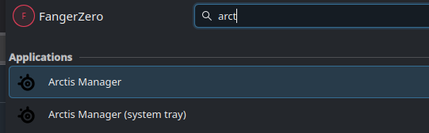
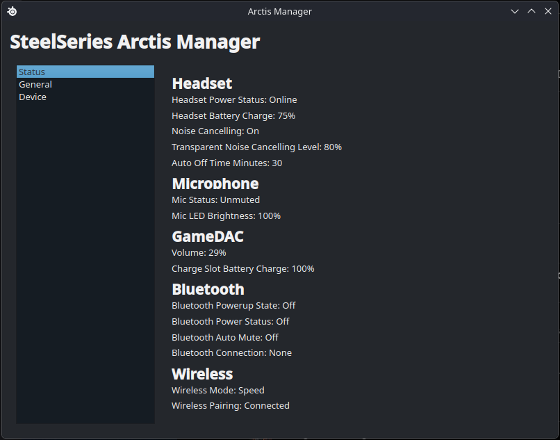
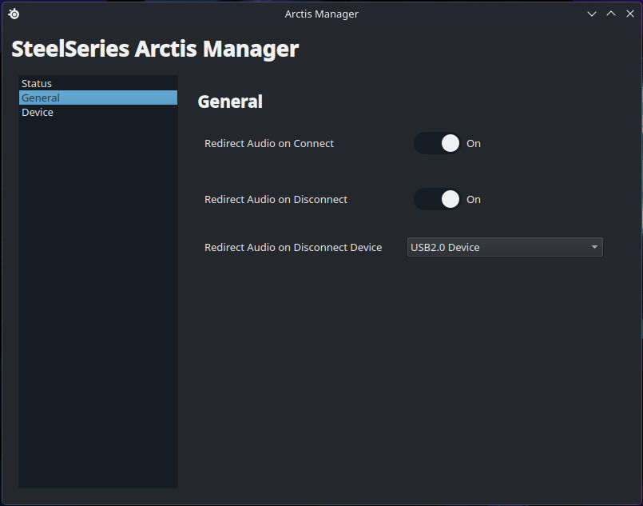
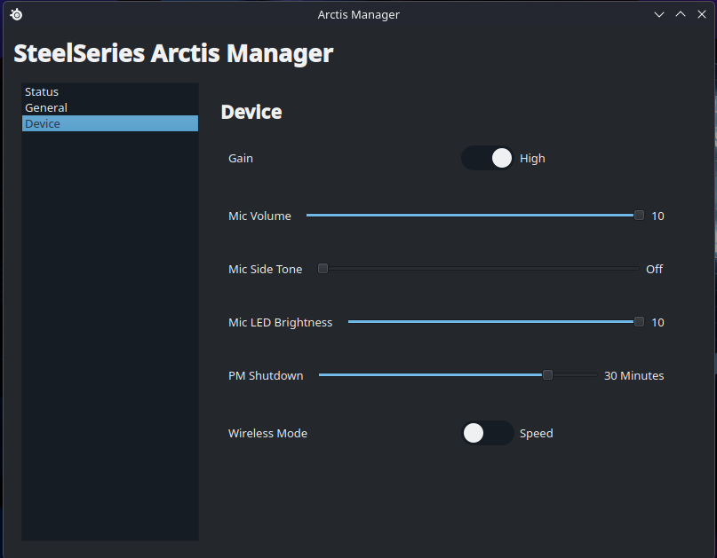
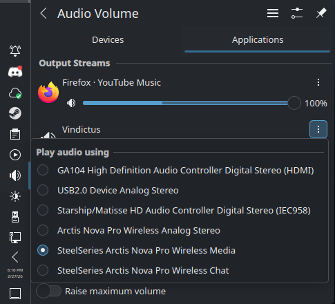

# Linux Arctis Manager: KDE User manual 

- [Which App to Use?](#which-app-to-use)
- [Status](#status)
- [General](#general)
- [Device](#device)
- [Optional - Using the Mixer](#optional---using-the-mixer)
- [Tips](#tips)

## Which App to use? 
**Arctis Manager** - The Main app that allows you to manage your headphones. 

**Arctis Manager (system tray)** - Displays a shortcut to the manager in your system tray. *Tip* - Add to your `Autostart - System Settings`. 

[Back To Top](#linux-arctis-manager)

## Status 
Gives information on your devices if connected.

[Back To Top](#linux-arctis-manager)

## General
| Option | Description |
|--------|-------------|
| Redirect Audio On Connect | When headphones turn on it should redirect to them. |
| Redirect Audio on Disconnet | When your headphones disconnect it will connect to a different device such as external speakers. |
| Redirect Audio on Disconnet Device | Select the device to change to if `Redirect Audio on Disconnect` is on. |

[Back To Top](#linux-arctis-manager)

## Device
| Option | Description | 
|--------|-------------|
| Gain | **High**: Will sound louder and have possible distortion or clipping, more sensitive to background noise.   **Low**: Will be quieter, less risk of distortion. |
| Mic Volume | Helps make your voice louder or quieter for your listeners. |
| Mic Side Tone | Feeds a small amount of your mic signal back to you in real time to your headset. |
Mic LED Brightness | When Mic is muted how bright the light will be. |
| PM Shutdown | Will shutdown headest if no activity detected after a certain period of time. | 
| Wireless Mode | **Speed**: Prioritizes low latency.   **Range**: Extends the wireless signal range. |

[Back To Top](#linux-arctis-manager)

## *Optional* - Using the Mixer

1. Open up the system's sound system tray and go to applications. 
1. Click the three dots of the application you want change.
1. You can choose to keep it neutral `Arctis...Analog Stereo`, set it to the `SteelSeries...Media` (Game) or `SteelSeries...Chat` (Chat).

[Back To Top](#linux-arctis-manager)

## Tips
- Sometimes the Application is slow to respond close and reopen to refresh. 
- If you need to kill the app completely you can either go to your distro's monitor and kill it there, or use the terminal command `killall lam-daemon`

[Back To Top](#linux-arctis-manager)
