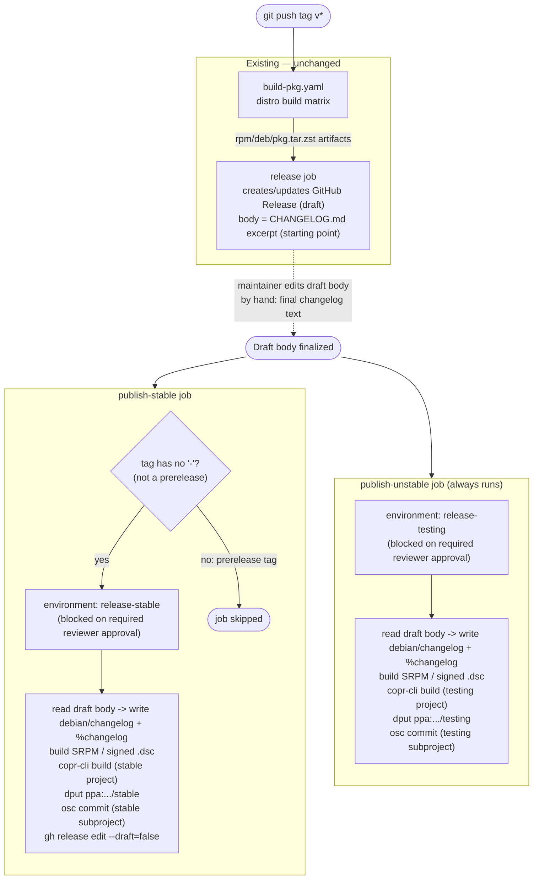

# Release & Distribution Pipeline

This document specifies the full release system: versioning/channel semantics, the
GitHub Actions pipeline shape, the one-time manual setup required on each hosting
platform, and the credentials the automated jobs need. It is meant to be
implementation-ready — when it's time to write the actual workflow YAML, this
document is the spec to follow, not a proposal to re-litigate.

> [!NOTE]
> Distribution channels (COPR/PPA/OBS accounts and projects) have not been created
> yet, and the `publish-stable`/`publish-unstable` jobs described below do not exist
> yet. What already exists today: `build-pkg.yaml` (distro build matrix),
> `install-test.yaml` (install verification), and `release.yaml` (drafts a GitHub
> Release with the built packages, debug/source packages already filtered out).

## 1. Versioning and channels

The project already follows SemVer via the `VERSION` file and `vX.Y.Z[-prerelease]`
git tags (e.g. `v3.0.0`, `v3.0.0-alpha4`). This maps directly onto two distribution
channels:

- **`stable`** — tags with no `-prerelease` suffix (`vX.Y.Z`).
- **`testing`** — every tag, including stable ones. A stable release always also
  lands in `testing`, so `testing` is always a superset of what `stable` has, plus
  whatever prereleases came after the last stable tag.

The tag-to-channel rule used everywhere in the pipeline is: **a tag is a prerelease
if it contains a `-` after the numeric core** (`contains(github.ref_name, '-')` in
GitHub Actions terms). This is deliberately not hardcoded to the literal strings
`alpha`/`beta`, so a future `-rc1` tag (or any other SemVer prerelease label) is
classified correctly without touching the pipeline.

### Naming: `testing`, not `fast-ring` or `-git`

- **`fast-ring`/`slow-ring`** is Windows Insider terminology, not a Linux packaging
  convention — dropped in favor of names users of these ecosystems already
  recognize.
- **`-git`** has a specific, different meaning in Arch packaging: a VCS package
  that always builds from the current branch HEAD, rebuilt on every install. This
  project ships tagged `-alpha`/`-beta` prereleases, not continuous HEAD snapshots,
  so `-git` would misrepresent what's actually being shipped.
- **`testing`** matches Debian's own `testing` suite and Fedora/Bodhi's
  `updates-testing` terminology — the most native fit for the ecosystems being
  targeted. Used as the channel name everywhere: COPR project suffix, PPA suffix,
  OBS subproject.

## 2. Distribution channel matrix

| Distro family | Platform | Stable | Testing | Notes |
|---|---|---|---|---|
| Fedora (+ rpm-ostree family, e.g. Bazzite, via layered COPR) | **COPR** | `elegos/linux-arctis-manager` | `elegos/linux-arctis-manager-testing` | Two separate COPR projects |
| Ubuntu | **Launchpad PPA** | `ppa:elegos/linux-arctis-manager` | `ppa:elegos/linux-arctis-manager-testing` | Two separate PPAs |
| Debian (+ opportunistically openSUSE, see §7) | **OBS** (openSUSE Build Service) | `home:elegos:linux-arctis-manager` | `home:elegos:linux-arctis-manager:testing` | One project, two subprojects |
| Arch | **AUR** (community-maintained by `tonitch`) | `linux-arctis-manager` | `linux-arctis-manager-git` | Out of scope — see §8, not part of this pipeline |

> [!IMPORTANT]
> COPR, Launchpad, and OBS all **build from source on their own infrastructure** —
> none of them consume the `.rpm`/`.deb`/`.pkg.tar.zst` binaries that
> `build-pkg.yaml` already produces for the GitHub Release. `build-pkg.yaml`'s job
> is unchanged: verify the package builds and installs cleanly across the distro
> matrix, and produce the binaries attached to the GitHub Release. The
> repository-publishing jobs are a second, independent build path starting from
> the same tagged source tree, submitting *source* packages (SRPM / signed `.dsc` /
> OBS package) to each platform.

### Per-platform source artifact required

| Platform | Source artifact | Built with |
|---|---|---|
| COPR | `.src.rpm` (SRPM) | `rpmbuild -bs` against `packaging/fedora/linux-arctis-manager.spec` (the existing `rpmbuild -ba` call in `build-pkg.yaml` already produces this as a side effect, just currently discarded) |
| Launchpad | Signed `.dsc` + orig tarball + debian tarball | `dpkg-buildpackage -S -sa`, signed with the maintainer's GPG key via `debsign`/`dpkg-buildpackage`'s own signing step |
| OBS | Package sources checked into the OBS package (control, changelog, orig tarball — can reuse the same `.dsc`/orig tarball built for Launchpad) | `osc commit` via the `osc` CLI |

## 3. Known per-platform constraints

> [!WARNING]
> `linux-arctis-manager.spec` requires network access at build time (`pip install`
> resolving from PyPI — see the `%build`/`BuildRequires` comments in the spec).
> COPR allows network access during builds, so this is fine for the COPR channel.
> It would **not** be fine for an official Fedora submission built on Koji, which
> sandboxes builds with no network access at all. Decision: **COPR only for now**
> (see §8, "Official Fedora review") — this constraint is not being worked around
> at this time.

> [!NOTE]
> openSUSE (via OBS) is not confirmed buildable. OBS builds each target against
> that target's own native repositories — a Fedora target pulls from Fedora's
> repos, an openSUSE target from openSUSE's — so RPM-format compatibility does
> **not** imply dependency-name compatibility (`BuildRequires`/`Requires` naming
> for things like `systemd-devel`, `libcap`, Python packaging can differ). This is
> a stretch goal to attempt once the OBS project exists for Debian, not a
> requirement — see §8.

## 4. Changelog handling

**Source of truth: the GitHub Release's draft body, edited by hand by the
maintainer.** Not a `workflow_dispatch` input — GitHub Actions' manual-trigger
inputs don't support real multi-line text boxes (single-line only in the "Run
workflow" UI), which is a poor fit for a changelog that's usually a bulleted list
across several lines. The GitHub Release draft already has a full markdown editor
and is already the thing the maintainer edits by hand before publishing (see the
alpha3 release's hand-written "How to install" sections, which don't come from
`CHANGELOG.md`).

Flow:

1. `release.yaml`'s existing `release` job creates/updates the GitHub Release as a
   **draft**, with a body auto-extracted from `CHANGELOG.md`'s top section as a
   starting point (already implemented via `changelog_section.py`).
2. The maintainer opens the draft on GitHub and edits the body into the real,
   final changelog text for this release.
3. When a `publish-*` job runs (after the maintainer approves its environment
   gate, see §5), it reads the **current** draft body via
   `gh release view <tag> --json body -q .body` and treats that text as the
   authoritative changelog for this release.
4. A shared script converts that raw text into each platform's required format:
   - **`debian/changelog`**: prepend a new stanza
     (`linux-arctis-manager (<version>) <distribution>; urgency=medium` /
     bullet lines prefixed with `  * ` / trailer with maintainer + RFC 5322 date),
     built once per target distro slug (mirrors the existing per-slug `+<slug>`
     version tagging already in `build-pkg.yaml`).
   - **`%changelog`** (rpm spec): prepend a new
     `* <date> <maintainer> - <version>` entry with `- ` bullet lines.
   - Neither of these is a copy-paste of the raw markdown — both formats have
     strict structural requirements (exact date format, exact stanza header
     syntax) that the script must produce, not the maintainer.

> [!NOTE]
> This script is new work, not yet written. It needs one function per output
> format (debian stanza, rpm entry), sharing only the parsed
> version/date/changelog-body input. Keep it in `.github/scripts/`, next to
> `changelog_section.py` and `resolve_distro_matrix.py`.

## 5. Pipeline shape

### Job breakdown

- **`publish-stable`**
  - `if: ${{ !contains(github.ref_name, '-') }}` — skipped outright for any
    prerelease tag, before the approval gate is even reached. This is a
    correctness guard, not just a formality: it makes it structurally impossible
    to accidentally approve a prerelease into the stable channel.
  - `environment: release-stable`, with the maintainer as required reviewer.
  - On approval: writes changelogs, builds source packages, submits to
    COPR-stable, PPA-stable, OBS-stable, and — since this is the channel that
    represents "this version is really out" — also flips the GitHub Release out
    of draft (`gh release edit <tag> --draft=false`).
- **`publish-unstable`**
  - No `if:` condition — runs for every tag, stable or prerelease, since
    `testing` is always a superset of `stable`.
  - `environment: release-testing`, with the maintainer as required reviewer.
  - Does **not** un-draft the GitHub Release on a prerelease tag (there is
    nothing else in the pipeline that would un-draft it for a prerelease, which
    is correct — prereleases aren't meant to become the "Latest" GitHub Release).
    On a stable tag, both jobs run; whichever finishes last un-drafting is a
    no-op the second time, so no ordering dependency needs to be enforced between
    the two jobs.

Both jobs live inside `release.yaml` as additional jobs (not separate workflow
files) — one workflow run shows build → release-draft → both gated publish jobs
in a single place, and GitHub Environments already provide the per-job approval
gate without needing `workflow_run`-chained separate files.

## 6. Secrets and configuration

| Name | Kind | Scope | Used by |
|---|---|---|---|
| `COPR_CONFIG` | secret (contents of a `copr-cli` config ini: login, token, copr_url) | repo-level (same account for both COPR projects; only the target project name differs, which is a plain non-secret value) | both publish jobs |
| `LAUNCHPAD_GPG_PRIVATE_KEY` | secret (armored private key) | repo-level | both publish jobs |
| `LAUNCHPAD_GPG_PASSPHRASE` | secret | repo-level | both publish jobs |
| `LAUNCHPAD_GPG_KEY_ID` | variable (not secret — a key ID isn't sensitive) | repo-level | both publish jobs |
| `OBS_USERNAME` / `OBS_PASSWORD` (or an OBS API token, if supported for the account) | secret | repo-level | both publish jobs |
| Target project/PPA/subproject names (`linux-arctis-manager` vs `-testing`) | plain job-level values, not secrets | hardcoded per job or as repo variables | both publish jobs |

> [!NOTE]
> Nothing here needs to be scoped *differently* per environment — the same COPR
> account, GPG key, and OBS account publish to both the stable and testing
> targets, only the destination project/PPA/subproject name changes. Environment
> scoping is only needed for the *approval gate*, not for splitting credentials.

## 7. One-time manual setup (before implementation starts)

This is manual, maintainer-side work — not scriptable from CI, and a prerequisite
for writing the actual workflow jobs:

1. Create COPR account + two projects: `elegos/linux-arctis-manager`,
   `elegos/linux-arctis-manager-testing`. Generate a `copr-cli` API token.
2. Create a Launchpad account (if not already existing) + two PPAs:
   `linux-arctis-manager`, `linux-arctis-manager-testing`. Generate (or reuse) a
   GPG key and register it with the Launchpad account (Launchpad requires the
   key's fingerprint to be confirmed via their own signed-cleartext challenge
   flow before it can sign uploads).
3. Create an OBS account + one project (`home:elegos:linux-arctis-manager`) with
   a `testing` subproject, each configured with a Debian build target (and
   optionally an openSUSE target, see §8).
4. Register all of the above as GitHub repo secrets (§6).
5. Create the two GitHub Environments (`release-stable`, `release-testing`) with
   the maintainer set as a required reviewer on each.

## 8. Deferred / open items

- **Official Fedora review** (GitHub issue #52's original context — a Bugzilla
  package review): not pursued for now. Blocked on the network-access-at-build-time
  constraint (§3) unless the Python dependency resolution is reworked to vendor
  wheels instead of hitting PyPI at build time. COPR-only is the current decision.
- **openSUSE via OBS**: stretch goal, attempt once the Debian OBS project exists,
  not blocking. See §3 for why compatibility isn't a given.
- **Arch binary repository**: not built. The community-maintained AUR packages
  (`linux-arctis-manager`, `linux-arctis-manager-git`, `linux-arctis-manager-legacy`,
  maintained by `tonitch`) are left as-is and are outside this pipeline's control
  — they're source-only (`makepkg` compiles locally on install) and not
  coordinated with this project's release tags. Revisit only if that
  maintainership arrangement changes.
- **Issues #52 and #56**: both describe v2/Python-daemon-era constraints (a
  `uv-build` version pin, and installing udev rules via `lam-cli`) that no longer
  apply — v3's Fedora spec doesn't use `uv` at all (stdlib venv + `pip`), and v3
  has no udev rules at all (privilege is handled by the `lam-hidraw-helper`
  setcap binary instead). Close both with a comment explaining the architecture
  change, once this is confirmed against the current `main`/`develop` state.

## 9. Manual QA checklist (for the upcoming VM testing pass)

Once the first real publish to each platform happens, verify on a clean VM per
target before trusting the channel:

- **Fedora** (COPR): `dnf copr enable elegos/linux-arctis-manager[-testing]`,
  then `dnf install linux-arctis-manager` — confirm it resolves and installs
  cleanly, and that `-lang` gets pulled in automatically by whichever UI shell
  package is chosen (see the `Requires:` fix already made for this).
- **Ubuntu** (PPA): `add-apt-repository ppa:elegos/linux-arctis-manager[-testing]`,
  `apt install linux-arctis-manager`.
- **Debian** (OBS): add the OBS repo per its generated `.list`/keyring
  instructions, `apt install linux-arctis-manager`.
- For all three: verify `apt`/`dnf remove` cascades correctly (main package
  removes dependent shell packages and `-lang`, per the fix already made).
- Confirm the published changelog entry (`apt show`, `rpm -q --changelog`)
  matches what was written in the GitHub Release draft, not a stale placeholder.
