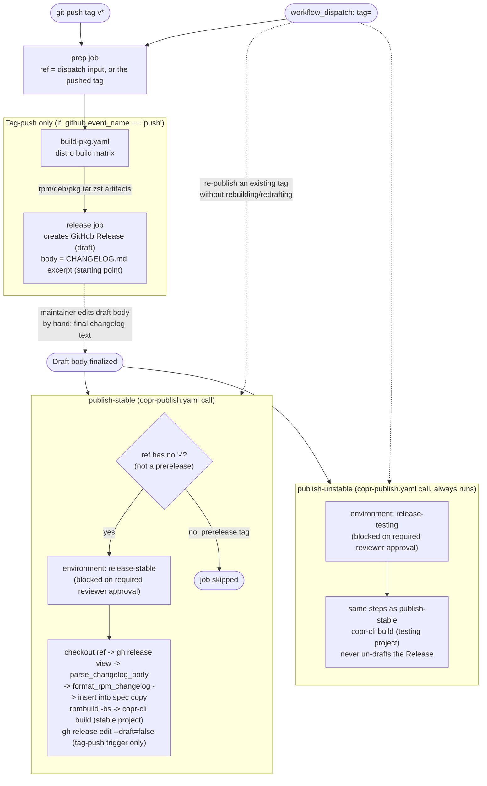

# Release & Distribution Pipeline

This document specifies the full release system: versioning/channel semantics, the
GitHub Actions pipeline shape, the one-time manual setup required on each hosting
platform, and the credentials the automated jobs need. It is meant to be
implementation-ready — when it's time to write the actual workflow YAML, this
document is the spec to follow, not a proposal to re-litigate.

> [!NOTE]
> **COPR is implemented.** `elegos/linux-arctis-manager` (stable) and
> `elegos/linux-arctis-manager-testing` (testing) exist, and `release.yaml`'s
> `publish-stable`/`publish-unstable` jobs (via the reusable `copr-publish.yaml`,
> see §5) submit to them. **Launchpad (PPA) and OBS are not implemented yet** —
> no accounts/PPAs/OBS project exist, and the `dput`/`osc commit` steps described
> below for those two platforms are still a proposal, not working code. What
> already exists: `build-pkg.yaml` (distro build matrix), `install-test.yaml`
> (install verification), `release.yaml` (drafts a GitHub Release, then gates
> COPR publishing behind `release-stable`/`release-testing` environment approval),
> `copr-publish.yaml` (the actual COPR build+submit steps — also directly
> runnable on its own from the Actions tab, not just via `release.yaml`; see
> §5), and
> `.github/scripts/{changelog_body,format_rpm_changelog,insert_rpm_changelog}.py`
> (changelog conversion — see §4).
>
> The `release-stable`/`release-testing` **environments don't exist yet** — the
> COPR API credentials are plain repo-level secrets (§6), so this doesn't block
> publishing, it just means `environment: <name>` currently has no protection
> rules: GitHub auto-creates a bare, unprotected environment the first time a
> job references an unknown name, so runs go through immediately with no
> approval step until the two environments are actually created per §7.
>
> A `workflow_dispatch` trigger is only offered by GitHub's "Run workflow" UI
> button once it exists in the workflow file **on the repository's default
> branch** (`develop` here) — while this work is still only on a feature
> branch, use `gh workflow run copr-publish.yaml --ref <branch> -f ref=<tag>
> -f copr-project=<owner/project> -f environment-name=<name>` instead (works
> on any branch/tag that already has the trigger, since the workflow has
> already run at least once via another event).

## 1. Versioning and channels

The project already follows SemVer via the `VERSION` file and `vX.Y.Z[-prerelease]`
git tags (e.g. `v3.0.0`, `v3.0.0-alpha4`). This maps directly onto two distribution
channels:

- **`stable`** — tags with no `-prerelease` suffix (`vX.Y.Z`).
- **`testing`** — every tag, including stable ones. A stable release always also
  lands in `testing`, so `testing` is always a superset of what `stable` has, plus
  whatever prereleases came after the last stable tag.

The tag-to-channel rule used everywhere in the pipeline is: **a tag is a prerelease
if it contains a `-` after the numeric core** (`contains(github.ref_name, '-')` in
GitHub Actions terms). This is deliberately not hardcoded to the literal strings
`alpha`/`beta`, so a future `-rc1` tag (or any other SemVer prerelease label) is
classified correctly without touching the pipeline.

### Naming: `testing`, not `fast-ring` or `-git`

- **`fast-ring`/`slow-ring`** is Windows Insider terminology, not a Linux packaging
  convention — dropped in favor of names users of these ecosystems already
  recognize.
- **`-git`** has a specific, different meaning in Arch packaging: a VCS package
  that always builds from the current branch HEAD, rebuilt on every install. This
  project ships tagged `-alpha`/`-beta` prereleases, not continuous HEAD snapshots,
  so `-git` would misrepresent what's actually being shipped.
- **`testing`** matches Debian's own `testing` suite and Fedora/Bodhi's
  `updates-testing` terminology — the most native fit for the ecosystems being
  targeted. Used as the channel name everywhere: COPR project suffix, PPA suffix,
  OBS subproject.

## 2. Distribution channel matrix

| Distro family | Platform | Stable | Testing | Notes |
|---|---|---|---|---|
| Fedora (+ rpm-ostree family, e.g. Bazzite, via layered COPR) | **COPR** | `elegos/linux-arctis-manager` | `elegos/linux-arctis-manager-testing` | Two separate COPR projects |
| Ubuntu | **Launchpad PPA** | `ppa:elegos/linux-arctis-manager` | `ppa:elegos/linux-arctis-manager-testing` | Two separate PPAs |
| Debian (+ opportunistically openSUSE, see §7) | **OBS** (openSUSE Build Service) | `home:elegos:linux-arctis-manager` | `home:elegos:linux-arctis-manager:testing` | One project, two subprojects |
| Arch | **AUR** (community-maintained by `tonitch`) | `linux-arctis-manager` | `linux-arctis-manager-git` | Out of scope — see §8, not part of this pipeline |

> [!IMPORTANT]
> COPR, Launchpad, and OBS all **build from source on their own infrastructure** —
> none of them consume the `.rpm`/`.deb`/`.pkg.tar.zst` binaries that
> `build-pkg.yaml` already produces for the GitHub Release. `build-pkg.yaml`'s job
> is unchanged: verify the package builds and installs cleanly across the distro
> matrix, and produce the binaries attached to the GitHub Release. The
> repository-publishing jobs are a second, independent build path starting from
> the same tagged source tree, submitting *source* packages (SRPM / signed `.dsc` /
> OBS package) to each platform.

### Per-platform source artifact required

| Platform | Source artifact | Built with |
|---|---|---|
| COPR | `.src.rpm` (SRPM) | `rpmbuild -bs` against `packaging/fedora/linux-arctis-manager.spec` (the existing `rpmbuild -ba` call in `build-pkg.yaml` already produces this as a side effect, just currently discarded) |
| Launchpad | Signed `.dsc` + orig tarball + debian tarball | `dpkg-buildpackage -S -sa`, signed with the maintainer's GPG key via `debsign`/`dpkg-buildpackage`'s own signing step |
| OBS | Package sources checked into the OBS package (control, changelog, orig tarball — can reuse the same `.dsc`/orig tarball built for Launchpad) | `osc commit` via the `osc` CLI |

## 3. Known per-platform constraints

> [!WARNING]
> `linux-arctis-manager.spec` requires network access at build time (`pip install`
> resolving from PyPI — see the `%build`/`BuildRequires` comments in the spec).
> COPR allows network access during builds, so this is fine for the COPR channel.
> It would **not** be fine for an official Fedora submission built on Koji, which
> sandboxes builds with no network access at all. Decision: **COPR only for now**
> (see §8, "Official Fedora review") — this constraint is not being worked around
> at this time.

> [!NOTE]
> openSUSE (via OBS) is not confirmed buildable. OBS builds each target against
> that target's own native repositories — a Fedora target pulls from Fedora's
> repos, an openSUSE target from openSUSE's — so RPM-format compatibility does
> **not** imply dependency-name compatibility (`BuildRequires`/`Requires` naming
> for things like `systemd-devel`, `libcap`, Python packaging can differ). This is
> a stretch goal to attempt once the OBS project exists for Debian, not a
> requirement — see §8.

## 4. Changelog handling

**Source of truth: the GitHub Release's draft body, edited by hand by the
maintainer.** Not a `workflow_dispatch` input — GitHub Actions' manual-trigger
inputs don't support real multi-line text boxes (single-line only in the "Run
workflow" UI), which is a poor fit for a changelog that's usually a bulleted list
across several lines. The GitHub Release draft already has a full markdown editor
and is already the thing the maintainer edits by hand before publishing (see the
alpha3 release's hand-written "How to install" sections, which don't come from
`CHANGELOG.md`).

Flow:

1. `release.yaml`'s existing `release` job creates/updates the GitHub Release as a
   **draft**, with a body auto-extracted from `CHANGELOG.md`'s top section as a
   starting point (already implemented via `changelog_section.py`).
2. The maintainer opens the draft on GitHub and edits the body into the real,
   final changelog text for this release.
3. When a `publish-*` job runs (after the maintainer approves its environment
   gate, see §5), it reads the **current** draft body via
   `gh release view <tag> --json body -q .body` and treats that text as the
   authoritative changelog for this release.
4. Per-platform scripts convert that raw text into each platform's required
   format, sharing one parsing step:
   - **`.github/scripts/changelog_body.py`** (`parse_changelog_body`): turns the
     raw draft body into a flat, heading-free list of change strings. Handles,
     without silently dropping content, what a maintainer's hand-edited draft can
     actually contain: any ATX heading level (this project's own CHANGELOG.md
     history mixes `##` and `###` for the same kind of section), `-`/`*`/`+` as
     the bullet marker, a bullet's text wrapped onto unmarked continuation
     lines (joined back into one item), and nested sub-bullets (flattened into
     the list rather than merged into their parent).
   - **`.github/scripts/format_rpm_changelog.py`**: formats those items as one
     `%changelog` entry — `* <day> <mon> <DD> <YYYY> <maintainer> - <version>-<release>`
     header, `- ` bullet lines. **Implemented**, used by `copr-publish.yaml`.
   - **`.github/scripts/insert_rpm_changelog.py`**: inserts that entry right
     after the spec's `%changelog` line (newest-first, matching the existing
     hand-written entries in `packaging/fedora/linux-arctis-manager.spec`) —
     applied to the *copy* of the spec used to build the SRPM, not committed
     back to the repository.
   - **`debian/changelog` stanza formatter**: **not yet written** — deferred
     until the Launchpad/OBS work starts (see the top-of-file NOTE). Would be a
     second formatter function consuming the same `parse_changelog_body()`
     output: prepend a new stanza
     (`linux-arctis-manager (<version>) <distribution>; urgency=medium` /
     bullet lines prefixed with `  * ` / trailer with maintainer + RFC 5322 date),
     built once per target distro slug (mirrors the existing per-slug `+<slug>`
     version tagging already in `build-pkg.yaml`).

## 5. Pipeline shape

COPR is implemented; the PPA/OBS steps sketched in earlier revisions of this
diagram are removed below until that work actually starts (see §1's NOTE).

### Job breakdown

- **`prep`** — resolves one `ref` output used by every job below: the pushed
  tag (`github.ref_name`) on a tag-push trigger, or the `tag` input on a manual
  `workflow_dispatch` run. This is what makes the manual trigger safe: nothing
  downstream needs to know which event fired.
- **`build-pkg` / `release`** — `if: ${{ github.event_name == 'push' }}` only.
  A manual dispatch never re-creates or rebuilds the GitHub Release — `gh
  release create` errors on a tag that already has one, and the whole point of
  the manual trigger is to (re)run *publishing* for a tag whose release already
  exists. `publish-stable`/`publish-unstable` still declare `needs: release`:
  a skipped job satisfies `needs:` in GitHub Actions, so this doesn't block them
  on a dispatch run.
- **`publish-stable`** (`copr-publish.yaml`, called with
  `copr-project: elegos/linux-arctis-manager`, `environment-name:
  release-stable`, `finalize-release: ${{ github.event_name == 'push' }}`)
  - `if: ${{ !contains(needs.prep.outputs.ref, '-') }}` — skipped outright for
    any prerelease ref, before the approval gate is even reached. This is a
    correctness guard, not just a formality: it makes it structurally impossible
    to accidentally approve a prerelease into the stable channel.
  - `environment: release-stable`, with the maintainer as required reviewer.
  - On approval: reads the release draft body, builds an SRPM with a
    `%changelog` entry generated from it, submits to COPR-stable, and — only on
    the tag-push trigger, since a manual re-publish shouldn't un-draft again —
    flips the GitHub Release out of draft.
- **`publish-unstable`** (same reusable workflow, `copr-project:
  elegos/linux-arctis-manager-testing`, `environment-name: release-testing`,
  `finalize-release: false`)
  - No `if:` condition — runs for every ref, stable or prerelease, since
    `testing` is always a superset of `stable`.
  - `environment: release-testing`, with the maintainer as required reviewer.
  - Never un-drafts the GitHub Release (nothing else in the pipeline would need
    that on a prerelease, and on a stable tag `publish-stable` already does it).

`publish-stable` and `publish-unstable` both call the same `copr-publish.yaml`
reusable workflow (`uses:` + `secrets: inherit`) instead of duplicating the
build+submit steps inline — a deliberate change from this document's original
"not separate workflow files" call: a `uses:`-called reusable workflow still
shows as jobs inside the *same* workflow run in the Actions UI (unlike a
`workflow_run`-chained separate workflow, which is the thing that call was
actually ruling out), so the "one run, one place" property this document cared
about is unaffected, and the two channels no longer drift out of sync with
each other by construction.

## 6. Secrets and configuration

| Name | Kind | Scope | Used by |
|---|---|---|---|
| `COPR_API_LOGIN` / `COPR_API_USERNAME` / `COPR_API_TOKEN` / `COPR_API_COPR_URL` | secrets (the four fields of a `copr-cli` config ini) | repo-level (same account for both COPR projects; only the target project name differs, which is a plain non-secret value) | both publish jobs |
| `LAUNCHPAD_GPG_PRIVATE_KEY` | secret (armored private key) | repo-level | both publish jobs |
| `LAUNCHPAD_GPG_PASSPHRASE` | secret | repo-level | *not implemented yet* |
| `LAUNCHPAD_GPG_KEY_ID` | variable (not secret — a key ID isn't sensitive) | repo-level | *not implemented yet* |
| `OBS_USERNAME` / `OBS_PASSWORD` (or an OBS API token, if supported for the account) | secret | repo-level | *not implemented yet* |
| Target project/PPA/subproject names (`linux-arctis-manager` vs `-testing`) | plain job-level values, not secrets | hardcoded per `copr-publish.yaml` call in `release.yaml` | both publish jobs |

> [!NOTE]
> Nothing here needs to be scoped *differently* per environment — the same COPR
> account (and, once implemented, the same GPG key and OBS account) publishes to
> both the stable and testing targets, only the destination project/PPA/subproject
> name changes. Environment scoping is only needed for the *approval gate*, not
> for splitting credentials. The Launchpad/OBS rows above are kept for when that
> work starts — they don't correspond to any secret actually in use today.

## 7. One-time manual setup

Done, for COPR:

1. ~~Create COPR account + two projects: `elegos/linux-arctis-manager`,
   `elegos/linux-arctis-manager-testing`. Generate a `copr-cli` API token.~~
2. ~~Register `COPR_API_LOGIN`/`COPR_API_USERNAME`/`COPR_API_TOKEN`/`COPR_API_COPR_URL`
   as GitHub repo secrets (§6).~~
3. ~~Create the two GitHub Environments (`release-stable`, `release-testing`)
   with the maintainer set as a required reviewer on each.~~

Still needed, before the Launchpad/OBS steps in §4/§5 can move past "proposal":

1. Create a Launchpad account (if not already existing) + two PPAs:
   `linux-arctis-manager`, `linux-arctis-manager-testing`. Generate (or reuse) a
   GPG key and register it with the Launchpad account (Launchpad requires the
   key's fingerprint to be confirmed via their own signed-cleartext challenge
   flow before it can sign uploads).
2. Create an OBS account + one project (`home:elegos:linux-arctis-manager`) with
   a `testing` subproject, each configured with a Debian build target (and
   optionally an openSUSE target, see §8).
3. Register the Launchpad/OBS secrets from §6 once the above exist.

## 8. Deferred / open items

- **Official Fedora review** (GitHub issue #52's original context — a Bugzilla
  package review): not pursued for now. Blocked on the network-access-at-build-time
  constraint (§3) unless the Python dependency resolution is reworked to vendor
  wheels instead of hitting PyPI at build time. COPR-only is the current decision.
- **openSUSE via OBS**: stretch goal, attempt once the Debian OBS project exists,
  not blocking. See §3 for why compatibility isn't a given.
- **Arch binary repository**: not built. The community-maintained AUR packages
  (`linux-arctis-manager`, `linux-arctis-manager-git`, `linux-arctis-manager-legacy`,
  maintained by `tonitch`) are left as-is and are outside this pipeline's control
  — they're source-only (`makepkg` compiles locally on install) and not
  coordinated with this project's release tags. Revisit only if that
  maintainership arrangement changes.
- **Issues #52 and #56**: both describe v2/Python-daemon-era constraints (a
  `uv-build` version pin, and installing udev rules via `lam-cli`) that no longer
  apply — v3's Fedora spec doesn't use `uv` at all (stdlib venv + `pip`), and v3
  has no udev rules at all (privilege is handled by the `lam-hidraw-helper`
  setcap binary instead). Close both with a comment explaining the architecture
  change, once this is confirmed against the current `main`/`develop` state.

## 9. Manual QA checklist (for the upcoming VM testing pass)

Once the first real publish to each platform happens, verify on a clean VM per
target before trusting the channel:

- **Fedora** (COPR): `dnf copr enable elegos/linux-arctis-manager[-testing]`,
  then `dnf install linux-arctis-manager` — confirm it resolves and installs
  cleanly, and that `-lang` gets pulled in automatically by whichever UI shell
  package is chosen (see the `Requires:` fix already made for this).
- **Ubuntu** (PPA): `add-apt-repository ppa:elegos/linux-arctis-manager[-testing]`,
  `apt install linux-arctis-manager`.
- **Debian** (OBS): add the OBS repo per its generated `.list`/keyring
  instructions, `apt install linux-arctis-manager`.
- For all three: verify `apt`/`dnf remove` cascades correctly (main package
  removes dependent shell packages and `-lang`, per the fix already made).
- Confirm the published changelog entry (`apt show`, `rpm -q --changelog`)
  matches what was written in the GitHub Release draft, not a stale placeholder.
