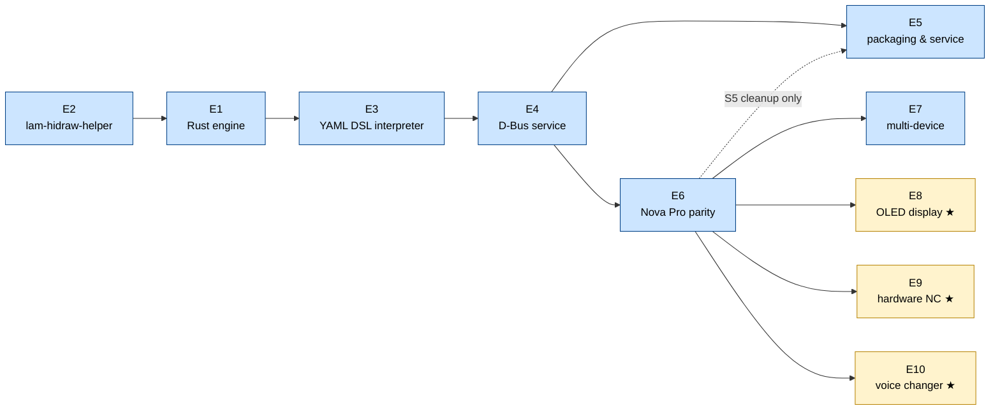

# v3 Backlog

---

## Conventions

**Static checks before every commit**

Run `cargo fmt --all -- --check`, `cargo clippy --all-targets -- -D warnings`, and `cargo test --all` (in that order) before committing any Rust change. A commit that breaks any of these three is not acceptable.

**Testing policy**

- Every story must ship with unit tests covering its logic. A story without meaningful tests is not done.
- Unit tests must not touch real hardware or spawn real OS processes. The `lam-hidraw-helper` is mocked in tests (see E2-S6).
- Integration tests (full stack against a real device) are performed manually. No automated integration test suite.
- "Meaningful" means the test would catch a real regression, not just assert `true`. Tests that only verify that a function returns without panicking are not sufficient on their own.

**Completing a story** means the feature works end-to-end with no stubs or `TODO` comments left in the code. If a story is blocked mid-implementation because a dependency that was not anticipated turns up, it must **not** be marked done. Instead:

1. Leave the story unchecked.
2. Add a note directly under it in the checklist:
   ```
   - [ ] [EX-SY] Story title
     > Blocked: depends on [EZ-SW] — <one line explaining what is missing>
   ```
3. Resolve the block as soon as the dependency is completed, then close the story.

This keeps the checklist honest and makes blocked work immediately visible without digging through code or commit history.

---

## Epics and Stories

- [x] **[E1] Rust engine foundation**
  - [x] [E1-S1] Cargo workspace
  - [x] [E1-S2] HID transport layer
  - [x] [E1-S3] USB hot-plug detection
  - [x] [E1-S4] Device init sequence executor
  - [x] [E1-S5] Async event loop
  - [x] [E1-S6] Structured logging and error handling
- [x] **[E2] Privileged HID helper (`lam-hidraw-helper`)**
  - [x] [E2-S1] Unix domain socket server
  - [x] [E2-S2] Peer credential validation
  - [x] [E2-S3] VID allowlist enforcement
  - [x] [E2-S4] File descriptor passing
  - [x] [E2-S5] Installation and `setcap` instructions
  - [x] [E2-S6] Test mock for `lam-hidraw-helper`
- [x] **[E3] YAML DSL interpreter**
  - [x] [E3-S1] Base file inheritance (`extends:`)
  - [x] [E3-S2] Struct serialization and deserialization
  - [x] [E3-S3] API execution
  - [x] [E3-S4] Transform evaluation
  - [x] [E3-S5] Builtin transforms
  - [x] [E3-S6] Sync event dispatcher
  - [x] [E3-S7] Sync read (startup bulk poll)
  - [x] [E3-S8] Lifecycle hook executor
- [x] **[E4] D-Bus service**
  - [x] [E4-S1] `zbus` session bus service
  - [x] [E4-S2] `GetStatus` and status signals
  - [x] [E4-S3] `GetSettings` and `SetSettings`
  - [x] [E4-S4] Device online/offline signals
  - [x] [E4-S5] `ReloadConfigs`
  - [x] [E4-S6] Version property and mismatch detection
- [ ] **[E5] systemd user service and packaging**
  - [ ] [E5-S1] systemd user service unit
  - [ ] [E5-S2] Helper installation target
  - [ ] [E5-S3] AUR package update
  - [ ] [E5-S4] Migration guide from v2
  - [ ] [E5-S5] Python engine cleanup
  - [ ] [E5-S6] README and docs refresh
  - [ ] [E5-S7] RPM spec for Fedora and Bazzite *(stretch)*
- [ ] **[E6] Nova Pro Wireless — full protocol parity**
  - [x] [E6-S1] Rewrite `nova_pro_wireless.yaml`
  - [x] [E6-S2] Write `base_arctis_nova_pro_wireless.yaml`
  - [x] [E6-S3] 10-band custom EQ
  - [x] [E6-S4] EQ preset selection
  - [x] [E6-S5] Line out mode and stream mix
  - [x] [E6-S6] OLED settings (brightness, dim timer, home screen type)
  - [x] [E6-S7] Bluetooth startup default and call behavior
  - [x] [E6-S8] Fix status parsing gaps
  - [x] [E6-S9] Save to flash
- [ ] **[E7] Multi-device support**
  - [ ] [E7-S1] Spec-to-YAML conversion script
  - [ ] [E7-S2] Arctis Nova 7 family
  - [ ] [E7-S3] Arctis Nova Pro (wired)
  - [ ] [E7-S4] Arctis Nova 5 and Nova Elite
  - [ ] [E7-S5] Arctis 7+ family
  - [ ] [E7-S6] Bootloader and upgrade PID registration
  - [ ] [E7-S7] Device compatibility matrix
- [ ] **[E8] OLED display** *(stretch)*
  - [ ] [E8-S1] `draw_bitmap` API
  - [ ] [E8-S2] `reload_display` API
  - [ ] [E8-S3] `transform_image_to_column_packed` builtin
  - [ ] [E8-S4] D-Bus `DrawBitmap` method
  - [ ] [E8-S5] Static image display from file
  - [ ] [E8-S6] Animated GIF playback
- [ ] **[E9] Hardware noise cancelling** *(stretch)*
  - [ ] [E9-S1] Write command reverse engineering
  - [ ] [E9-S2] ANC / transparent mode setting
  - [ ] [E9-S3] Transparent level setting
  - [ ] [E9-S4] GUI integration
- [ ] **[E10] AI voice changer port to Rust** *(stretch)*
  - [x] [E10-S1] Generic source listing (`GetListOptions("pulse_audio_sources")`), close the pulsectl leak in NC/mic/sidetone GUI panels
  - [x] [E10-S2] `vc_config.rs` (settings persistence) + `vc_ladspa_chain.rs` (LADSPA filter-chain, mirrors `nc_manager.rs`)
  - [x] [E10-S3] `vc_models.rs` (local model scan/delete) + `vc_hf_client.rs` (HuggingFace search/download, `.pth` and `.zip`) + `vc_base_models.rs` (RMVPE/ContentVec download + SHA-256 verification)
  - [ ] [E10-S4] `vc_calibration.rs` — guided calibration state machine (`pw-record` subprocess), same lifecycle as the Python `CalibrationSession`
    > Blocked: the recording half (`record_start`/`record_stop`, downmix, `propose_variants`) is done. `render_start`/`_render` need the RVC inference pipeline to convert the recording through candidate params — that wiring is split out as [E10-S6b].
  - [x] [E10-S5a] `VcInterface` D-Bus service (`...Next.VC`) + `mic_router` hookup (VC output takes priority over NC per the existing `mic_router.rs` comment)
  - [x] [E10-S5b] Cut GUI (`vc_widget.py`, `vc_calibration_wizard.py`, `dbus_wrapper.py`) over from the legacy Python daemon's VC service to the Rust engine's `VcInterface` — live-verified against a real device
  - [ ] [E10-S6a] `vc/inference/` — unified `ort`-based engine (ContentVec, RMVPE, synthesizer) replacing the separate PyTorch/OpenVINO backends, execution-provider selection (`providers.rs`, done), native mel-spectrogram (`mel.rs`, done), brute-force k-NN retrieval (`retrieval.rs`, done) replacing the `libfaiss` dependency
  - [ ] [E10-S6b] Wire `vc_calibration.rs`'s `render_start`/`_render` onto the [E10-S6a] engine — run each `propose_variants` candidate's params through a fresh pipeline instance over the recording, write `variant_<label>.wav`, transition `Recorded → Rendering → Done`. This is the piece [E10-S4] left blocked.
    > Model conversion (`.pth` → ONNX) stays a one-shot offline Python script, not a daemon runtime dependency. See `docs/voice-changing-feature.md` for the full design.
  - [ ] [E10-S7] Guided `libonnxruntime` install helper — per-distro/vendor plain-text tutorials + a GPU-detect + verify D-Bus flow, replacing the old `DetectGPU`/`InstallAIDeps` stubs

---

## Dependency graph

E5-S1–S4 (packaging basics) and E6 are parallel after E4. E5-S5 (Python cleanup) is gated on E6 being validated on real hardware, shown as a dashed edge.



---

## [E1] Rust engine foundation

The Rust engine replaces `core.py` as the process that owns HID communication, device state, and the main event loop. Everything else (GUI, voice changer, PipeWire management) continues to run in Python and communicates with the engine via D-Bus.

- **[E1-S1] Cargo workspace**
  Set up a Cargo workspace with three crates: `engine` (main binary), `device-config` (YAML parsing and DSL types), `hid-transport` (HID I/O abstraction). Add CI build and `cargo clippy` / `cargo test` checks.

- **[E1-S2] HID transport layer**
  Implement an async HID transport using the `hidapi` crate with the `hidraw` backend. Expose two operations on an open file descriptor: `write(report: &[u8])` and `read() -> Vec<u8>` with a configurable timeout. Support both `HID_IO` (64-byte interrupt reports) and `HID_FEATURE` (up to 1024 bytes) chunk types.
  Wire `hidapi = { workspace = true }` into `hid-transport/Cargo.toml` and uncomment the `libudev-dev` install step in `.github/workflows/rust-ci.yaml`.
  > Requires system package: `libudev-dev` (Debian/Ubuntu), `systemd-devel` (Fedora), `udev` (Arch).

- **[E1-S3] USB hot-plug detection**
  Use `tokio-udev` to subscribe to kernel `add`/`remove` udev events. On `add`, check VID against the SteelSeries allowlist (`0x1038`) and PID against the loaded device configs; if matched, trigger device initialisation. On `remove`, trigger device shutdown and clear state.
  Wire `tokio-udev = { workspace = true }` into `engine/Cargo.toml`.
  > Requires system package: same `libudev-dev` / `systemd-devel` / `udev` as E1-S2.

- **[E1-S4] Device init sequence executor**
  Parse the `device_init` byte sequence from the device config and send each command to the device over HID, respecting `time_between_commands_ms` between writes. Support the `init_sleep_ms` delay before the sequence starts (some devices need time after USB enumeration).

- **[E1-S5] Async event loop**
  Implement the main tokio runtime: one task per connected device, each running a read loop on the sync interface. Dispatch incoming reports to the sync event system (E3). Handle concurrent devices without blocking.

- **[E1-S6] Structured logging and error handling**
  Integrate `tracing` for structured logs with configurable level via environment variable. Define an `EngineError` enum covering HID I/O failures, config parse errors, and protocol violations. Ensure all errors are logged with context before the engine continues or exits cleanly.

---

## [E2] Privileged HID helper (`lam-hidraw-helper`)

A minimal standalone binary that holds `CAP_DAC_OVERRIDE` and is the only process that opens `/dev/hidraw*` nodes. The engine requests file descriptors from it; once the fd is passed, the helper has no further involvement in I/O.

- **[E2-S1] Unix domain socket server**
  The helper listens on a fixed socket path (e.g. `$XDG_RUNTIME_DIR/lam-hidraw-helper.sock`). It accepts one connection at a time. On startup it creates the socket, sets permissions to `700`, and enters the accept loop.

- **[E2-S2] Peer credential validation**
  On each accepted connection, call `getsockopt(SO_PEERCRED)` to retrieve the connecting process's UID. Reject connections from any UID other than the helper's own UID (i.e. only the engine process, running as the same user, may connect).

- **[E2-S3] VID allowlist enforcement**
  Before opening any `/dev/hidraw*` node, read `/sys/class/hidraw/hidrawN/device/idVendor` for the requested device. Reject the request if the VID is not in the compiled-in allowlist (`0x1038`). Additionally, verify that the parent USB device has at least one interface with `bInterfaceClass == 01` (USB Audio): headsets always have an audio interface; SteelSeries keyboards do not, so this prevents the helper from being used to open keyboard HID nodes even when the VID matches.

- **[E2-S4] File descriptor passing**
  Open the validated hidraw node with `O_RDWR` and pass the resulting fd to the engine over the Unix socket using `sendmsg` with `SCM_RIGHTS`. Close the local fd after passing. The engine then owns the fd for all subsequent I/O.

- **[E2-S5] Installation and `setcap` instructions**
  Document and script the one-time setup: install the helper binary to `/usr/local/libexec/lam-hidraw-helper`, set ownership to `root:root` with mode `755`, and run `setcap cap_dac_override+eip` on it. Provide an install Makefile target and an AUR PKGBUILD hook.

- **[E2-S6] Test mock for `lam-hidraw-helper`**
  Provide a test double binary (or a Rust test fixture) that speaks the same Unix socket protocol as the real helper but, instead of opening `/dev/hidraw*`, creates a `socketpair(AF_UNIX, SOCK_SEQPACKET)` and passes one end as the fake fd. The other end is held by the test harness, which can inject raw HID reports (to simulate device-to-host events) and capture writes (to assert the commands the engine sends). No real device is required. The mock is launched as a subprocess before each integration-style test and torn down after. Configure via the `LAM_HELPER_SOCKET` environment variable that the engine already consults at startup.

---

## [E3] YAML DSL interpreter

The interpreter loads device YAML files, resolves `extends:` inheritance, and provides the engine with typed, executable representations of all protocol elements defined in `DEVICE_DSL.md`.

- **[E3-S1] Base file inheritance (`extends:`)**
  When loading a device file that declares `extends: <name>`, load the named base file first, then deep-merge the device file on top. Lists are replaced, not appended. Constants, structs, apis, transforms, sync_events, sync_read, and lifecycle sections all participate in the merge.

- **[E3-S2] Struct serialization and deserialization**
  Parse `structs:` definitions into typed Rust structs at load time. Implement `serialize(fields) -> Vec<u8>` (for writes) and `deserialize(&[u8]) -> FieldMap` (for reads), applying `constant`, `range`, and `values` constraints. Validate constraints on both paths; log and drop malformed incoming reports rather than panicking.

- **[E3-S3] API execution**
  For each entry in `apis:`, implement `api_read(struct_name)` and `api_write(struct_name, fields)`. Route to the correct transport (`HID_IO` or `HID_FEATURE`), apply `payload_transform` if present, and handle chunked writes (multiple HID reports for payloads that exceed the chunk size).

- **[E3-S4] Transform evaluation**
  Implement the four transform types: `case_int_to_int`, `case_int_to_str`, `linear`, and `builtin`. The `builtin` type dispatches to a named Rust function registered at startup. Apply transforms lazily at event emission and sync-read mapping time.

- **[E3-S5] Builtin transforms**
  Implement the three builtins identified in the DSL spec:
  - `transform_gains_to_firmware_values`: maps 10 float32 dB values to 10 uint8 firmware values using `firmware_val = (2 × (10 + dB)).round() as u8`.
  - `transform_bitmap_sub_payload`: splits a column-packed bitmap into one or two HID FEATURE payloads depending on whether the data exceeds 512 bytes.
  - `transform_image_to_column_packed`: converts a row-major 1-bit bitmap to column-packed LSB-y-flipped format required by the OLED controller.

- **[E3-S6] Sync event dispatcher**
  At runtime, when a report arrives on the sync interface, extract byte 1 as the command byte and look it up in the `sync_events:` table. Extract declared fields, apply transforms, and emit the named D-Bus signal. Execute any `side_effects` in order.

- **[E3-S7] Sync read (startup bulk poll)**
  On device init (after the init sequence), iterate `sync_read:` entries in order. For each, call the associated API read, map response fields to engine state events using declared transforms, and emit the corresponding D-Bus signals. This populates the full initial state visible to GUI clients.

- **[E3-S8] Lifecycle hook executor**
  Implement `run_lifecycle(hook: &str)` that looks up the named hook (`init`, `post_init`, `shutdown`) and executes each call in the list sequentially. Built-in calls (`enable_sonar`, `disable_chatmix`, `save_to_flash`, etc.) are dispatched to named Rust functions.

---

## [E4] D-Bus service

Exposes the engine's state and settings to GUI clients and CLI tools on the session bus. The interface names and method signatures are unchanged from v2 so no client-side changes are required.

- **[E4-S1] `zbus` session bus service**
  Register the well-known bus name `name.giacomofurlan.ArctisManager.Next` on the session bus using `zbus`. Implement the `Settings`, `Status`, and `Config` interfaces at their existing object paths. No polkit policy is required because the service runs in the user session.

- **[E4-S2] `GetStatus` and status signals**
  Maintain an in-memory device state map updated by sync events and sync read. Serve `GetStatus` from this map. Emit a `StatusChanged` signal whenever any field changes, so clients can react without polling.

- **[E4-S3] `GetSettings` and `SetSettings`**
  `GetSettings` returns the current settings values together with their DSL-derived config (type, range, valid values) so the GUI can render controls dynamically without hardcoded knowledge of device capabilities. `SetSettings` validates the value against the config, calls the corresponding API write, and if the device declares `save_to_flash`, sends the flash command immediately after.

- **[E4-S4] Device online/offline signals**
  Emit `DeviceConnected(product_id, name, capabilities[])` when a device completes its init sequence and `DeviceDisconnected(product_id)` when it is removed. Clients use the capabilities list to show or hide feature sections in the UI.

- **[E4-S5] `ReloadConfigs`**
  Re-read all YAML files from disk without restarting the engine. Useful during development. If a connected device's config changed, re-run the init sequence.

- **[E4-S6] Version property and mismatch detection**
  Expose a `Version` read-only property on the main D-Bus interface returning the daemon's semver string (sourced from `Cargo.toml` at compile time via `env!("CARGO_PKG_VERSION")`). The GUI already reads this property and shows a warning in the footer when the daemon version differs from the UI version. Verify that the v3 daemon exposes the property under the same interface path and with the same type signature (`s`) as the v2 Python implementation so the existing mismatch UI works without modification.

---

## [E5] systemd user service and packaging

Makes the engine trivial to install, start, and keep running across reboots without requiring root or system-level service management.

- **[E5-S1] systemd user service unit**
  Write `lam-daemon.service` targeting the user session (`[Install] WantedBy=default.target`). Set `Restart=on-failure` and `RestartSec=2`. Document enabling with `systemctl --user enable --now lam-daemon`.

- **[E5-S2] Helper installation target**
  Add a `make install-helper` target (or equivalent) that copies `lam-hidraw-helper` to `/usr/local/libexec/`, sets ownership and permissions, and runs `setcap`. Require `sudo` only for this step.
  > Partial: `lam-hidraw-helper.service` (systemd user unit) exists (commit `0354a77`). Makefile install target and `setcap` step still missing.

- **[E5-S3] AUR package update**
  Update the existing AUR `PKGBUILD` to build the Rust engine, install the helper with correct permissions, and install the systemd user unit. Remove the udev rule from the package since it is no longer required.

- **[E5-S4] Migration guide from v2**
  Write a short migration note: stop the v2 service, install v3, run `make install-helper`, enable the new unit. Note that existing device YAML files in `~/.config/arctis_manager/devices/` are superseded by the bundled v3 files and should be removed.

- **[E5-S5] Python engine cleanup**
  Once `lam-daemon` is functional and the D-Bus interface is validated end-to-end, remove the Python engine layer that it replaces. Specifically: delete `core.py`, `config.py`, `status_parser_fn.py`, `eq_manager.py`, `app_matcher.py`, `cli_tools.py`, `dbus_service.py`, and `constants.py`. Remove the `usb` and `pyserial` dependencies from `pyproject.toml`. Keep `gui/` and `eq_preset.py` — they remain in Python. `ai_deps.py` and `voice_changer/` are removed once [E10] lands (superseded by `vc/inference/providers.rs` and the rest of the Rust `vc/` module); only the one-shot `.pth → ONNX` conversion script stays Python. Update the `lam-gui` entry point to connect to the session bus (replacing the in-process engine startup it currently does) and remove the `--no-daemon` / `--daemon` CLI flags that are no longer meaningful.

- **[E5-S6] README and docs refresh**
  Update `README.md` to describe v3: new prerequisites (`lam-hidraw-helper` + `setcap`), installation steps, D-Bus interface overview, supported devices list, and a link to `DEVICE_DSL.md` for adding new devices. Remove or rewrite any section that references the v2 Python engine. Audit `docs/`: retire files that described v2-only concerns (e.g. old architecture notes, the old status-parser reference if present), and confirm that `ARCHITECTURE.md`, `DEVICE_DSL.md`, and `dbus.md` are accurate against the shipped code.

- **[E5-S7] RPM spec for Fedora and Bazzite** *(stretch)*
  Write an RPM `.spec` file for `lam-daemon` and `lam-hidraw-helper`. Target Fedora 40+ and Bazzite (which uses Fedora RPM infrastructure). The spec must: build from source via `cargo build --release`, install the helper with `%caps(cap_dac_override=eip)` in the `%files` section (Fedora's RPM macros honour this), install the systemd user unit under `%{_userunitdir}`, and declare `Requires: systemd`. Submit to COPR as the initial distribution channel; provide a one-liner install command in the README.

---

## [E6] Nova Pro Wireless — full protocol parity

Rewrite the Nova Pro Wireless YAML using the new DSL and implement every feature defined in the official spec. This device is the reference implementation: passing it validates the entire DSL interpreter.

- **[E6-S1] Rewrite `nova_pro_wireless.yaml`**
  Replace the existing file with a device file that extends `base_arctis_nova_pro_wireless.yaml`. Include all three product ID variants (standard `0x12E0`, Xbox `0x12E5`, Xbox White `0x225D`) with their respective bootloader PIDs.

- **[E6-S2] Write `base_arctis_nova_pro_wireless.yaml`**
  Full base file covering all structs, APIs, transforms, sync events, sync read, and lifecycle hooks as documented in `DEVICE_DSL.md`. This is the complete translation of `base_arctis_nova_pro_wireless.device`.

- **[E6-S3] 10-band custom EQ**
  Implement `eq_10band` capability: `custom_eq` struct (10 × float32 gain fields), `custom_eq` API write with `transform_gains_to_firmware_values` builtin, sync event `0x33` dispatch for on-device EQ band changes, and sync read mapping from `audio_settings`.

- **[E6-S4] EQ preset selection**
  Implement `eq_preset` capability: `selected_eq_preset` struct and API write (cmd `0x2E`), sync event `0x2E` dispatch, 19 preset slots (0 = Flat … 18 = last game EQ). Expose as a discrete setting on D-Bus.

- **[E6-S5] Line out mode and stream mix**
  Implement `line_out_mode` (cmd `0x43`, ChatMix vs Stream Mix) and `stream_mix` (cmd `0x47`, three independent levels: main / aux / mic). Both have sync events and are included in the startup sync read from `audio_settings`.

- **[E6-S6] OLED settings (brightness, dim timer, home screen type)**
  Implement the three UX settings for the GameDAC OLED display: `oled_brightness` (cmd `0x85`, 1–10), `oled_dim_timer` (cmd `0x83`, six durations), `home_screen_type` (cmd `0x89`, detailed vs simple). All three are readable from `ux_settings` and have sync events.

- **[E6-S7] Bluetooth startup default and call behavior**
  Implement `bluetooth_startup` (cmd `0xB2`, power-on default) and `bt_call_behavior` (cmd `0xB3`, do nothing / −12 dB attenuation / mute all other audio). Both are readable from `wireless_settings`.

- **[E6-S8] Fix status parsing gaps**
  Correct the four incomplete status field mappings identified in the v2 analysis:
  - `bt_connection_mode`: add states `2` (pairing) and `4` (link mode).
  - `bt_connection_status`: add states `4` (busy) and `8` (error).
  - `radio_connection_status`: add state `2` (searching).
  - `headset_batt_status`: add state `4` (fully charged, not charging).

- **[E6-S9] Save to flash**
  Send `save_to_flash` (cmd `0x09`) after every successful `SetSettings` call for this device. This persists the new value to device NVRAM so it survives a power cycle. The existing v2 engine never sent this command.

---

## [E7] Multi-device support

Extend coverage to all Arctis headset families present in the official spec, starting from families closest to the Nova Pro Wireless (shared base protocol) and working outward.

- **[E7-S1] Spec-to-YAML conversion script**
  Write a one-shot Python script that reads the decoded `.device` files, extracts PID/VID pairs, include chains, and top-level struct/API names, and emits YAML stubs for each device. Output requires manual review and completion but eliminates the mechanical parts of the translation.

- **[E7-S2] Arctis Nova 7 family**
  Write base and device files for Nova 7, Nova 7X, Nova 7P, and their Gen2 / upgrade variants. Key difference: `battery_discrete_5step` (0/25/50/75/100%) on original vs `battery_percentage` (1–100%) on Gen2. Cover all SKU variants (Diablo IV, WoW editions).

- **[E7-S3] Arctis Nova Pro (wired)**
  Translate the existing `nova_pro_wired.yaml` to the new DSL. Wired device has no wireless_settings struct; validate that sync events and capabilities reflect this correctly.

- **[E7-S4] Arctis Nova 5 and Nova Elite**
  Translate the existing YAML files for these simpler devices. Confirm capability lists are minimal (no OLED, no wireless settings, no chatmix).

- **[E7-S5] Arctis 7+ family**
  Translate the existing `arctis_7_plus.yaml` and verify against the spec files for the 7+ and its variants.

- **[E7-S6] Bootloader and upgrade PID registration**
  Ensure every device file registers its bootloader PID(s). Implement the engine-side logic that detects a bootloader PID, marks the device as `firmware_update_mode`, suppresses D-Bus settings exposure, and emits a `DeviceFirmwareUpdateMode` signal.

- **[E7-S7] Device compatibility matrix**
  Maintain `docs/device_support.md` with a table listing all supported devices, their PID(s), supported capabilities, and known gaps. Auto-generate the table from the YAML files as part of the CI build.

---

## [E8] OLED display *(stretch)*

Exposes the GameDAC OLED (128×64, monochromatic) as a writable surface via D-Bus. Available only on devices that declare the `oled_draw` capability.

- **[E8-S1] `draw_bitmap` API**
  Implement the `draw_bitmap` struct (cmd `0x93`) and the `transform_bitmap_sub_payload` builtin. For images whose data exceeds 512 bytes, split into two HID FEATURE reports covering the left and right halves of the image respectively, as specified in the `sub-payload` function of the spec.

- **[E8-S2] `reload_display` API**
  Implement the `reload_display` struct (cmd `0x95`, HID_IO, 64 bytes). Always call this after a `draw_bitmap` sequence to commit the frame to the panel.

- **[E8-S3] `transform_image_to_column_packed` builtin**
  Convert a row-major 1-bit bitmap (width × height bytes, 1 bit per pixel) to column-packed LSB-y-flipped format: for each column, pack the pixels of that column into bytes with bit 0 at the top row, padding the column height to the nearest multiple of 8.

- **[E8-S4] D-Bus `DrawBitmap` method**
  Add `DrawBitmap(x: u8, y: u8, width: u8, height: u8, data: Vec<u8>)` to the D-Bus `Status` interface. Accepts a raw 1-bit row-major bitmap; the engine applies the column-packed transform internally before sending to the device.

- **[E8-S5] Static image display from file**
  Add a `DisplayImage(path: String)` D-Bus method. Load the image using the `image` crate, resize to fit the drawable area (128×52 if preserving the status bar, 128×64 for full screen), dither to 1-bit using Floyd-Steinberg, and call the draw pipeline.

- **[E8-S6] Animated GIF playback**
  Add a `PlayGif(path: String, loop: bool)` D-Bus method. Decode GIF frames using the `image` crate, convert each frame to 1-bit, and transmit them in sequence at the GIF's declared frame delay. Given the HID timing constraints (`time_between_commands_ms: 50`, 3 commands per frame), expect a practical ceiling of 5–7 fps. Run the animation loop in a background task; a subsequent `StopAnimation` call or a new `PlayGif`/`DisplayImage` call cancels it.

---

## [E9] Hardware noise cancelling *(stretch)*

The official spec exposes `transparency_mode` (off / transparent / ANC) as a readable field in `wireless_settings` but does not define a direct write command for it in the TX spec files. This epic covers the reverse engineering and implementation of the write path.

- **[E9-S1] Write command reverse engineering**
  Capture USB traffic on Windows while toggling ANC/transparent mode in SteelSeries GG. Identify the HID command that changes `transparency_mode` and `transparent_level`. Document the findings and add the struct and API to `base_arctis_nova_pro_wireless.yaml`.

- **[E9-S2] ANC / transparent mode setting**
  Once the write command is confirmed, implement the `noise_cancelling` capability write path: expose a discrete setting (off / transparent / ANC) on D-Bus via `SetSettings`. Read the current mode from `wireless_settings` on startup via sync read.

- **[E9-S3] Transparent level setting**
  Implement the `transparent_level` capability write path: a 1–10 slider. Only active when `transparency_mode` is set to transparent. Read initial value from `wireless_settings`.

- **[E9-S4] GUI integration**
  Update the existing `nc_widget.py` to use the new D-Bus settings rather than the v2 status-only approach. Show the mode selector and the level slider; disable the slider when mode is off or ANC.

---

## [E10] AI voice changer port to Rust *(stretch)*

The voice changer (RVC-based, PipeWire-backed) is fully implemented on the legacy Python daemon (`src/linux_arctis_manager/voice_changer/`), whose D-Bus service is already server-authoritative — settings, LADSPA chain, calibration, and HuggingFace model management all live daemon-side, not in the GUI. This epic is a straight Python → Rust port of that existing server-side logic, not an architecture change. See `docs/voice-changing-feature.md` for the full target design (module layout, signal flow, the unified `ort` inference engine decision).

- **[E10-S1] Generic source listing** — Done. `GetListOptions("pulse_audio_sources")` (`audio.rs`, `dbus.rs`) lists physical mic sources with an `is_default` flag; `nc_widget.py` and `mic_widget.py`'s sidetone preview use it instead of opening their own `pulsectl` connection (`mic_widget.py`'s separate physical-*sink* lookup for the sidetone destination is a distinct, smaller follow-up — not source listing).

- **[E10-S2] `vc_config.rs` + `vc_ladspa_chain.rs`** — Done. LADSPA effect chain (pitch/chorus/delay/distortion/reverb) via `libpipewire-module-filter-chain`, mirroring `nc_manager.rs`. Unlike NC, these plugins have no true bypass port, so a disabled effect is omitted from the graph rather than baked-in-and-neutralised; the process rebuilds when the *set* of enabled effects changes. `ladspa_util.rs` extracted from `nc_manager.rs` for the LADSPA plugin-discovery code shared between NC and VC.

- **[E10-S3] `vc_models.rs` + `vc_hf_client.rs` + `vc_base_models.rs`** — Done.
  Local model scan/delete (`vc_models.rs`, port of `model_manager.py`), HuggingFace search/repo-listing/download over `reqwest` (`vc_hf_client.rs`, port of `hf_search.py`, using the public HF Hub REST API instead of the `huggingface_hub` Python SDK), and RMVPE/ContentVec download with SHA-256 verification (`vc_base_models.rs`, port of `model_downloader.py`, same release URL and checksums). `.zip` archive downloads (RVC WebUI sometimes bundles `.pth` + `.index` together) are extracted in-memory via the `zip` crate (`flate2`'s pure-Rust backend for DEFLATE, no system zlib) — port of `hf_search.py`'s `_extract_pth_from_zip`, including its `__MACOSX`/dotfile filtering and stem-based index pairing.

- **[E10-S4] `vc_calibration.rs`** — Recording half done; rendering split out as [E10-S6b].
  `record_start`/`record_stop` (`pw-record` subprocess capture, f32-stereo→mono downmix with NaN/Inf-as-silence and peak detection, canonical WAV writing) and `propose_variants` (pure parameter-candidate arithmetic) — port of `rvc/calibration.py`'s `CalibrationSession`, already server-owned in the Python reference. `render_start`/`_render` are not implemented here: they need the actual RVC inference pipeline (ContentVec → RMVPE → synthesizer) to convert the recording through each candidate's params — `CalibrationState` declares `Rendering`/`Done` for the eventual full contract shape, but this module can only produce `Idle`/`Recording`/`Recorded`/`Error` until [E10-S6b] wires rendering onto the engine built in [E10-S6a]. `RvcParams` (per-model tuning, port of `backend.py`) lives in the new `vc_rvc_config.rs`.

- **[E10-S5a] `VcInterface` D-Bus service + `mic_router` hookup** — Done.
  `name.giacomofurlan.ArctisManager.Next.VC` wires `vc_config.rs`+`vc_ladspa_chain.rs` (`GetVCCapabilities`, `GetVCSettings`, `SetVCSettings` + `VcChanged` signal — zbus derives signal names from the Rust fn name unless overridden, same as the existing `NcChanged`/`EqChanged`, not `NCChanged`/`EQChanged`), `vc_models.rs` (`GetRVCModels`, `DeleteRVCModel`), `vc_hf_client.rs` (`GetHFToken`, `SetHFToken`, `SearchHFModels`, `ListRepoFiles`, `DownloadHFModel` + `DownloadProgress`/`DownloadComplete` signals), `vc_base_models.rs` (`DownloadBaseModels` + `BaseModelProgress`/`BaseModelComplete` signals, status folded into `GetVCCapabilities`'s `rvc.base_models`), and `vc_calibration.rs` (`CalibrationStartRecording`, `CalibrationStopRecording`, `CalibrationGetStatus`). `SetVCSettings` calls the new `mic_router::set_vc_source`/`set_nc_source` priority arbitration (`mic_router.rs` previously let whichever of NC/VC called last win outright; it now tracks both candidate sources and resolves VC > NC > teardown independently of call order).
  `GetRVCMetrics`, `SetRVCLiveParams`, `DetectGPU`, `InstallAIDeps`, and `CalibrationStartRender` are **not** in the interface — they need the inference engine ([E10-S6a]/[E10-S6b]) and would just be fake stubs today. `GetVCCapabilities` reports `rvc.available: false` so clients gate their RVC UI on it instead of hitting an UnknownMethod error. `DownloadHFModel`/`DownloadBaseModels` report start/complete only, no byte-level progress yet (`vc_hf_client`/`vc_base_models` don't stream progress internally).

- **[E10-S5b] Cut GUI over to `VcInterface`** — Done, live-verified against a real Arctis Nova Pro Wireless + KDE Wayland session.
  `gui/dbus_wrapper.py`'s VC layer was already method-name/signature-generic (`_call_vc_async(member, signature, body, ...)`) and happened to match the new `VcInterface` verbatim for every method both sides implement — both were ported from the same Python service, independently converging on the same contract. Real gaps found live and fixed: `_register_vc_signals` aborted its entire registration (including the working `DownloadProgress`/`DownloadComplete`) because it tried to subscribe to `InstallProgress`/`InstallComplete`, which `VcInterface` doesn't declare — `dbus_next` raises `AttributeError` for an `on_<signal>` accessor missing from the introspected interface; removed, and `on_base_model_download_progress`/`_complete` renamed to match the daemon's actual `BaseModelProgress`/`BaseModelComplete`. `GetVCCapabilities` enriched with `rvc.models`/`models_folder`/`backends`/`ai_env_exists` (the model dropdown reads from this call on initial show, not a separate `GetRVCModels` call). `SetVCSettings` gates actually applying the LADSPA chain on the payload's `mode` field, so selecting "AI Voice Changer" + Enable doesn't silently run the LADSPA chain instead (RVC has no backend to run). `vc_widget.py`: calibration button gated on `rvc.available` (recording works standalone, but the wizard auto-triggers a render that would hang forever); "Detect GPU"/"Install AI Dependencies" now always shown disabled with an explanatory tooltip, since both hung indefinitely (`DetectGPU`/`InstallAIDeps` aren't in the interface either, [E10-S6a]).

- **[E10-S6a] `vc/inference/` — unified `ort` engine** — ONNX export verified; `providers.rs`, `mel.rs`, `retrieval.rs` done; `engine.rs` loads and runs the real ContentVec + RMVPE ONNX sessions, live-verified against real `onnxruntime` output; the synthesizer session and the streaming window state machine are the remaining pieces.
  Single Rust inference module (ContentVec → RMVPE f0 → retrieval blend → synthesizer) via the `ort` crate, replacing the separate `pytorch_impl.py`/`openvino_impl.py` backends with one execution-provider selection (`providers.rs`: CUDA/ROCm/OpenVINO/CPU). Brute-force weighted k-NN retrieval (`retrieval.rs`) over the model's `.index` feature vectors replaces the `libfaiss` dependency. Model conversion (`.pth` → ONNX) stays a one-shot offline Python script, not a daemon runtime dependency — its only real dependency is `torch` (CPU-only, no `torchaudio`/GPU build needed for export), acquired per [E10-S7]'s dependency-acquisition philosophy: prefer the distro's own `python3-torch`-equivalent package (also officially packaged on Fedora/Debian/Arch, unlike `libonnxruntime`'s CUDA gap; Ubuntu's `universe` build has reported reliability issues, worth a build-time check same as any other distro-specific gap), fall back to a slim per-user `pip` venv (reusing/slimming the existing `ai_deps.py` venv mechanism — just `torch`, no `torchaudio`/`faiss-cpu`) only with the user's explicit per-action consent to the exact command. This engine serves both the live VC chain (via [E10-S5a]/[E10-S5b]) and calibration rendering ([E10-S6b]).
  All three models (ContentVec, RMVPE, the VITS-based synthesizer) were exported to ONNX and numerically verified against PyTorch on real model files (base models + a real downloaded voice model) — max diff 1.3e-7 / 1.2e-5 / 3.4e-3 respectively. Full technical writeup, including how the synthesizer's internal `torch.randn`/`torch.rand` calls were externalised as explicit ONNX inputs (proven bit-exact equivalent to the original `.infer()` before export) and why static shapes were used instead of dynamic axes: [`voice-changer-rvc-pipeline.md`](voice-changer-rvc-pipeline.md). Base models (RMVPE/ContentVec) converted once and published as `elegos/Linux-Arctis-Manager-AI-Models` release `v2` (not a pre-release — same weights as `v1`, just also re-exported to ONNX), alongside the original `.pt`/`.bin` files for continuity. `vc_base_models.rs` resolves that release **dynamically** rather than pointing at a hardcoded tag: it fetches the *latest* GitHub release via the API and reads `checksum.onnx.sha256` from it, looking up `rmvpe.onnx`/`content_vec_best.onnx` by name — a future re-export only needs a new release, not a daemon rebuild. The legacy Python daemon is unaffected: it stays pinned to `v1` with hardcoded checksums and never requests anything from newer releases. `vc_dsp.rs` now ports the full set of deterministic DSP glue as pure functions: F0 quantisation, gap filling, RMS mix, soft limiter, VTLN frequency warp (via the new `realfft` dependency), voicedness (autocorrelation periodicity score, ported to a direct time-domain sum rather than the Python reference's FFT-based approach — equivalent for the lags used here), SOLA crossfade alignment search, RMVPE's salience→F0/confidence decode (including onset backfill), and the input-envelope output-gate release curve. Each is verified against fixed test vectors computed from the real Python reference. Not yet ported: the *stateful* orchestration around these (the VAD hysteresis/hangover state machine, the sliding-window buffer management) — that lives with the streaming loop itself, not as pure functions. The Rust engine's groundwork under `vc/inference/` is done: `providers.rs` builds the CUDA→ROCm→OpenVINO→CPU `ExecutionProviderDispatch` list for `ort` (confirmed to compile with none of those vendor SDKs installed, via the `load-dynamic` Cargo feature — the actual `libonnxruntime.so` is resolved at runtime, not build time, deferred to when the engine actually needs a working session); `mel.rs` natively reproduces RMVPE's `torch.stft` + HTK mel-filterbank front end via `rustfft`/`realfft` (the filterbank matrix is computed from the same formulas as `torchaudio.functional.melscale_fbanks`, checked against its real GitHub source rather than reconstructed from memory, not embedded as a literal constant). `retrieval.rs` parses a model's FAISS `.index` file (plain `IndexIVFFlat`, RVC WebUI never uses PQ/scalar quantization) directly — the on-disk format was reverse-engineered from `facebookresearch/faiss`'s real `index_read.cpp`/`io_macros.h` source (not memory) and verified byte-exact against four real downloaded RVC models' `.index` files (51k-164k vectors, 160-520 MB each: every parse consumed the file to the last byte, and the inverted lists' vector counts summed to exactly `ntotal`); the coarse quantizer's centroids are parsed only far enough to skip past them (not needed for brute force) and a maintained direct map is rejected as unsupported (RVC WebUI never enables one). `knn_search`/`retrieval_blend` (the weighted k-NN feature blend, port of `pipeline.py`'s FAISS retrieval block) are verified against a Python reference.

  `vc/inference/engine.rs` loads `ContentVecSession`/`RmvpeSession` (`ort::Session::builder()?.commit_from_file(...)`, named-tensor `run()`) and runs real inference — live-verified against the real published `content_vec_best.onnx`/`rmvpe.onnx` (copied into `~/.config/arctis_manager/models/`, the same location `vc_base_models.rs` downloads them to) and a real `onnxruntime` (Python, pip-installed) reference on closed-form (non-random, so trivially reproducible bit-for-bit in Rust) test inputs — exact numeric match. `init_runtime` requires `ort::init_from(dylib_path)` to be pointed at a real `libonnxruntime.so` before any session is created (this crate is built with `ort`'s `load-dynamic` feature, so nothing is bundled or linked at build time — confirmed compiling cleanly earlier in this phase with no CUDA/ROCm/OpenVINO SDK installed); for local dev/testing, `pip install onnxruntime` and point at its bundled `onnxruntime/capi/libonnxruntime.so.*` works directly. **Where the daemon obtains a working `.so` for real end users is still an open packaging question** — this only resolves it for development and CI-adjacent testing, not distribution.

  One real correction found and fixed while building this: the pipeline doc previously said "every model" was exported with static shapes; inspecting the real published `.onnx` files (`onnx.load(..., load_external_data=False)`, no torch needed) shows ContentVec/RMVPE actually use **dynamic** axes (`wav[1,'samples']`, `mel[1,128,'frames']`) — the static-shape workaround was only ever needed for the synthesizer's `LayerNorm`. `RmvpeSession::infer_salience` also right-pads the frame axis to a multiple of 32 **per mel-channel** (not a flat trailing append, which would corrupt every row after the first) before calling the model, matching `rmvpe.py::RMVPE.infer`'s own DeepUnet padding requirement — caught by a real `Concat` shape-mismatch error from `onnxruntime` on the first attempt.

  Still missing: the synthesizer session (blocked on recreating the `ExportableSynth` Python export tool — prototyped and verified in an earlier session but never committed, so there's currently no `.onnx` synthesizer file to load) and the streaming window state machine that ties all three sessions + the DSP/retrieval modules together into the real-time chain.

- **[E10-S6b] Wire calibration rendering onto the engine**
  The piece [E10-S4] left blocked. Implement `vc_calibration.rs`'s `render_start`/`_render`: for each `propose_variants` candidate, run a fresh [E10-S6a] pipeline instance over the recorded WAV at the same 128 ms hop cadence as the live chain (so artifacts heard in calibration match the live chain's), write `variant_<label>.wav`, and transition `Recorded → Rendering → Done` (or `Error` on failure) — port of `calibration.py`'s `_render`.

- **[E10-S7] Guided `libonnxruntime` install helper**
  Replaces the old Python daemon's `DetectGPU`/`InstallAIDeps` D-Bus methods (currently stubbed out disabled in `vc_widget.py`, since `VcInterface` has neither — see [E10-S5a]/[E10-S5b]) with a design that survived a multi-turn review of the actual packaging landscape across Fedora, Arch, Debian, and Ubuntu (see "Packaging landscape research" below) — none of which can be solved cleanly by RPM/deb/pacman dependency declarations alone, so this pushes the decision to the user instead, with the daemon doing the detection legwork.

  **Design** (agreed, not yet implemented):
  1. **GPU vendor detection** (`vc_gpu_detect.rs`, pure/testable where possible): read `/sys/class/drm/card*/device/vendor` for PCI vendor IDs (`0x10de` NVIDIA, `0x1002` AMD, `0x8086` Intel) — no `lspci`/root needed. Multiple cards (iGPU+dGPU) are deduplicated by vendor.
  2. **Distro/package-manager detection**: read `/etc/os-release`'s `ID` field (canonical, present on every modern distro) as the primary key; fall back to probing `PATH` for `apt`/`dnf`/`pacman`/`zypper` binaries when the `ID` doesn't match a known file.
  3. **Plain-text, per-(distro-or-pkgmgr)×(vendor) tutorial files**, shipped as data files (not compiled into the binary as string literals) so they can be corrected without a daemon rebuild when a distro changes a package/repo name — e.g. `packaging/onnxruntime-install/fedora-nvidia.txt`, `fedora-amd.txt`, `fedora-cpu.txt`, `arch-nvidia.txt`, `debian-nvidia.txt`, `ubuntu-nvidia.txt`, generic `apt-cpu.txt`/`dnf-cpu.txt`/`pacman-cpu.txt` fallbacks for distros without a specific file. Each file is a full mini-tutorial (repo-enabling steps included where needed, e.g. Ubuntu's `universe`), not just a bare one-liner — deliberately more than "run this command" so it stays useful even after a minor command changes, and so it can explain multi-step cases (Debian stable currently has no package at all; Arch's `onnxruntime-cuda` conflicts with the plain `onnxruntime` package and must be chosen deliberately, not pulled in via a virtual-package resolution — see the Arch forum incident below).
  4. **Selection order**: try `<os-release ID>-<vendor>.txt`, then `<detected pkg manager>-<vendor>.txt`, then `<detected pkg manager>-cpu.txt`.
  5. **D-Bus contract** (new `VcInterface` methods): `GetOnnxRuntimeInstallInstructions() -> {vendor, gpu_name, instructions}` for the GUI to render as a dialog ("You need to install libonnxruntime for your graphics card: <gpu_name>" + the tutorial text); `DetectOnnxRuntime() -> {found, path, active_backend}` for a "Verify" button the user clicks *after* following the instructions themselves — probes a list of known candidate `.so` paths (`/usr/lib64/libonnxruntime.so.1`, `/usr/lib64/rocm/lib/libonnxruntime.so.1`, Debian/Ubuntu's multiarch `/usr/lib/x86_64-linux-gnu/...`, common pip-venv locations) via the same `ort::init_from()` mechanism [E10-S6a]'s `engine.rs` already uses.
  6. **Dependency acquisition philosophy** (applies here and to [E10-S6a]'s `.pth`→ONNX conversion tool's `torch` dependency — general project principle, not repeated per-story): system package first, always — a distro packaging a library natively (verified per-distro at build/CI time, e.g. the build image checks whether a given distro's repo actually carries the package and skips the `Requires`/`Depends` line where it doesn't, per Ubuntu's `python3-torch` reliability gaps found in this session's research) means one fewer untrusted supply-chain hop. **System packages that need root** (`apt`/`dnf`/`pacman` — this story's case, `libonnxruntime`) are never installed by the daemon/GUI itself: only the tutorial + a copy button are shown, exactly mirroring how a distro's own package manager needs the user's own `sudo`/`pkexec` consent, not a background process silently escalating. **User-scoped fallbacks that don't need root** (`pip install --user`/a venv — [E10-S6a]'s `torch` case, when no system package exists) *may* be run by the daemon/GUI itself, but never silently: show the exact command about to run and require explicit per-action user consent first, the same trust model as this assistant asking before running a shell command. The two cases differ only in *who* can consent (a `pkexec` prompt inherently requires the user anyway, so showing instructions is strictly equivalent there; a `pip install --user` doesn't inherently prompt anyone, so the consent step has to be added deliberately) — never silently reach for PyPI/npm/etc. as a first resort when a system package exists, and never execute anything privilege-requiring without the user's own OS-level prompt doing the asking.

  **Packaging landscape research** (verified this session, not from memory — via `dnf`/`rpm` on the dev machine plus `WebSearch`/`WebFetch` against packages.debian.org, packages.ubuntu.com, and archlinux.org):
  - **Fedora**: `onnxruntime` (CPU) and `onnxruntime-rocm` (AMD) are both official, in the base `fedora` repo, and install to *different* paths (`/usr/lib64/` vs `/usr/lib64/rocm/lib/`) — no conflict, can coexist. No CUDA variant anywhere in Fedora's own repos, RPM Fusion, or NVIDIA's own `cuda-fedora*` repo (confirmed on the dev machine: full CUDA 13.1 toolkit + active proprietary driver installed via `akmod-nvidia`/RPM Fusion nonfree, but no cuDNN and no onnxruntime-cuda anywhere).
  - **Arch**: the *only* distro with an official CUDA build (`onnxruntime-cuda`, `extra` repo) — but it `Conflicts`/`Replaces` the plain `onnxruntime` (CPU) package, they are mutually exclusive. A real incident on the Arch forums: when `python-onnxruntime` was deprecated, a dependent package (`gst-plugin-onnx`) pulled in `python-onnxruntime-cuda` as the virtual-package replacement by default, force-installing a CUDA-only package onto systems with *only AMD hardware*. Direct lesson for this design: never depend on a generic/virtual `onnxruntime` name when hardware-specific variants conflict — always let the user pick explicitly, which this design does by construction (it only ever suggests, never resolves a dependency graph).
  - **Debian**: `libonnxruntime1.x` only exists in `testing`/`unstable` (sid/trixie/forky) — **absent from stable entirely**. A stable Debian user currently has no apt-based path regardless of hardware.
  - **Ubuntu**: present, but only in `universe` (community-maintained, not `main`) — fine in practice since `universe` is enabled by default on desktop installs, but worth surfacing to the user as a caveat in that tutorial file.
  - **CUDA compatibility fact** (from onnxruntime's own docs, worth encoding in the CUDA tutorial files): compatibility is per CUDA *major* version — a build compiled against CUDA 13.0 works with any 13.x runtime — so a user's existing system CUDA toolkit is very likely usable once they obtain a matching onnxruntime build (pip `onnxruntime-gpu`, or Arch's `onnxruntime-cuda`), it's specifically the *packaging availability*, not version compatibility, that's the gap on Fedora/Debian/Ubuntu.
