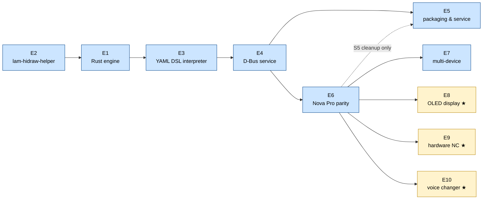

# v3 Backlog

---

## Conventions

**Static checks before every commit**

Run `cargo fmt --all -- --check`, `cargo clippy --all-targets -- -D warnings`, and `cargo test --all` (in that order) before committing any Rust change. A commit that breaks any of these three is not acceptable.

**Testing policy**

- Every story must ship with unit tests covering its logic. A story without meaningful tests is not done.
- Unit tests must not touch real hardware or spawn real OS processes. The `lam-hidraw-helper` is mocked in tests (see E2-S6).
- Integration tests (full stack against a real device) are performed manually. No automated integration test suite.
- "Meaningful" means the test would catch a real regression, not just assert `true`. Tests that only verify that a function returns without panicking are not sufficient on their own.

**Completing a story** means the feature works end-to-end with no stubs or `TODO` comments left in the code. If a story is blocked mid-implementation because a dependency that was not anticipated turns up, it must **not** be marked done. Instead:

1. Leave the story unchecked.
2. Add a note directly under it in the checklist:
   ```
   - [ ] [EX-SY] Story title
     > Blocked: depends on [EZ-SW] — <one line explaining what is missing>
   ```
3. Resolve the block as soon as the dependency is completed, then close the story.

This keeps the checklist honest and makes blocked work immediately visible without digging through code or commit history.

---

## Epics and Stories

- [x] **[E1] Rust engine foundation**
  - [x] [E1-S1] Cargo workspace
  - [x] [E1-S2] HID transport layer
  - [x] [E1-S3] USB hot-plug detection
  - [x] [E1-S4] Device init sequence executor
  - [x] [E1-S5] Async event loop
  - [x] [E1-S6] Structured logging and error handling
- [ ] **[E2] Privileged HID helper (`lam-hidraw-helper`)**
  - [x] [E2-S1] Unix domain socket server
  - [x] [E2-S2] Peer credential validation
  - [x] [E2-S3] VID allowlist enforcement
  - [x] [E2-S4] File descriptor passing
  - [x] [E2-S5] Installation and `setcap` instructions
  - [x] [E2-S6] Test mock for `lam-hidraw-helper`
- [ ] **[E3] YAML DSL interpreter**
  - [x] [E3-S1] Base file inheritance (`extends:`)
  - [x] [E3-S2] Struct serialization and deserialization
  - [x] [E3-S3] API execution
  - [x] [E3-S4] Transform evaluation
  - [x] [E3-S5] Builtin transforms
  - [x] [E3-S6] Sync event dispatcher
  - [x] [E3-S7] Sync read (startup bulk poll)
  - [x] [E3-S8] Lifecycle hook executor
- [ ] **[E4] D-Bus service**
  - [ ] [E4-S1] `zbus` session bus service
  - [ ] [E4-S2] `GetStatus` and status signals
  - [ ] [E4-S3] `GetSettings` and `SetSettings`
  - [ ] [E4-S4] Device online/offline signals
  - [ ] [E4-S5] `ReloadConfigs`
  - [ ] [E4-S6] Version property and mismatch detection
- [ ] **[E5] systemd user service and packaging**
  - [ ] [E5-S1] systemd user service unit
  - [ ] [E5-S2] Helper installation target
  - [ ] [E5-S3] AUR package update
  - [ ] [E5-S4] Migration guide from v2
  - [ ] [E5-S5] Python engine cleanup
  - [ ] [E5-S6] README and docs refresh
  - [ ] [E5-S7] RPM spec for Fedora and Bazzite *(stretch)*
- [ ] **[E6] Nova Pro Wireless — full protocol parity**
  - [ ] [E6-S1] Rewrite `nova_pro_wireless.yaml`
  - [ ] [E6-S2] Write `base_arctis_nova_pro_wireless.yaml`
  - [ ] [E6-S3] 10-band custom EQ
  - [ ] [E6-S4] EQ preset selection
  - [ ] [E6-S5] Line out mode and stream mix
  - [ ] [E6-S6] OLED settings (brightness, dim timer, home screen type)
  - [ ] [E6-S7] Bluetooth startup default and call behavior
  - [ ] [E6-S8] Fix status parsing gaps
  - [ ] [E6-S9] Save to flash
- [ ] **[E7] Multi-device support**
  - [ ] [E7-S1] Spec-to-YAML conversion script
  - [ ] [E7-S2] Arctis Nova 7 family
  - [ ] [E7-S3] Arctis Nova Pro (wired)
  - [ ] [E7-S4] Arctis Nova 5 and Nova Elite
  - [ ] [E7-S5] Arctis 7+ family
  - [ ] [E7-S6] Bootloader and upgrade PID registration
  - [ ] [E7-S7] Device compatibility matrix
- [ ] **[E8] OLED display** *(stretch)*
  - [ ] [E8-S1] `draw_bitmap` API
  - [ ] [E8-S2] `reload_display` API
  - [ ] [E8-S3] `transform_image_to_column_packed` builtin
  - [ ] [E8-S4] D-Bus `DrawBitmap` method
  - [ ] [E8-S5] Static image display from file
  - [ ] [E8-S6] Animated GIF playback
- [ ] **[E9] Hardware noise cancelling** *(stretch)*
  - [ ] [E9-S1] Write command reverse engineering
  - [ ] [E9-S2] ANC / transparent mode setting
  - [ ] [E9-S3] Transparent level setting
  - [ ] [E9-S4] GUI integration
- [ ] **[E10] AI voice changer integration** *(stretch)*
  - [ ] [E10-S1] Merge `feature/voice-changer` into `feature/v3`
  - [ ] [E10-S2] Subscribe to engine mic state signals
  - [ ] [E10-S3] Expose VC state on D-Bus
  - [ ] [E10-S4] Guided calibration persistence

---

## Dependency graph

E5-S1–S4 (packaging basics) and E6 are parallel after E4. E5-S5 (Python cleanup) is gated on E6 being validated on real hardware, shown as a dashed edge.



---

## [E1] Rust engine foundation

The Rust engine replaces `core.py` as the process that owns HID communication, device state, and the main event loop. Everything else (GUI, voice changer, PipeWire management) continues to run in Python and communicates with the engine via D-Bus.

- **[E1-S1] Cargo workspace**
  Set up a Cargo workspace with three crates: `engine` (main binary), `device-config` (YAML parsing and DSL types), `hid-transport` (HID I/O abstraction). Add CI build and `cargo clippy` / `cargo test` checks.

- **[E1-S2] HID transport layer**
  Implement an async HID transport using the `hidapi` crate with the `hidraw` backend. Expose two operations on an open file descriptor: `write(report: &[u8])` and `read() -> Vec<u8>` with a configurable timeout. Support both `HID_IO` (64-byte interrupt reports) and `HID_FEATURE` (up to 1024 bytes) chunk types.
  Wire `hidapi = { workspace = true }` into `hid-transport/Cargo.toml` and uncomment the `libudev-dev` install step in `.github/workflows/rust-ci.yaml`.
  > Requires system package: `libudev-dev` (Debian/Ubuntu), `systemd-devel` (Fedora), `udev` (Arch).

- **[E1-S3] USB hot-plug detection**
  Use `tokio-udev` to subscribe to kernel `add`/`remove` udev events. On `add`, check VID against the SteelSeries allowlist (`0x1038`) and PID against the loaded device configs; if matched, trigger device initialisation. On `remove`, trigger device shutdown and clear state.
  Wire `tokio-udev = { workspace = true }` into `engine/Cargo.toml`.
  > Requires system package: same `libudev-dev` / `systemd-devel` / `udev` as E1-S2.

- **[E1-S4] Device init sequence executor**
  Parse the `device_init` byte sequence from the device config and send each command to the device over HID, respecting `time_between_commands_ms` between writes. Support the `init_sleep_ms` delay before the sequence starts (some devices need time after USB enumeration).

- **[E1-S5] Async event loop**
  Implement the main tokio runtime: one task per connected device, each running a read loop on the sync interface. Dispatch incoming reports to the sync event system (E3). Handle concurrent devices without blocking.

- **[E1-S6] Structured logging and error handling**
  Integrate `tracing` for structured logs with configurable level via environment variable. Define an `EngineError` enum covering HID I/O failures, config parse errors, and protocol violations. Ensure all errors are logged with context before the engine continues or exits cleanly.

---

## [E2] Privileged HID helper (`lam-hidraw-helper`)

A minimal standalone binary that holds `CAP_DAC_OVERRIDE` and is the only process that opens `/dev/hidraw*` nodes. The engine requests file descriptors from it; once the fd is passed, the helper has no further involvement in I/O.

- **[E2-S1] Unix domain socket server**
  The helper listens on a fixed socket path (e.g. `$XDG_RUNTIME_DIR/lam-hidraw-helper.sock`). It accepts one connection at a time. On startup it creates the socket, sets permissions to `700`, and enters the accept loop.

- **[E2-S2] Peer credential validation**
  On each accepted connection, call `getsockopt(SO_PEERCRED)` to retrieve the connecting process's UID. Reject connections from any UID other than the helper's own UID (i.e. only the engine process, running as the same user, may connect).

- **[E2-S3] VID allowlist enforcement**
  Before opening any `/dev/hidraw*` node, read `/sys/class/hidraw/hidrawN/device/idVendor` for the requested device. Reject the request if the VID is not in the compiled-in allowlist (`0x1038`). Additionally, verify that the parent USB device has at least one interface with `bInterfaceClass == 01` (USB Audio): headsets always have an audio interface; SteelSeries keyboards do not, so this prevents the helper from being used to open keyboard HID nodes even when the VID matches.

- **[E2-S4] File descriptor passing**
  Open the validated hidraw node with `O_RDWR` and pass the resulting fd to the engine over the Unix socket using `sendmsg` with `SCM_RIGHTS`. Close the local fd after passing. The engine then owns the fd for all subsequent I/O.

- **[E2-S5] Installation and `setcap` instructions**
  Document and script the one-time setup: install the helper binary to `/usr/local/libexec/lam-hidraw-helper`, set ownership to `root:root` with mode `755`, and run `setcap cap_dac_override+eip` on it. Provide an install Makefile target and an AUR PKGBUILD hook.

- **[E2-S6] Test mock for `lam-hidraw-helper`**
  Provide a test double binary (or a Rust test fixture) that speaks the same Unix socket protocol as the real helper but, instead of opening `/dev/hidraw*`, creates a `socketpair(AF_UNIX, SOCK_SEQPACKET)` and passes one end as the fake fd. The other end is held by the test harness, which can inject raw HID reports (to simulate device-to-host events) and capture writes (to assert the commands the engine sends). No real device is required. The mock is launched as a subprocess before each integration-style test and torn down after. Configure via the `LAM_HELPER_SOCKET` environment variable that the engine already consults at startup.

---

## [E3] YAML DSL interpreter

The interpreter loads device YAML files, resolves `extends:` inheritance, and provides the engine with typed, executable representations of all protocol elements defined in `DEVICE_DSL.md`.

- **[E3-S1] Base file inheritance (`extends:`)**
  When loading a device file that declares `extends: <name>`, load the named base file first, then deep-merge the device file on top. Lists are replaced, not appended. Constants, structs, apis, transforms, sync_events, sync_read, and lifecycle sections all participate in the merge.

- **[E3-S2] Struct serialization and deserialization**
  Parse `structs:` definitions into typed Rust structs at load time. Implement `serialize(fields) -> Vec<u8>` (for writes) and `deserialize(&[u8]) -> FieldMap` (for reads), applying `constant`, `range`, and `values` constraints. Validate constraints on both paths; log and drop malformed incoming reports rather than panicking.

- **[E3-S3] API execution**
  For each entry in `apis:`, implement `api_read(struct_name)` and `api_write(struct_name, fields)`. Route to the correct transport (`HID_IO` or `HID_FEATURE`), apply `payload_transform` if present, and handle chunked writes (multiple HID reports for payloads that exceed the chunk size).

- **[E3-S4] Transform evaluation**
  Implement the four transform types: `case_int_to_int`, `case_int_to_str`, `linear`, and `builtin`. The `builtin` type dispatches to a named Rust function registered at startup. Apply transforms lazily at event emission and sync-read mapping time.

- **[E3-S5] Builtin transforms**
  Implement the three builtins identified in the DSL spec:
  - `transform_gains_to_firmware_values`: maps 10 float32 dB values to 10 uint8 firmware values using `firmware_val = (2 × (10 + dB)).round() as u8`.
  - `transform_bitmap_sub_payload`: splits a column-packed bitmap into one or two HID FEATURE payloads depending on whether the data exceeds 512 bytes.
  - `transform_image_to_column_packed`: converts a row-major 1-bit bitmap to column-packed LSB-y-flipped format required by the OLED controller.

- **[E3-S6] Sync event dispatcher**
  At runtime, when a report arrives on the sync interface, extract byte 1 as the command byte and look it up in the `sync_events:` table. Extract declared fields, apply transforms, and emit the named D-Bus signal. Execute any `side_effects` in order.

- **[E3-S7] Sync read (startup bulk poll)**
  On device init (after the init sequence), iterate `sync_read:` entries in order. For each, call the associated API read, map response fields to engine state events using declared transforms, and emit the corresponding D-Bus signals. This populates the full initial state visible to GUI clients.

- **[E3-S8] Lifecycle hook executor**
  Implement `run_lifecycle(hook: &str)` that looks up the named hook (`init`, `post_init`, `shutdown`) and executes each call in the list sequentially. Built-in calls (`enable_sonar`, `disable_chatmix`, `save_to_flash`, etc.) are dispatched to named Rust functions.

---

## [E4] D-Bus service

Exposes the engine's state and settings to GUI clients and CLI tools on the session bus. The interface names and method signatures are unchanged from v2 so no client-side changes are required.

- **[E4-S1] `zbus` session bus service**
  Register the well-known bus name `name.giacomofurlan.ArctisManager.Next` on the session bus using `zbus`. Implement the `Settings`, `Status`, and `Config` interfaces at their existing object paths. No polkit policy is required because the service runs in the user session.

- **[E4-S2] `GetStatus` and status signals**
  Maintain an in-memory device state map updated by sync events and sync read. Serve `GetStatus` from this map. Emit a `StatusChanged` signal whenever any field changes, so clients can react without polling.

- **[E4-S3] `GetSettings` and `SetSettings`**
  `GetSettings` returns the current settings values together with their DSL-derived config (type, range, valid values) so the GUI can render controls dynamically without hardcoded knowledge of device capabilities. `SetSettings` validates the value against the config, calls the corresponding API write, and if the device declares `save_to_flash`, sends the flash command immediately after.

- **[E4-S4] Device online/offline signals**
  Emit `DeviceConnected(product_id, name, capabilities[])` when a device completes its init sequence and `DeviceDisconnected(product_id)` when it is removed. Clients use the capabilities list to show or hide feature sections in the UI.

- **[E4-S5] `ReloadConfigs`**
  Re-read all YAML files from disk without restarting the engine. Useful during development. If a connected device's config changed, re-run the init sequence.

- **[E4-S6] Version property and mismatch detection**
  Expose a `Version` read-only property on the main D-Bus interface returning the daemon's semver string (sourced from `Cargo.toml` at compile time via `env!("CARGO_PKG_VERSION")`). The GUI already reads this property and shows a warning in the footer when the daemon version differs from the UI version. Verify that the v3 daemon exposes the property under the same interface path and with the same type signature (`s`) as the v2 Python implementation so the existing mismatch UI works without modification.

---

## [E5] systemd user service and packaging

Makes the engine trivial to install, start, and keep running across reboots without requiring root or system-level service management.

- **[E5-S1] systemd user service unit**
  Write `lam-daemon.service` targeting the user session (`[Install] WantedBy=default.target`). Set `Restart=on-failure` and `RestartSec=2`. Document enabling with `systemctl --user enable --now lam-daemon`.

- **[E5-S2] Helper installation target**
  Add a `make install-helper` target (or equivalent) that copies `lam-hidraw-helper` to `/usr/local/libexec/`, sets ownership and permissions, and runs `setcap`. Require `sudo` only for this step.

- **[E5-S3] AUR package update**
  Update the existing AUR `PKGBUILD` to build the Rust engine, install the helper with correct permissions, and install the systemd user unit. Remove the udev rule from the package since it is no longer required.

- **[E5-S4] Migration guide from v2**
  Write a short migration note: stop the v2 service, install v3, run `make install-helper`, enable the new unit. Note that existing device YAML files in `~/.config/arctis_manager/devices/` are superseded by the bundled v3 files and should be removed.

- **[E5-S5] Python engine cleanup**
  Once `lam-daemon` is functional and the D-Bus interface is validated end-to-end, remove the Python engine layer that it replaces. Specifically: delete `core.py`, `config.py`, `status_parser_fn.py`, `eq_manager.py`, `app_matcher.py`, `cli_tools.py`, `dbus_service.py`, and `constants.py`. Remove the `usb` and `pyserial` dependencies from `pyproject.toml`. Keep `gui/`, `eq_preset.py`, `ai_deps.py`, and the voice changer modules untouched — they remain in Python. Update the `lam-gui` entry point to connect to the session bus (replacing the in-process engine startup it currently does) and remove the `--no-daemon` / `--daemon` CLI flags that are no longer meaningful.

- **[E5-S6] README and docs refresh**
  Update `README.md` to describe v3: new prerequisites (`lam-hidraw-helper` + `setcap`), installation steps, D-Bus interface overview, supported devices list, and a link to `DEVICE_DSL.md` for adding new devices. Remove or rewrite any section that references the v2 Python engine. Audit `docs/`: retire files that described v2-only concerns (e.g. old architecture notes, the old status-parser reference if present), and confirm that `ARCHITECTURE.md`, `DEVICE_DSL.md`, and `dbus.md` are accurate against the shipped code.

- **[E5-S7] RPM spec for Fedora and Bazzite** *(stretch)*
  Write an RPM `.spec` file for `lam-daemon` and `lam-hidraw-helper`. Target Fedora 40+ and Bazzite (which uses Fedora RPM infrastructure). The spec must: build from source via `cargo build --release`, install the helper with `%caps(cap_dac_override=eip)` in the `%files` section (Fedora's RPM macros honour this), install the systemd user unit under `%{_userunitdir}`, and declare `Requires: systemd`. Submit to COPR as the initial distribution channel; provide a one-liner install command in the README.

---

## [E6] Nova Pro Wireless — full protocol parity

Rewrite the Nova Pro Wireless YAML using the new DSL and implement every feature defined in the official spec. This device is the reference implementation: passing it validates the entire DSL interpreter.

- **[E6-S1] Rewrite `nova_pro_wireless.yaml`**
  Replace the existing file with a device file that extends `base_arctis_nova_pro_wireless.yaml`. Include all three product ID variants (standard `0x12E0`, Xbox `0x12E5`, Xbox White `0x225D`) with their respective bootloader PIDs.

- **[E6-S2] Write `base_arctis_nova_pro_wireless.yaml`**
  Full base file covering all structs, APIs, transforms, sync events, sync read, and lifecycle hooks as documented in `DEVICE_DSL.md`. This is the complete translation of `base_arctis_nova_pro_wireless.device`.

- **[E6-S3] 10-band custom EQ**
  Implement `eq_10band` capability: `custom_eq` struct (10 × float32 gain fields), `custom_eq` API write with `transform_gains_to_firmware_values` builtin, sync event `0x33` dispatch for on-device EQ band changes, and sync read mapping from `audio_settings`.

- **[E6-S4] EQ preset selection**
  Implement `eq_preset` capability: `selected_eq_preset` struct and API write (cmd `0x2E`), sync event `0x2E` dispatch, 19 preset slots (0 = Flat … 18 = last game EQ). Expose as a discrete setting on D-Bus.

- **[E6-S5] Line out mode and stream mix**
  Implement `line_out_mode` (cmd `0x43`, ChatMix vs Stream Mix) and `stream_mix` (cmd `0x47`, three independent levels: main / aux / mic). Both have sync events and are included in the startup sync read from `audio_settings`.

- **[E6-S6] OLED settings (brightness, dim timer, home screen type)**
  Implement the three UX settings for the GameDAC OLED display: `oled_brightness` (cmd `0x85`, 1–10), `oled_dim_timer` (cmd `0x83`, six durations), `home_screen_type` (cmd `0x89`, detailed vs simple). All three are readable from `ux_settings` and have sync events.

- **[E6-S7] Bluetooth startup default and call behavior**
  Implement `bluetooth_startup` (cmd `0xB2`, power-on default) and `bt_call_behavior` (cmd `0xB3`, do nothing / −12 dB attenuation / mute all other audio). Both are readable from `wireless_settings`.

- **[E6-S8] Fix status parsing gaps**
  Correct the four incomplete status field mappings identified in the v2 analysis:
  - `bt_connection_mode`: add states `2` (pairing) and `4` (link mode).
  - `bt_connection_status`: add states `4` (busy) and `8` (error).
  - `radio_connection_status`: add state `2` (searching).
  - `headset_batt_status`: add state `4` (fully charged, not charging).

- **[E6-S9] Save to flash**
  Send `save_to_flash` (cmd `0x09`) after every successful `SetSettings` call for this device. This persists the new value to device NVRAM so it survives a power cycle. The existing v2 engine never sent this command.

---

## [E7] Multi-device support

Extend coverage to all Arctis headset families present in the official spec, starting from families closest to the Nova Pro Wireless (shared base protocol) and working outward.

- **[E7-S1] Spec-to-YAML conversion script**
  Write a one-shot Python script that reads the decoded `.device` files, extracts PID/VID pairs, include chains, and top-level struct/API names, and emits YAML stubs for each device. Output requires manual review and completion but eliminates the mechanical parts of the translation.

- **[E7-S2] Arctis Nova 7 family**
  Write base and device files for Nova 7, Nova 7X, Nova 7P, and their Gen2 / upgrade variants. Key difference: `battery_discrete_5step` (0/25/50/75/100%) on original vs `battery_percentage` (1–100%) on Gen2. Cover all SKU variants (Diablo IV, WoW editions).

- **[E7-S3] Arctis Nova Pro (wired)**
  Translate the existing `nova_pro_wired.yaml` to the new DSL. Wired device has no wireless_settings struct; validate that sync events and capabilities reflect this correctly.

- **[E7-S4] Arctis Nova 5 and Nova Elite**
  Translate the existing YAML files for these simpler devices. Confirm capability lists are minimal (no OLED, no wireless settings, no chatmix).

- **[E7-S5] Arctis 7+ family**
  Translate the existing `arctis_7_plus.yaml` and verify against the spec files for the 7+ and its variants.

- **[E7-S6] Bootloader and upgrade PID registration**
  Ensure every device file registers its bootloader PID(s). Implement the engine-side logic that detects a bootloader PID, marks the device as `firmware_update_mode`, suppresses D-Bus settings exposure, and emits a `DeviceFirmwareUpdateMode` signal.

- **[E7-S7] Device compatibility matrix**
  Maintain `docs/device_support.md` with a table listing all supported devices, their PID(s), supported capabilities, and known gaps. Auto-generate the table from the YAML files as part of the CI build.

---

## [E8] OLED display *(stretch)*

Exposes the GameDAC OLED (128×64, monochromatic) as a writable surface via D-Bus. Available only on devices that declare the `oled_draw` capability.

- **[E8-S1] `draw_bitmap` API**
  Implement the `draw_bitmap` struct (cmd `0x93`) and the `transform_bitmap_sub_payload` builtin. For images whose data exceeds 512 bytes, split into two HID FEATURE reports covering the left and right halves of the image respectively, as specified in the `sub-payload` function of the spec.

- **[E8-S2] `reload_display` API**
  Implement the `reload_display` struct (cmd `0x95`, HID_IO, 64 bytes). Always call this after a `draw_bitmap` sequence to commit the frame to the panel.

- **[E8-S3] `transform_image_to_column_packed` builtin**
  Convert a row-major 1-bit bitmap (width × height bytes, 1 bit per pixel) to column-packed LSB-y-flipped format: for each column, pack the pixels of that column into bytes with bit 0 at the top row, padding the column height to the nearest multiple of 8.

- **[E8-S4] D-Bus `DrawBitmap` method**
  Add `DrawBitmap(x: u8, y: u8, width: u8, height: u8, data: Vec<u8>)` to the D-Bus `Status` interface. Accepts a raw 1-bit row-major bitmap; the engine applies the column-packed transform internally before sending to the device.

- **[E8-S5] Static image display from file**
  Add a `DisplayImage(path: String)` D-Bus method. Load the image using the `image` crate, resize to fit the drawable area (128×52 if preserving the status bar, 128×64 for full screen), dither to 1-bit using Floyd-Steinberg, and call the draw pipeline.

- **[E8-S6] Animated GIF playback**
  Add a `PlayGif(path: String, loop: bool)` D-Bus method. Decode GIF frames using the `image` crate, convert each frame to 1-bit, and transmit them in sequence at the GIF's declared frame delay. Given the HID timing constraints (`time_between_commands_ms: 50`, 3 commands per frame), expect a practical ceiling of 5–7 fps. Run the animation loop in a background task; a subsequent `StopAnimation` call or a new `PlayGif`/`DisplayImage` call cancels it.

---

## [E9] Hardware noise cancelling *(stretch)*

The official spec exposes `transparency_mode` (off / transparent / ANC) as a readable field in `wireless_settings` but does not define a direct write command for it in the TX spec files. This epic covers the reverse engineering and implementation of the write path.

- **[E9-S1] Write command reverse engineering**
  Capture USB traffic on Windows while toggling ANC/transparent mode in SteelSeries GG. Identify the HID command that changes `transparency_mode` and `transparent_level`. Document the findings and add the struct and API to `base_arctis_nova_pro_wireless.yaml`.

- **[E9-S2] ANC / transparent mode setting**
  Once the write command is confirmed, implement the `noise_cancelling` capability write path: expose a discrete setting (off / transparent / ANC) on D-Bus via `SetSettings`. Read the current mode from `wireless_settings` on startup via sync read.

- **[E9-S3] Transparent level setting**
  Implement the `transparent_level` capability write path: a 1–10 slider. Only active when `transparency_mode` is set to transparent. Read initial value from `wireless_settings`.

- **[E9-S4] GUI integration**
  Update the existing `nc_widget.py` to use the new D-Bus settings rather than the v2 status-only approach. Show the mode selector and the level slider; disable the slider when mode is off or ANC.

---

## [E10] AI voice changer integration *(stretch)*

The voice changer (RVC-based, PipeWire-backed) was developed on `feature/voice-changer` and merges into v3. The integration work is limited to connecting the Python voice changer process to the v3 engine's D-Bus signals.

- **[E10-S1] Merge `feature/voice-changer` into `feature/v3`**
  Rebase or merge the voice changer branch. Resolve any conflicts with changes made in v3 to the PipeWire pipeline management and D-Bus wrapper.

- **[E10-S2] Subscribe to engine mic state signals**
  Update the voice changer process to listen for `StatusChanged` events on the v3 D-Bus interface instead of reading the Python engine's internal state. React to `mic_status` (muted/unmuted) and `DeviceDisconnected` to pause or stop the VC pipeline appropriately.

- **[E10-S3] Expose VC state on D-Bus**
  Add a `VoiceChanger` interface to the D-Bus service (or extend the existing one) with methods `Enable`, `Disable`, `SetModel(path)`, and a `VoiceChangerStateChanged` signal. This allows the GUI's VC widget to control the Python VC process via the same D-Bus connection it uses for device settings, without a separate IPC channel.

- **[E10-S4] Guided calibration persistence**
  Ensure the calibration data (speaker embedding, pitch statistics) written by the calibration wizard is stored in `~/.config/arctis_manager/vc_calibration/` and survives engine restarts. Validate on startup that the calibration file matches the current model; emit a warning signal if stale.
