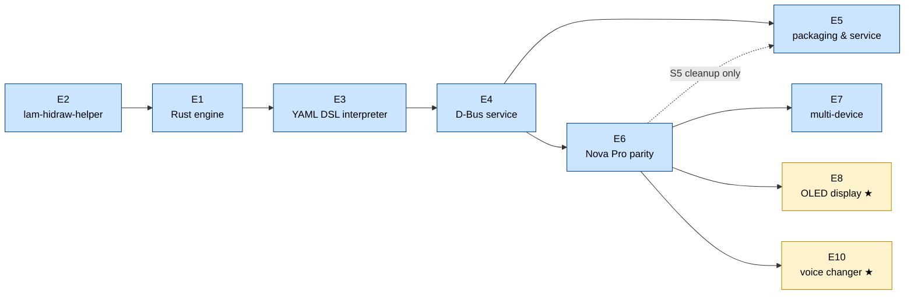

# v3 Backlog

---

## Conventions

**Static checks before every commit**

Run `cargo fmt --all -- --check`, `cargo clippy --all-targets -- -D warnings`, and `cargo test --all` (in that order) before committing any Rust change. A commit that breaks any of these three is not acceptable.

**Testing policy**

- Every story must ship with unit tests covering its logic. A story without meaningful tests is not done.
- Unit tests must not touch real hardware or spawn real OS processes. The `lam-hidraw-helper` is mocked in tests (see E2-S6).
- Integration tests (full stack against a real device) are performed manually. No automated integration test suite.
- "Meaningful" means the test would catch a real regression, not just assert `true`. Tests that only verify that a function returns without panicking are not sufficient on their own.

**Completing a story** means the feature works end-to-end with no stubs or `TODO` comments left in the code. If a story is blocked mid-implementation because a dependency that was not anticipated turns up, it must **not** be marked done. Instead:

1. Leave the story unchecked.
2. Add a note directly under it in the checklist:
   ```
   - [ ] [EX-SY] Story title
     > Blocked: depends on [EZ-SW] — <one line explaining what is missing>
   ```
3. Resolve the block as soon as the dependency is completed, then close the story.

This keeps the checklist honest and makes blocked work immediately visible without digging through code or commit history.

---

## Epics and Stories

- [x] **[E1] Rust engine foundation**
  - [x] [E1-S1] Cargo workspace
  - [x] [E1-S2] HID transport layer
  - [x] [E1-S3] USB hot-plug detection
  - [x] [E1-S4] Device init sequence executor
  - [x] [E1-S5] Async event loop
  - [x] [E1-S6] Structured logging and error handling
- [x] **[E2] Privileged HID helper (`lam-hidraw-helper`)**
  - [x] [E2-S1] Unix domain socket server
  - [x] [E2-S2] Peer credential validation
  - [x] [E2-S3] VID allowlist enforcement
  - [x] [E2-S4] File descriptor passing
  - [x] [E2-S5] Installation and `setcap` instructions
  - [x] [E2-S6] Test mock for `lam-hidraw-helper`
- [x] **[E3] YAML DSL interpreter**
  - [x] [E3-S1] Base file inheritance (`extends:`)
  - [x] [E3-S2] Struct serialization and deserialization
  - [x] [E3-S3] API execution
  - [x] [E3-S4] Transform evaluation
  - [x] [E3-S5] Builtin transforms
  - [x] [E3-S6] Sync event dispatcher
  - [x] [E3-S7] Sync read (startup bulk poll)
  - [x] [E3-S8] Lifecycle hook executor
- [x] **[E4] D-Bus service**
  - [x] [E4-S1] `zbus` session bus service
  - [x] [E4-S2] `GetStatus` and status signals
  - [x] [E4-S3] `GetSettings` and `SetSettings`
  - [x] [E4-S4] Device online/offline signals
  - [x] [E4-S5] `ReloadConfigs`
  - [x] [E4-S6] Version property and mismatch detection
- [ ] **[E5] systemd user service and packaging**
  - [x] [E5-S1] systemd user service unit
  - [x] [E5-S2] Helper installation target
  - [x] [E5-S3] AUR package update
  - [x] [E5-S4] Migration guide from v2
  - [ ] [E5-S5] Python engine cleanup
    > Deliberately deferred: keep the old Python v2 device YAML files (`src/linux_arctis_manager/devices/`) as a cross-check reference for the new-DSL conversions in [E7] — a real discrepancy already caught a bug on the Nova Pro Wireless. Do the rest of the cleanup once E7's device ports are done and the comparison is no longer needed.
  - [x] [E5-S6] README and docs refresh
  - [ ] [E5-S7] RPM spec for Fedora and Bazzite *(stretch)*
    > Spec is written and builds locally (`make container-build-rpm`); not yet submitted to COPR, so README points users at the local build instead of a `dnf copr` one-liner.
- [ ] **[E6] Nova Pro Wireless — full protocol parity**
  - [x] [E6-S1] Rewrite `nova_pro_wireless.yaml`
  - [x] [E6-S2] Write `base_arctis_nova_pro_wireless.yaml`
  - [x] [E6-S3] 10-band custom EQ
  - [x] [E6-S4] EQ preset selection
  - [x] [E6-S5] Line out mode and stream mix
  - [x] [E6-S6] OLED settings (brightness, dim timer, home screen type)
  - [x] [E6-S7] Bluetooth startup default and call behavior
  - [x] [E6-S8] Fix status parsing gaps
  - [x] [E6-S9] Save to flash
- [ ] **[E7] Multi-device support**
  - [ ] [E7-S1] Spec-to-YAML conversion script
  - [x] [E7-S2] Arctis Nova 7 family (gen1 + gen2/upgrade protocol, see [E7-S11])
  - [x] [E7-S3] Arctis Nova Pro (wired)
  - [x] [E7-S4] Arctis Nova 5 and Nova Elite
  - [ ] [E7-S5] Arctis 7+ family
    > Not done here: RF/BT `pairing_mode` (found in the spec, all tiers) has no D-Bus exposure — the DSL has no "fire and forget action" primitive yet, only value-bearing settings and internal lifecycle calls. Struct/API are declared and ready to dispatch once that lands. Everything else in the story (mic, sidetone, EQ, battery, chatmix, connection sync) is complete and tested.
  - [x] [E7-S6] Bootloader and upgrade PID registration
  - [x] [E7-S7] Device compatibility matrix
  - [x] [E7-S8] Nova 5 parametric EQ
  - [x] [E7-S9] Action-command DSL primitive
  - [x] [E7-S10] Nova Elite EQ (named-slot presets — write done, readback deferred)
  - [x] [E7-S11] Nova 7 Gen2 + upgrade-firmware protocol (EQ write and readback both done)
  - [x] [E7-S12] Signed 8-bit field type (`int8`)
  - [x] [E7-S13] Arctis Nova Pro Omni
  - [x] [E7-S14] Generic YAML-parameterized EQ builtins
  - [x] [E7-S15] Arctis Nova 3 / 3X Wireless
  - [x] [E7-S16] Arctis Nova 4 / 4X
  - [x] [E7-S17] Arctis Nova 3 (wired)
- [ ] **[E8] OLED display** *(stretch)*
  - [ ] [E8-S1] `draw_bitmap` API
  - [ ] [E8-S2] `reload_display` API
  - [ ] [E8-S3] `transform_image_to_column_packed` builtin
  - [ ] [E8-S4] D-Bus `DrawBitmap` method
  - [ ] [E8-S5] Static image display from file
  - [ ] [E8-S6] Animated GIF playback

  > [E9] Hardware noise cancelling — dropped. ANC/transparent mode is handled directly by the headset firmware, not the daemon; nothing to implement here.
- [x] **[E10] AI voice changer port to Rust** *(stretch)*
  - [x] [E10-S1] Generic source listing (`GetListOptions("pulse_audio_sources")`), close the pulsectl leak in NC/mic/sidetone GUI panels
  - [x] [E10-S2] `vc_config.rs` (settings persistence) + `vc_ladspa_chain.rs` (LADSPA filter-chain, mirrors `nc_manager.rs`)
  - [x] [E10-S3] `vc_models.rs` (local model scan/delete) + `vc_hf_client.rs` (HuggingFace search/download, `.pth` and `.zip`) + `vc_base_models.rs` (RMVPE/ContentVec download + SHA-256 verification)
  - [x] [E10-S4] `vc_calibration.rs` — guided calibration state machine (`pw-record` subprocess), same lifecycle as the Python `CalibrationSession`. Recording and rendering both done; see [E10-S6b].
  - [x] [E10-S5a] `VcInterface` D-Bus service (`...Next.VC`) + `mic_router` hookup (VC output takes priority over NC per the existing `mic_router.rs` comment)
  - [x] [E10-S5b] Cut GUI (`vc_widget.py`, `vc_calibration_wizard.py`, `dbus_wrapper.py`) over from the legacy Python daemon's VC service to the Rust engine's `VcInterface` — live-verified against a real device
  - [x] [E10-S6a] `vc/inference/` — unified `ort`-based engine (ContentVec, RMVPE, synthesizer) replacing the separate PyTorch/OpenVINO backends, execution-provider selection (`providers.rs`), native mel-spectrogram (`mel.rs`), brute-force k-NN retrieval (`retrieval.rs`) replacing the `libfaiss` dependency, and the sliding-window streaming state machine (`pipeline.rs`) tying it all together — end-to-end live-verified (real audio in, real synthesis out, no crashes/NaNs) and now **acoustically verified**: output spectrally matches the pre-existing Python reference on the same input/model (see the dedicated note below). Two real gaps found along the way: `providers.rs`'s CUDA fallback not covering a registered-but-then-failing provider (missing `libcudnn.so`) is **fixed** (`engine::init_runtime` now self-heals a pip-installed cuDNN, and `DetectOnnxRuntime`/the GUI guide the user when it's genuinely absent); `retrieval.rs`'s brute-force k-NN being far too slow for real-time use on real-sized indexes is tracked as a follow-up, not fixed here.
  - [x] [E10-S6b] `render_start`/`render_blocking` + D-Bus/settings/GUI wiring — the render engine (fresh `Pipeline` per candidate over the recording at the live chain's hop cadence, writes `variant_<label>.wav`, transitions `Recorded → Rendering → Done`) is live-verified; `CalibrationStartRender` now actually calls it, resolving the model + persisted `RvcConfig` tuning and picking a pitch pre-scan round (`propose_pitch_variants`) or a dynamics round (`propose_variants`) from the request; `vc_config.rs`'s new `VcSettings`/`RvcConfig`/`RvcModelSnapshot` are the persisted RVC settings (model, pitch, tuning) that were missing; `vc_calibration_wizard.py` now drives the two-stage pitch-then-dynamics flow with dynamically-sized variant lists instead of 3 hardcoded rows. The synthesizer's native sample rate — previously an explicit required parameter, since nothing could derive it from a `.onnx` file — is now auto-detected via a `sample_rate` custom metadata key `export_onnx.py` stamps onto the exported graph (`SynthSession::native_sample_rate()`), with per-model manual entry (`RvcModelSnapshot::sample_rate_override`) as the last-resort fallback for an `.onnx` exported before that existed.
    Also closes the manual-export gap the above depends on: `vc_export.rs` + `VcInterface`'s `GetExportDepsStatus`/`InstallExportDeps`/`EnsureModelExported` run `export_onnx.py` automatically (right after a download completes, or the first time an unexported model is selected), with a consent-gated `torch`/`numpy`/`onnx` install into a slim per-user venv when needed — no more manual terminal invocation. See the dedicated paragraph below.
    > Model conversion (`.pth` → ONNX) stays a one-shot offline Python script, not a daemon runtime dependency. See `docs/voice-changing-feature.md` for the full design.
  - [x] [E10-S7] Guided `libonnxruntime` install helper — per-distro/vendor plain-text tutorials + a GPU-detect + verify D-Bus flow, replacing the old `DetectGPU`/`InstallAIDeps` stubs — live-verified on the real dev machine (Fedora + NVIDIA correctly detected, matching tutorial selected)
  - [x] [E10-S8] Wire the *live* VC chain to the [E10-S6a] engine — distinct from [E10-S6b] (calibration render, offline, one recording in/out): this is the real-time path a live call actually uses. New `rvc_live_chain.rs`, a direct port of `voice_changer/rvc/rvc_chain.py`'s architecture: `pw-record` (stereo capture, downmixed by averaging) feeds a `spawn_blocking` inference loop (`Pipeline::convert` per 128 ms hop) writing into `pacat`, playing into a new `Arctis_VC_Sink` null sink whose `.monitor` `mic_router` points `Arctis_Manager_Mic` at (VC still wins over NC). `SetVCSettings` now actually builds this chain when `mode: "rvc"` and `enabled: true`, resolving the model the same way `CalibrationStartRender` already does (found, exported, a working onnxruntime), tearing it down on any mode/enabled change. `GetRVCMetrics`/`SetRVCLiveParams` are real D-Bus methods now: metrics report actual operational numbers (hops processed, rolling-average per-hop latency, last error — no per-hop quality auto-tuner exists on this engine yet, so this is real data instead of a fake stub); live params push to the running `Pipeline` via a new `set_params` without a chain rebuild. Known limitation carried from the calibration render path: FAISS retrieval is only loaded once at chain-build time — turning `index_rate` on later via `SetRVCLiveParams` without it being on at build time silently has no effect. Unit-tested; a `#[ignore]`d live test (`live_apply_rvc_runs_real_inference`) exists for scripted/CI-adjacent runs. **Live-verified for real** via the pre-existing `_SidetonePreview` (`mic_widget.py`) on the real dev machine: enabling RVC mode really builds the chain (mic_router redirect, `pw-record`/`pacat` spawned), sessions now load successfully (`rvc_live: inference loop started`, hundreds of real hops processed per run). This run found and fixed four real bugs in sequence — a genuinely-missing cuDNN silently killing the inference thread with no user-facing signal; `is_active()` not noticing that death, permanently zombie-locking future settings changes into a no-op; a *silent feedback loop* (`vc_widget.py`'s Input Device combo could select the daemon's own `Arctis_Manager_Mic` as VC's capture source, since it duplicated — incompletely — the daemon's own `Arctis_*`-filtering source list logic) that produced confident-looking "chain started, hops processing" logs with no real microphone audio ever entering the pipeline; and, once a real physical mic was actually in the loop, the VAD gate itself never opening — the hardcoded thresholds assume input already normalized the way calibration *rendering* normalizes a whole recording up front, which live capture never did. Fixed with a `Pipeline::set_gate_calibration` runtime hook plus a one-time measurement of the session's own real leading noise floor, reusing `vc_dsp` tooling that already existed for calibration but had never been wired anywhere. Also added, directly requested after the second bug: every failure path (validation and background-thread alike) now sends a `LiveChainError` D-Bus signal to a persistent GUI error label, instead of only the daemon log. A fifth real bug surfaced by the same run once the first four were fixed: `pw-record --target <name>` was found to unreliably resolve by name (linked to `Arctis_Manager_Mic` instead of the requested physical mic, a second feedback loop at the PipeWire link-resolution level, distinct from the GUI source-picker one) — fixed with a new `audio::resolve_source_numeric_id`, used by both this module and `vc_calibration.rs`. Separately, directly requested: the Enable checkbox's persisted-but-not-really-acted-on-after-restart state (the reason several rounds of this debugging session needed "did you actually re-toggle it after the restart?") is now a real tri-state control (off / this session / always — new `autostart: bool` on `VcLadspaConfig`/`NcConfig`, applied at daemon startup by new `dbus::autostart_nc_and_vc`); done for VC's GUI, `nc_widget.py`'s own equivalent control is a follow-up (backend ready). See the dedicated CHANGELOG entries for all of the above. **Confirmed**: correctly-converted speech verified end to end through the real live chain.

**Manual verification: complete.** The full real-daemon + real-GUI pass (`sudo make install && systemctl --user restart lam-daemon.service`) has been run end to end: model download/selection through the consent-gated export flow, both calibration render rounds, refine, save and re-open with a confirmed `model_params` round-trip, and — closing the last open item — the live chain confirmed to carry correctly-converted speech, not just non-crashing activity. Epic closed.

---

## Dependency graph

E5-S1–S4 (packaging basics) and E6 are parallel after E4. E5-S5 (Python cleanup) is gated on E6 being validated on real hardware, shown as a dashed edge.



---

## [E1] Rust engine foundation

The Rust engine replaces `core.py` as the process that owns HID communication, device state, and the main event loop. Everything else (GUI, voice changer, PipeWire management) continues to run in Python and communicates with the engine via D-Bus.

- **[E1-S1] Cargo workspace**
  Set up a Cargo workspace with three crates: `engine` (main binary), `device-config` (YAML parsing and DSL types), `hid-transport` (HID I/O abstraction). Add CI build and `cargo clippy` / `cargo test` checks.

- **[E1-S2] HID transport layer**
  Implement an async HID transport using the `hidapi` crate with the `hidraw` backend. Expose two operations on an open file descriptor: `write(report: &[u8])` and `read() -> Vec<u8>` with a configurable timeout. Support both `HID_IO` (64-byte interrupt reports) and `HID_FEATURE` (up to 1024 bytes) chunk types.
  Wire `hidapi = { workspace = true }` into `hid-transport/Cargo.toml` and uncomment the `libudev-dev` install step in `.github/workflows/rust-ci.yaml`.
  > Requires system package: `libudev-dev` (Debian/Ubuntu), `systemd-devel` (Fedora), `udev` (Arch).

- **[E1-S3] USB hot-plug detection**
  Use `tokio-udev` to subscribe to kernel `add`/`remove` udev events. On `add`, check VID against the SteelSeries allowlist (`0x1038`) and PID against the loaded device configs; if matched, trigger device initialisation. On `remove`, trigger device shutdown and clear state.
  Wire `tokio-udev = { workspace = true }` into `engine/Cargo.toml`.
  > Requires system package: same `libudev-dev` / `systemd-devel` / `udev` as E1-S2.

- **[E1-S4] Device init sequence executor**
  Parse the `device_init` byte sequence from the device config and send each command to the device over HID, respecting `time_between_commands_ms` between writes. Support the `init_sleep_ms` delay before the sequence starts (some devices need time after USB enumeration).

- **[E1-S5] Async event loop**
  Implement the main tokio runtime: one task per connected device, each running a read loop on the sync interface. Dispatch incoming reports to the sync event system (E3). Handle concurrent devices without blocking.

- **[E1-S6] Structured logging and error handling**
  Integrate `tracing` for structured logs with configurable level via environment variable. Define an `EngineError` enum covering HID I/O failures, config parse errors, and protocol violations. Ensure all errors are logged with context before the engine continues or exits cleanly.

---

## [E2] Privileged HID helper (`lam-hidraw-helper`)

A minimal standalone binary that holds `CAP_DAC_OVERRIDE` and is the only process that opens `/dev/hidraw*` nodes. The engine requests file descriptors from it; once the fd is passed, the helper has no further involvement in I/O.

- **[E2-S1] Unix domain socket server**
  The helper listens on a fixed socket path (e.g. `$XDG_RUNTIME_DIR/lam-hidraw-helper.sock`). It accepts one connection at a time. On startup it creates the socket, sets permissions to `700`, and enters the accept loop.

- **[E2-S2] Peer credential validation**
  On each accepted connection, call `getsockopt(SO_PEERCRED)` to retrieve the connecting process's UID. Reject connections from any UID other than the helper's own UID (i.e. only the engine process, running as the same user, may connect).

- **[E2-S3] VID allowlist enforcement**
  Before opening any `/dev/hidraw*` node, read `/sys/class/hidraw/hidrawN/device/idVendor` for the requested device. Reject the request if the VID is not in the compiled-in allowlist (`0x1038`). Additionally, verify that the parent USB device has at least one interface with `bInterfaceClass == 01` (USB Audio): headsets always have an audio interface; SteelSeries keyboards do not, so this prevents the helper from being used to open keyboard HID nodes even when the VID matches.

- **[E2-S4] File descriptor passing**
  Open the validated hidraw node with `O_RDWR` and pass the resulting fd to the engine over the Unix socket using `sendmsg` with `SCM_RIGHTS`. Close the local fd after passing. The engine then owns the fd for all subsequent I/O.

- **[E2-S5] Installation and `setcap` instructions**
  Document and script the one-time setup: install the helper binary to `/usr/local/libexec/lam-hidraw-helper`, set ownership to `root:root` with mode `755`, and run `setcap cap_dac_override+eip` on it. Provide an install Makefile target and an AUR PKGBUILD hook.

- **[E2-S6] Test mock for `lam-hidraw-helper`**
  Provide a test double binary (or a Rust test fixture) that speaks the same Unix socket protocol as the real helper but, instead of opening `/dev/hidraw*`, creates a `socketpair(AF_UNIX, SOCK_SEQPACKET)` and passes one end as the fake fd. The other end is held by the test harness, which can inject raw HID reports (to simulate device-to-host events) and capture writes (to assert the commands the engine sends). No real device is required. The mock is launched as a subprocess before each integration-style test and torn down after. Configure via the `LAM_HELPER_SOCKET` environment variable that the engine already consults at startup.

---

## [E3] YAML DSL interpreter

The interpreter loads device YAML files, resolves `extends:` inheritance, and provides the engine with typed, executable representations of all protocol elements defined in `DEVICE_DSL.md`.

- **[E3-S1] Base file inheritance (`extends:`)**
  When loading a device file that declares `extends: <name>`, load the named base file first, then deep-merge the device file on top. Lists are replaced, not appended. Constants, structs, apis, transforms, sync_events, sync_read, and lifecycle sections all participate in the merge.

- **[E3-S2] Struct serialization and deserialization**
  Parse `structs:` definitions into typed Rust structs at load time. Implement `serialize(fields) -> Vec<u8>` (for writes) and `deserialize(&[u8]) -> FieldMap` (for reads), applying `constant`, `range`, and `values` constraints. Validate constraints on both paths; log and drop malformed incoming reports rather than panicking.

- **[E3-S3] API execution**
  For each entry in `apis:`, implement `api_read(struct_name)` and `api_write(struct_name, fields)`. Route to the correct transport (`HID_IO` or `HID_FEATURE`), apply `payload_transform` if present, and handle chunked writes (multiple HID reports for payloads that exceed the chunk size).

- **[E3-S4] Transform evaluation**
  Implement the four transform types: `case_int_to_int`, `case_int_to_str`, `linear`, and `builtin`. The `builtin` type dispatches to a named Rust function registered at startup. Apply transforms lazily at event emission and sync-read mapping time.

- **[E3-S5] Builtin transforms**
  Implement the three builtins identified in the DSL spec:
  - `transform_gains_to_firmware_values`: maps 10 float32 dB values to 10 uint8 firmware values using `firmware_val = (2 × (10 + dB)).round() as u8`.
  - `transform_bitmap_sub_payload`: splits a column-packed bitmap into one or two HID FEATURE payloads depending on whether the data exceeds 512 bytes.
  - `transform_image_to_column_packed`: converts a row-major 1-bit bitmap to column-packed LSB-y-flipped format required by the OLED controller.

- **[E3-S6] Sync event dispatcher**
  At runtime, when a report arrives on the sync interface, extract byte 1 as the command byte and look it up in the `sync_events:` table. Extract declared fields, apply transforms, and emit the named D-Bus signal. Execute any `side_effects` in order.

- **[E3-S7] Sync read (startup bulk poll)**
  On device init (after the init sequence), iterate `sync_read:` entries in order. For each, call the associated API read, map response fields to engine state events using declared transforms, and emit the corresponding D-Bus signals. This populates the full initial state visible to GUI clients.

- **[E3-S8] Lifecycle hook executor**
  Implement `run_lifecycle(hook: &str)` that looks up the named hook (`init`, `post_init`, `shutdown`) and executes each call in the list sequentially. Built-in calls (`enable_sonar`, `disable_chatmix`, `save_to_flash`, etc.) are dispatched to named Rust functions.

---

## [E4] D-Bus service

Exposes the engine's state and settings to GUI clients and CLI tools on the session bus. The interface names and method signatures are unchanged from v2 so no client-side changes are required.

- **[E4-S1] `zbus` session bus service**
  Register the well-known bus name `name.giacomofurlan.ArctisManager.Next` on the session bus using `zbus`. Implement the `Settings`, `Status`, and `Config` interfaces at their existing object paths. No polkit policy is required because the service runs in the user session.

- **[E4-S2] `GetStatus` and status signals**
  Maintain an in-memory device state map updated by sync events and sync read. Serve `GetStatus` from this map. Emit a `StatusChanged` signal whenever any field changes, so clients can react without polling.

- **[E4-S3] `GetSettings` and `SetSettings`**
  `GetSettings` returns the current settings values together with their DSL-derived config (type, range, valid values) so the GUI can render controls dynamically without hardcoded knowledge of device capabilities. `SetSettings` validates the value against the config, calls the corresponding API write, and if the device declares `save_to_flash`, sends the flash command immediately after.

- **[E4-S4] Device online/offline signals**
  Emit `DeviceConnected(product_id, name, capabilities[])` when a device completes its init sequence and `DeviceDisconnected(product_id)` when it is removed. Clients use the capabilities list to show or hide feature sections in the UI.

- **[E4-S5] `ReloadConfigs`**
  Re-read all YAML files from disk without restarting the engine. Useful during development. If a connected device's config changed, re-run the init sequence.

- **[E4-S6] Version property and mismatch detection**
  Expose a `Version` read-only property on the main D-Bus interface returning the daemon's semver string (sourced from `Cargo.toml` at compile time via `env!("CARGO_PKG_VERSION")`). The GUI already reads this property and shows a warning in the footer when the daemon version differs from the UI version. Verify that the v3 daemon exposes the property under the same interface path and with the same type signature (`s`) as the v2 Python implementation so the existing mismatch UI works without modification.

---

## [E5] systemd user service and packaging

Makes the engine trivial to install, start, and keep running across reboots without requiring root or system-level service management.

- **[E5-S1] systemd user service unit** — Done.
  `lam-daemon.service`/`lam-hidraw-helper.service` (generated from `.in` templates by the Makefile, `Restart=on-failure`, correct `Requires=`/`After=` ordering between the two) are installed and enabled via `make install && make enable`.

- **[E5-S2] Helper installation target** — Done, folded into the main `install` target rather than a separate `install-helper` one (the `.PHONY` line still named a nonexistent `install-helper` target; removed). `make install` copies `lam-hidraw-helper`, then (outside `DESTDIR`, i.e. not a packaging build) chowns it `root:root` and applies `setcap cap_dac_override+eip`; packaging recipes (Arch `lam.install`, Fedora `%post`) do the equivalent in their own post-install hooks since `setcap` can't run against a `DESTDIR` buildroot.

- **[E5-S3] AUR package update** — Done. `packaging/arch/PKGBUILD` builds via `make build`/`make install`; `lam.install` reapplies `CAP_DAC_OVERRIDE` on every install/upgrade (setcap is stored in the inode xattr and lost on package replacement) and stops/disables both units on removal. No udev rule in the package.

- **[E5-S4] Migration guide from v2** — Done: [`docs/migration-v2-to-v3.md`](migration-v2-to-v3.md). Stop `arctis-manager.service`, install v3, enable the new units, drop the old udev rule and any `~/.config/arctis_manager/devices/` overrides (incompatible with the new DSL — see [E5-S5]'s deferral note for why the source tree still keeps its own copies).

- **[E5-S5] Python engine cleanup** — deliberately not started this round, see the checklist note above.

- **[E5-S6] README and docs refresh** — Done. `README.md`'s install/uninstall/troubleshooting/development sections rewritten for v3 (Makefile-based build+install, correct unit names, no udev rules, `lam-hidraw-helper` prerequisite); the v2 wheel/pipx quick-install script and the Distrobox script are gone (`scripts/install.sh`, `scripts/distrobox.sh` — neither could work against v3's split Rust daemon + helper, and nothing referenced them anymore once the README stopped pointing at them). `docs/v2-v3-gaps.md` retired (a scratch V2→V3 parity tracker, superseded by this file and already stale/wrong by the time it was reread). `ARCHITECTURE.md`/`DEVICE_DSL.md`/`dbus.md` spot-checked against the shipped code, no drift found. **Found and fixed along the way**, not just docs: the GUI's auto-restart-on-version-mismatch path (`main_app.py`) called `systemd.py`'s `ensure_systemd_unit`, which self-authored and restarted a *different*, ad-hoc unit (`arctis-manager.service`, `graphical-session.target`, no `Requires=` on the helper) instead of the real packaged `lam-daemon.service` — a leftover from v2's single-binary self-installing service, now stale/wrong against v3's two-unit, package-installed model. Fixed: `SYSTEMD_SERVICE_NAME` now names the real unit, `ensure_systemd_unit` no longer writes a unit file at all (enables/starts/restarts the two packaged units and lets a missing-unit `systemctl` error surface directly instead of masking it with a duplicate).
  **Not done here**: `docs/device_support.md` still documents the old per-field v2 DSL (`command_padding`, `status_parse`, `lam-cli tools arctis-devices`, ...) — a bigger rewrite tied to [E7]'s new-DSL device-porting workflow, not a docs-wording fix; left as a known gap for [E7-S1].

- **[E5-S7] RPM spec for Fedora and Bazzite** *(stretch)* — Spec written (`packaging/fedora/linux-arctis-manager.spec`) and builds locally via `make container-build-rpm`: `cargo build --release`, `%caps(cap_dac_override=eip)` on the helper, systemd user unit under `%{_userunitdir}`. Not yet submitted to COPR — README points Fedora/Bazzite users at the local container build instead of a `dnf copr enable` one-liner until that happens.

---

## [E6] Nova Pro Wireless — full protocol parity

Rewrite the Nova Pro Wireless YAML using the new DSL and implement every feature defined in the official spec. This device is the reference implementation: passing it validates the entire DSL interpreter.

- **[E6-S1] Rewrite `nova_pro_wireless.yaml`**
  Replace the existing file with a device file that extends `base_arctis_nova_pro_wireless.yaml`. Include all three product ID variants (standard `0x12E0`, Xbox `0x12E5`, Xbox White `0x225D`) with their respective bootloader PIDs.

- **[E6-S2] Write `base_arctis_nova_pro_wireless.yaml`**
  Full base file covering all structs, APIs, transforms, sync events, sync read, and lifecycle hooks as documented in `DEVICE_DSL.md`. This is the complete translation of `base_arctis_nova_pro_wireless.device`.

- **[E6-S3] 10-band custom EQ**
  Implement `eq_10band` capability: `custom_eq` struct (10 × float32 gain fields), `custom_eq` API write with `transform_gains_to_firmware_values` builtin, sync event `0x33` dispatch for on-device EQ band changes, and sync read mapping from `audio_settings`.
  > Bug found and fixed while building Nova 7 Gen2's EQ builtins ([E7-S11]): `gains_to_firmware_values`/`gains_to_firmware_values_7plus` decoded the incoming gain bytes little-endian, but `codec::write_fv` (the thing that actually produces those bytes from a `SetSettings` call) encodes every multi-byte numeric field big-endian. Every non-zero gain write on Nova Pro Wireless, Nova Pro Wired, Arctis 7+, and Nova 7 (gen1) would have sent byte-swapped garbage to the device — invisible in the existing tests because they only exercised 0.0 dB (endianness-blind: all-zero bytes either way) and because the builtins' own unit tests constructed little-endian input directly, self-consistently testing the wrong assumption. Fixed both functions to `from_be_bytes`; added `write_custom_eq_nonzero_gains_survive_the_full_pipeline` in `engine/src/device_session.rs` with asymmetric non-zero gains specifically so a BE/LE regression fails loudly through the real `prepare_write` pipeline, not just the builtin in isolation.

- **[E6-S4] EQ preset selection**
  Implement `eq_preset` capability: `selected_eq_preset` struct and API write (cmd `0x2E`), sync event `0x2E` dispatch, 19 preset slots (0 = Flat … 18 = last game EQ). Expose as a discrete setting on D-Bus.

- **[E6-S5] Line out mode and stream mix**
  Implement `line_out_mode` (cmd `0x43`, ChatMix vs Stream Mix) and `stream_mix` (cmd `0x47`, three independent levels: main / aux / mic). Both have sync events and are included in the startup sync read from `audio_settings`.

- **[E6-S6] OLED settings (brightness, dim timer, home screen type)**
  Implement the three UX settings for the GameDAC OLED display: `oled_brightness` (cmd `0x85`, 1–10), `oled_dim_timer` (cmd `0x83`, six durations), `home_screen_type` (cmd `0x89`, detailed vs simple). All three are readable from `ux_settings` and have sync events.

- **[E6-S7] Bluetooth startup default and call behavior**
  Implement `bluetooth_startup` (cmd `0xB2`, power-on default) and `bt_call_behavior` (cmd `0xB3`, do nothing / −12 dB attenuation / mute all other audio). Both are readable from `wireless_settings`.

- **[E6-S8] Fix status parsing gaps**
  Correct the four incomplete status field mappings identified in the v2 analysis:
  - `bt_connection_mode`: add states `2` (pairing) and `4` (link mode).
  - `bt_connection_status`: add states `4` (busy) and `8` (error).
  - `radio_connection_status`: add state `2` (searching).
  - `headset_batt_status`: add state `4` (fully charged, not charging).

- **[E6-S9] Save to flash**
  Send `save_to_flash` (cmd `0x09`) after every successful `SetSettings` call for this device. This persists the new value to device NVRAM so it survives a power cycle. The existing v2 engine never sent this command.

---

## [E7] Multi-device support

Extend coverage to all Arctis headset families present in the official spec, starting from families closest to the Nova Pro Wireless (shared base protocol) and working outward.

- **[E7-S1] Spec-to-YAML conversion script**
  Write a one-shot Python script that reads the decoded `.device` files, extracts PID/VID pairs, include chains, and top-level struct/API names, and emits YAML stubs for each device. Output requires manual review and completion but eliminates the mechanical parts of the translation.

- **[E7-S2] Arctis Nova 7 family**
  Write base and device files for Nova 7, Nova 7X, Nova 7P, and their Gen2 / upgrade variants. Key difference: `battery_discrete_5step` (0/25/50/75/100%) on original vs `battery_percentage` (1–100%) on Gen2. Cover all SKU variants (Diablo IV, WoW editions).
  > Gen1 protocol done: `base_arctis_nova_7.yaml` / `nova_7.yaml` (5 protocol-identical SKUs: standard `0x2202`, WoW `0x227A`, Diablo IV `0x223A`, 7X `0x2206`, 7X white `0x2258` — all have sidetone + chatmix) / `nova_7p.yaml` (7P `0x220A` — no sidetone struct at all in its own spec file, but *does* keep hardware chatmix, unlike the Arctis 7+ family's PlayStation tier). This is the simpler of two genuinely different wire protocols this raw-spec family exposes — no readback API for any setting besides `headset_status` (mic volume/sidetone/EQ/etc. are write-only, same situation as Arctis 7+), discrete 0-4 battery levels, EQ reuses `builtin:custom_eq_gains` as-is (same ±10dB/0-40 formula as Nova Pro — zero new code). `command_interface`/`sync_interface` both taken from v2 (interface 3, v2 only ever listens on 3 despite the spec declaring sync-interface 5) — same call made for Arctis 7+, unverified on real hardware. The richer "gen2" protocol (real gen2 hardware *and* gen1 units running "upgrade" firmware) is a separate device family — see [E7-S11].

- **[E7-S3] Arctis Nova Pro (wired)**
  Translate the existing `nova_pro_wired.yaml` to the new DSL. Wired device has no wireless_settings struct; validate that sync events and capabilities reflect this correctly.
  > Done. First real payoff of [E6]'s reference implementation: this is the same GameDAC/DSP chip family as Nova Pro Wireless (identical report_id 0x06, chunk_size 64, ±10dB/0-40 EQ formula, identical dim-timer enum) — reused `builtin:custom_eq_gains`, `builtin:high_gain_write`, and `builtin:dim_timer_write` as-is, **zero new Rust code**. Three PIDs, all protocol-identical (standard `0x12CB`, a firmware-revision successor `0x12FA` v2 that v2 never covered, Xbox `0x12CD`) — one device file, unlike Arctis 7+. Two real corrections against v2's config: `line_out_mode`'s values are "chatmix"/"stream" per the vendor spec's own comment, not v2's guessed "Speaker"/"Stream"; and the physical volume knob (`station_volume`) has no live sync-interface push in the spec — v2 assumed one (`starts_with: 0x0725`) that doesn't exist here, so it's read at connect/reconnect via the bulk `audio_settings` struct only, not live-updated (possibly OS-level HID consumer-control volume on real hardware, outside this interface — unconfirmed).

- **[E7-S4] Arctis Nova 5 and Nova Elite**
  Translate the existing YAML files for these simpler devices.
  > Nova 5 done: `base_arctis_nova_5.yaml` / `nova_5.yaml`, covering all three SKUs (Nova 5 `0x2232`, Nova 5X `0x2253`, Nova 5X white `0x2264`). The story's original assumption ("no wireless settings, no chatmix") was wrong — corrected against the real spec: this device *does* have a wireless mode toggle (speed/range) and hardware ChatMix (`game_chatmix_level`/`chat_chatmix_level` on `headset_status`); it has no OLED, confirmed. Parametric EQ shipped separately — see [E7-S8]. `command_interface: {interface: 3}` was carried over from the v2 config (empirically validated on real hardware) rather than derived from the spec, which only declares `sync_interface: 5` and no command-interface number at all; wants confirming on real hardware before this ships.
  >
  > Nova Elite done: `base_arctis_nova_elite.yaml` / `nova_elite.yaml`, covering both PIDs (standard `0x2244`, "sng" SKU `0x2270` — protocol-identical, confirmed by diff). By far the richest family so far: real ANC (off/transparent/on, each with its own level), two independent sidetone paths (boom mic and on-ear mic), Bluetooth, a station display (home-screen view/options, screensaver, brightness), and a full startup snapshot (mic volume/both sidetone paths/line-out/stream-mix/chatmix/station-volume/surround) via `audio_settings`. Raw spec and v2 agree on the interface number here (3, both roles) — no discrepancy to flag, unlike Nova 5/Arctis 7+. `restore_factory_default` is the same one-shot action-command gap as Arctis 7+'s `pairing_mode` — tracked in [E7-S9]. `line_out_mode`'s values ("speaker"/"stream") are v2's unconfirmed guess, same as it guessed wrong for Nova Pro Wired — but this struct has no vendor comment to check against, so left as-is rather than silently "corrected" on no evidence. `wireless_mode` (speed/range) has no write command anywhere in the spec despite v2 assuming one (`0xC3`) — modelled read-only. EQ (all three domains, named-slot writes) is done — see [E7-S10]; reading a slot back is still out.
  >
  > `audio_settings` initially looked blocked by a transport-layer limit (its `HID_FEATURE` read is 1036 bytes, 12 over `hid-transport`'s `REPORT_SIZE_HID_FEATURE_MAX` of 1024) — turned out that constant isn't enforced anywhere in the codebase (buffer size flows straight from `chunk_size:` in the YAML, no clamp), so `chunk_size: 1036` just works with zero Rust changes. Implemented once this was confirmed by reading the code; still wants confirming against real hardware, since 1036 comes from the vendor's Windows-side spec and the device's actual USB HID report descriptor is the only true authority on the number.
  >
  > Also found and fixed while wiring `audio_settings` in: **live `sync_events` and startup `sync_read` used different field names for the same setting in several places** (e.g. `sync_events` named a field `enabled` while the matching `sync_read` map referenced `volume_limiter` on the same struct) — both are read by declared name, not by position, so mismatched pairs silently produced differently-shaped D-Bus events for what should be one signal. Found ~15 instances across Nova 5, Arctis 7+, and Nova Elite; fixed by renaming the `sync_events` side to match `sync_read`'s struct field names throughout. Added a permanent regression guard for this class of bug: `sync_event_and_sync_read_field_names_agree` in `daemon/device-config/src/lib.rs` (asserts, for every `emit:` name appearing in both sections, that `sync_read`'s field names are a subset of the live event's).

- **[E7-S5] Arctis 7+ family**
  Translate the existing `arctis_7_plus.yaml` and verify against the spec files for the 7+ and its variants.
  > Done as **three** device files, not one, and not the four flat variants v2 used — the raw spec revealed three genuinely different capability tiers, not four cosmetic skins: `arctis_7_plus.yaml` (standard `0x220E` + Destiny 2 skin `0x2236`, full: chatmix + sidetone + 10-band graphic EQ + mic volume + muted-mic brightness), `arctis_7x_plus.yaml` (Xbox `0x2216`: no hardware chatmix — the console mixes it), `arctis_7p_plus.yaml` (PlayStation `0x2212`: no chatmix *and* no sidetone struct at all). v2 exposed the same settings uniformly across all four PIDs, which would be a silent no-op on 7X/7P for chatmix and, on 7P, for sidetone too. Splitting was needed because `device.variants` only supports one shared `capabilities:` list per file — there is no way to say "this PID variant lacks capability X" inside a single device file with the current schema. v2 also never exposed mic volume, the 10-band EQ, or muted-mic brightness for this family at all (write-only structs with no readback API — nothing to poll, relies on the engine's own settings persistence). EQ formula is graphic (fixed-frequency, gain-only, like Nova Pro's) but with different constants (±12 dB / 0–48 firmware range vs Nova Pro's ±10 dB / 0–40) — added as a second near-duplicate builtin (`builtin:eq_gains_7plus`) rather than generalising the existing one; a third device needing yet another offset/clamp pair should prompt actually generalising it. `command_interface`/`sync_interface` again taken from v2 (interface 3 for both — this family's v2 config listens on 3 only, not the spec's declared sync-interface 5 either), unverified on real hardware, same caveat as Nova 5.

- **[E7-S6] Bootloader and upgrade PID registration** — Done. `nova_pro_wireless.yaml`'s two variants now carry `bootloader_pid` (`0x12E0` → `0x12E1`, `0x12E5` → `0x12E7`, from the real spec). Engine-side: new `find_bootloader_variant` (`engine/src/main.rs`) checked at both the startup device scan and the runtime hotplug-add path, before the normal `find_config` PID match; a hit skips `device_init`/`DeviceEntry` registration entirely (so it's automatically absent from `GetStatus`/`GetSettings`, no separate suppression logic needed) and sends a new `DeviceFirmwareUpdateMode` signal (`Status` D-Bus interface) instead. Unit-tested (`engine/src/main.rs`'s `tests` module).
  > The Xbox White variant (`0x225D`, bootloader `0x225F`) has now been added — confirmed protocol-identical against the raw spec (includes `base_arctis_nova_pro_wireless` directly, no struct redefinition, same sync-interface 4). Also checked the other two "missing variant" PIDs flagged in the original inventory (`0x2240`/`0x2241` "v2", `0x2242`/`0x2243` "xbox v2"): both are **RX-only** firmware-revision files (`arctis_nova_pro_wireless_v2_rx.device`/`..._xbox_v2_rx.device`, no matching TX file at all) — per this initiative's established rule, RX files are headset-side firmware bookkeeping, not separate USB devices, so they pair with the *existing* TX PIDs (0x12E0/0x12E5) rather than needing new `device.variants` entries. Confirmed by checking `base_arctis_nova_pro_wireless_rx.device`: only `fw_versions`/`fw_update`/`fw_update_bt`, nothing else.

- **[E7-S7] Device compatibility matrix**
  Maintain `docs/device_support.md` with a table listing all supported devices, their PID(s), supported capabilities, and known gaps. Auto-generate the table from the YAML files as part of the CI build.
  > Done, at a different path than originally written above: `docs/device_support.md` turned out to already be a different, hand-written "how to reverse-engineer and add a new device" HOWTO (predates this story) — repurposing it would have clobbered real content, so the generated matrix lives at `docs/device_compatibility.md` instead, linked from both `README.md`'s Documentation section and `device_support.md` isn't touched. A new bin, `lam-gen-device-matrix` (`daemon/device-config/src/bin/gen_device_matrix.rs`), walks every leaf file (anything not `base_*`) in `daemon/device-configs/`, loads it through the real `device_config::load` (so `extends:` is resolved exactly like the daemon does), and renders one row per device from its `device.name`/`device.variants`/`device.capabilities` — no separate hand-maintained list to drift. "Known gaps" is deliberately *not* a generated column — that's what `v3-backlog.md`'s own per-story `> Done:` notes already are, in far more useful detail than a table cell could hold, so the matrix just links there instead of duplicating it. `--check` mode (exit 1 on drift, no write) is wired into `rust-ci.yaml` right after the test step, so an addition/removal of a `capabilities:` entry that isn't followed by regenerating the doc fails CI instead of silently going stale. Found and fixed while auditing capabilities for this: `nova_elite.yaml`/`nova_pro_omni.yaml`/`nova_5.yaml` were all missing `custom_eq` in their own `capabilities:` list despite already shipping EQ writes ([E7-S8]/[E7-S10]) — the list is hand-maintained at device-port time and these three simply weren't updated when EQ landed in a later pass.

- **[E7-S8] Nova 5 parametric EQ**
  Done. The Nova 5 family's EQ is a 10-band *parametric* EQ (per-band frequency, filter type, gain, Q factor — write via `0xA5` name/preset announce + `0x33`/`0x34` band data, RF/BT domains), the same mechanical shape as the Arctis Nova 7 Gen2 family's already-shipped parametric EQ ([E7-S11]) — a 2-message write, no commit step (unlike Gen2's 3-message write with an `0x27` `update_complete` commit), and an unsigned half-dB-offset gain byte encoding (`round(2×(10+dB))` clamped `[0,40]`, identical formula to the graphic-EQ builtin) instead of Gen2's signed-tenths-dB one. Shipped by *generalising* Gen2's three hardcoded builtins into parameterised primitives (`parametric_eq_name_payload`/`parametric_eq_bands_payload`/`parametric_eq_commit_payload` + a `GainEncoding` enum, `daemon/device-config/src/builtins.rs`), at the time still registered under per-device names (`builtin:nova5_eq_name`/`_bands`, `builtin:nova7gen2_eq_name`/`_bands`/`_commit` — Gen2's behavior unchanged, proven by its existing tests passing untouched; these device-named registrations were later replaced by fully generic, YAML-parameterized ones in [E7-S14]). Read side (`audio_settings`/`audio_settings_bt`, cmd `0x20`/`0x22`) is also modeled with the real 10-band wire layout (unsigned `uint8` gain, `uint16` Q — no `int8` gap here, unlike Gen2's readback, which needed [E7-S12]'s new `int8` field type, done in a later pass) replacing the old `eq_data_raw` placeholder bytes, but — matching every other shipped EQ device (e.g. Nova Pro Wireless's own `custom_eq_band1..10` read fields) — not wired into `sync_read` as a live signal; this daemon always resets EQ state on init rather than restoring the hardware's persisted curve, and Nova 5 has no `selected_eq_preset`-style struct for the usual `reset_eq_preset` lifecycle call to target anyway (same as Gen2, which also has none). This groundwork (later made fully generic in [E7-S14]) is what let Nova 3/3X Wireless ([E7-S15]), Nova 4/4X ([E7-S16]), and Nova 3 wired ([E7-S17]) ship as pure YAML, no new Rust.

- **[E7-S9] Action-command DSL primitive**
  Found on the Arctis 7+ family ([E7-S5]): a `pairing_mode` write (`0x03`, mode 0/1) that triggers RF/BT pairing — a one-shot fire-and-forget command, not a persisted value like every other struct the DSL currently models. The DSL has `apis:`/`structs:` for value-bearing settings (read/write, `sync_read`-able) but nothing for "run this command now" with no associated state. Needs: a way to mark a struct as an action (vs. a setting) in the YAML, and a D-Bus method (or a convention on `SetSettings`) to trigger it from the GUI. Also found on Nova Elite ([E7-S4]): `restore_factory_default`, same shape — two independent devices with the same gap, worth designing generically rather than narrowly around either one.
  > Done: `ApiDef` gained an `action: bool` flag (`daemon/device-config/src/lib.rs`), and `SettingsInterface` gained a new D-Bus method, `TriggerAction(action_name, args_json)` (`daemon/engine/src/dbus.rs`), that fires an action-marked api's write directly — no disk persistence, no `status`/`SettingsChanged` echo, unlike `SetSetting`, since an action has no state to remember or restore on reconnect. `args_json` is a JSON object of the struct's non-constant field overrides (e.g. `{"mode": 1}` for `pairing_mode`'s enter/exit byte); missing fields default to their range minimum, and most actions (e.g. `restore_factory_default`) take none at all. The existing generic `SetSetting` field-lookup (`find_api_for_field`) and the `settings_config` schema builder both now skip `action: true` apis outright, so an action's non-constant field (if any) can never be reached through the ordinary persisted-setting path by accident. Wired to all three known instances: Arctis 7+/7x+/7p+'s `pairing_mode`, Nova Elite + Nova Pro Omni's `restore_factory_default` (shared via `base_arctis_nova_elite.yaml`), and Nova 7 Gen2's own `restore_factory_default` — struct/api declarations for all three already existed from earlier passes, just needed the `action: true` marker. GUI wiring (a "Pair"/"Factory reset" button) is left for a future pass — the D-Bus method exists for it to call once written.

- **[E7-S10] Nova Elite EQ (named-slot presets)**
  Found on Nova Elite ([E7-S4]): EQ (wireless/Bluetooth/microphone domains) has no simple "select preset by id" write, unlike every other family done so far. Presets are named slots read/written whole (`parametric_eq` for wireless — genuinely parametric, frequency/filter-type/gain/Q-factor per band, like Nova 5's; `ten_band_eq_mic`/`ten_band_eq_bt` — graphic, gain-only, like Nova Pro's) via `0x1B`/`0x1D`/`0x1F` `HID_FEATURE` writes (`chunk_size: 1036`, same as `audio_settings` — see [E7-S4]'s note on why that size is fine) carrying an alias + free-text name alongside the curve. Needs its own struct shapes and read/write flow, sharing groundwork with [E7-S8]'s parametric EQ builtin where the wireless domain overlaps, but the named-slot mechanic is new.
  > This story originally also covered `audio_settings`'s 1036-byte `HID_FEATURE` read as a second, transport-layer gap — that turned out not to be a real blocker (nothing in the code actually enforces `hid-transport`'s `REPORT_SIZE_HID_FEATURE_MAX`) and has been implemented; see [E7-S4]'s note.
  > Also covers Nova Pro Omni ([E7-S13]): its raw spec shares this same named-slot mechanic verbatim (`parametric_eq`/`ten_band_eq_mic`/`ten_band_eq_bt`, same commands, same 1036-byte writes) — modelled once in `base_arctis_nova_elite.yaml`, inherited by both leaf configs.
  > Done (write side; readback deferred — see below): all three structs live in the shared base, one 1036-byte `HID_FEATURE` message each, no multi-step write needed unlike Gen2/Nova 5's own parametric EQ. `parametric_eq` reuses the exact same per-band wire shape as Gen2/Nova 5 (11 bytes in, 6 bytes out per band: u16 frequency passthrough, u8 filter_type passthrough, gain → signed-tenths-dB byte, Q-factor → little-endian uint16 thousandths) — confirmed identical against the raw spec's own `create_filter_payload`. `ten_band_eq_mic`/`ten_band_eq_bt` are gain-only but use that *same* signed-tenths-dB byte encoding, not the Nova Pro/Arctis 7+ families' unsigned half-dB-offset graphic-EQ formula — confirmed from the raw spec's own `transform_gain_fw_to_ui` comment (`0x88 = -12dB … 0x00 = 0.0dB … 0x78 = 12dB`, a signed byte). New builtins added: `parametric_eq_named_slot_payload`/`named_slot_signed_gains_payload` (generic, `daemon/device-config/src/builtins.rs`) — originally registered under per-device names (`builtin:nova_elite_parametric_eq`/`builtin:nova_elite_ten_band_eq`), later migrated to fully generic, YAML-parameterized registrations (`builtin:parametric_eq_named_slot`/`builtin:named_slot_signed_gains`) in [E7-S14].
  >
  > `onboard_preset_index` (the actual byte written) is exposed directly as a plain field instead of replicating GG's own convenience logic, which resolves `preset_type` (factory/custom) plus a string match against the factory preset's own name ("Flat", "Bass Boost", …) into a raw slot index — this DSL has no string-matching primitive, and reproducing that felt like the wrong thing to spend it on; the caller picks the onboard slot directly (0-3/0-7 = the device's own named factory slots, the last index = "Custom").
  >
  > Found a real gap while wiring this up, fixed as part of this story: `alias_name`/`name` are a fixed 6/61-byte width on the wire, but sit *before* band/gain data in this device's single-message write — unlike Gen2/Nova 5, where a sized `varstring` is always the last thing in its message and only needs to be `size`-capped, not padded (the transport's own chunk-size padding fills the rest for free). `codec::encode_field`'s `varstring` write path now zero-pads to exactly `size` bytes whenever `size` is set, not just enforces it as a max. Verified wire-equivalent for Gen2/Nova 5 (same total bytes either way, since the padding either now comes from the codec or previously came from the transport) and covered by new tests in `codec.rs`/`api_executor.rs`.
  >
  > Reading a slot back is not modelled — same convention as every other shipped EQ device (curve state is never synced back live; the daemon always resets EQ to a known state on init), and this device's own slot-read commands (`read_radio_eq_name`/full curve-by-index reads, `0x18`-style) are a distinct, larger gap than "the write structs need an `int8` field" was for Gen2 — left for a future pass if a GUI need for it ever materialises.

- **[E7-S11] Nova 7 Gen2 + upgrade-firmware protocol**
  Found while scoping [E7-S2]: the raw spec's `base_arctis_nova_7_gen2_tx` (1243 lines, vs. gen1's 402) is a materially different, much richer protocol — not just a battery-scale difference as originally assumed. It's used by real Gen2 hardware (`0x227E` Nova 7 Gen2, `0x229E` 7X Gen2, `0x2298` 7P Gen2) *and* by gen1-hardware units running the "upgrade" firmware (e.g. `arctis_nova_7_upgrade_tx.device`, app_pid `0x22A1`, includes `base_arctis_nova_7_gen2_tx` while keeping the gen1 bootloader PID `0x2203` for the firmware-flash-in-place step) — this firmware-upgrade-in-place scheme is what the "possible PID collision" flagged early in this initiative turned out to be; it's not a collision, v2 already groups both under one `nova_7_wireless_perc_battery.yaml` by protocol, not by hardware generation.
  > Done: `base_arctis_nova_7_gen2.yaml` / `nova_7_gen2.yaml`, one device file for all 9 PIDs (3 native Gen2 + 6 upgrade-firmware SKUs) — no per-SKU capability split needed here, `sidetone` lives in the shared base for this family (unlike gen1, where 7P alone lacks it; here every SKU including 7P gen2/upgrade has it). Percentage battery (1-100, vs gen1's 0/25/50/75/100), live mic-mute status (cmd `0x52`, byte offset 3 not 2 — the one live event on this device that doesn't follow the usual layout), and Bluetooth link status (cmd `0xB5`, modelled as two raw fields rather than one combined label since the vendor's own mode/status decoding is nested two-input logic this DSL's single-field transforms can't express). "RGB color spin" turned out not to be a real capability once actually read: `translate_color_spin` in the raw spec is an unconditional `'()` stub — nothing to expose, not modelled.
  >
  > This story is what drove three new engine primitives (all implemented, all reusable by future devices — see the `device-config`/DSL changes below), motivated by matching the vendor spec's own multi-message EQ write as closely as possible rather than approximating it:
  > - **`apis:*.write.steps`** — a write API can now be an ordered sequence of steps instead of one shorthand op, each an independent `{transport, chunk_size, payload_transform}` HID write or a `{sleep_ms}` pause, all operating on one shared codec serialisation (mirrors the vendor spec's own multiple `api-write`/`chunk` calls sharing one `payload`). `ApiOp`/`WriteApi`/`WriteStep` in `device-config/src/lib.rs`; `WriteAction`/`WriteOp` (now `{actions: Vec<WriteAction>}` instead of a flat payload list) in `api_executor.rs`; `device_session.rs`'s `send_api_write` executes `Send` and `Sleep` actions in order, `Sleep` via `tokio::time::sleep`.
  > - **`varstring` field type** — a variable-length string field, always last in its layout: decodes by consuming every remaining byte and trimming at the first NUL (not just trailing NULs — matches the spec's own `bytes-to-string` semantics), encodes as raw UTF-8 bytes with `size:` as an optional max-length cap (a `ConstraintViolation` on overflow, never silent truncation). `FieldType::VarString` / `FieldValue::Str` in `device-config/src/lib.rs`/`codec.rs`.
  > - Used all three write-sequence steps for `parametric_eq`/`parametric_eq_bt`/`parametric_eq_mic` (name+header → band data → commit, cmd `0xA7`/`0x33`/`0x27`), and the sleep step for `save_to_flash` (this device's firmware blocks all commands 1.5s *after* the write — the opposite order from Nova Elite's own `save_to_flash`, which needed a 500ms sleep *before* the write; fixed as a drive-by correction on Nova Elite too, which had **no `save_to_flash` at all** — an outright gap from that device's original conversion pass, found in the same audit, since its `shutdown` lifecycle already called `disable_chatmix`/`disable_sonar` referencing `software_chatmix_status`/`set_sonar_present` structs that had *also* never been added, meaning those calls would have failed at runtime with an unknown-API error. Both fixed in `base_arctis_nova_elite.yaml`, all three structs finally added. Checked and confirmed Nova Pro/Nova Pro Wireless genuinely have no `HIDSLEEP` on `save_to_flash` in the real spec — nothing to fix there, an earlier claim in this conversation to the contrary was wrong).
  > - EQ **write** is fully modelled (10-band parametric, three independent domains, gain in dB → signed 0.1dB byte, Q-factor → little-endian uint16 thousandths — the vendor spec stores Q-factor little-endian specifically, everything else on this device is big-endian). EQ **readback** (`read_eq_preset_name`/`get_eq_preset_data`, RF/BT/mic domains) is now modelled too — see [E7-S12], which added the `int8` field type this needed.
  > - One raw discrepancy still needing hardware confirmation: v2's product_ids list includes `0x22a4`, which the raw spec assigns to `arctis_nova_7x_upgrade_**rx**` (not tx) — possibly a v2 typo (`0x22a5` is the matching tx PID), possibly a real quirk of how this specific SKU enumerates; verify against real hardware rather than assuming either way.

- **[E7-S12] Signed 8-bit field type (`int8`)**
  Found while scoping Nova 7 Gen2's parametric EQ readback ([E7-S11]): the vendor spec declares `(field gain int8)` for the incoming (device→engine) shape of an EQ band — a plain signed byte, two's-complement, no scaling at the struct level (the ×0.1 dB conversion happens in application code, same as this DSL's existing `linear` transform could handle *if* the raw value decoded correctly first). This DSL's `FieldType` has no signed integer variant at all (`Uint8/16/32`, `Float32`, `ByteArray`, `VarString`) — decoding a wire `int8` today would read `0x88` as `136` instead of `-120`. Needed for: Nova 7 Gen2's `get_eq_preset_data`/`read_eq_preset_name` readback (completing [E7-S11]), and likely Nova Elite's own EQ readback ([E7-S10]) once picked up — check whether it has the same shape before assuming.
  > Done: `FieldType::Int8`/`Int16`/`Int32` + matching `FieldValue::I8`/`I16`/`I32` (`daemon/device-config/src/{lib,codec}.rs`) — decode/encode two's-complement, big-endian for the 16/32-bit ones like their unsigned counterparts; `Int16`/`Int32` added alongside `Int8` for completeness per this story's own note, even though only `Int8` has a real consumer so far. Every exhaustive match on `FieldType`/`FieldValue` across the codec (`yaml_to_fv`/`write_fv`/`read_fv`/`field_byte_size`, plus `FieldValue::as_f64`/`as_u64` — the latter returns `None` for a negative value, since there's no lossless `u64` representation) and the D-Bus layer (`parse_setting_value`/`build_write_values_with_defaults` in `engine/src/dbus.rs`, `event_value_to_json` in `engine/src/state.rs`) now covers them. Used immediately to close out [E7-S11]: `base_arctis_nova_7_gen2.yaml` gained `read_eq_preset_name`/`get_eq_preset_data` (+ `_bt`/`_mic` domain variants — this DSL has no struct-inheritance-with-constant-override primitive, so each domain is a fully duplicated struct with a different `connection_type` constant, matching the existing `parametric_eq`/`_bt`/`_mic` write-side pattern), both read-only and — same convention as every other shipped EQ device — not wired into `sync_read`. One real unresolved ambiguity flagged rather than guessed: the raw spec's write-side EQ encoder has an explicit comment that Q-factor is stored little-endian on the wire, but the *readback* struct's own field declaration carries no such marker; modelled as the DSL's default big-endian pending real-hardware confirmation.

- **[E7-S13] Arctis Nova Pro Omni**
  Closes Phase 1 (the original 7-family v2 inventory). Flagged from the very first inventory pass as suspicious: its raw spec (`arctis_nova_pro_omni_tx.device`, PID `0x2290`/bootloader `0x2291`, rx `0x2296`/`0x2297`) includes `base_arctis_nova_elite_tx` directly ("Arctis Nova Pro Omni reuses most of Nova Elite APIs/functions"), not a Nova Pro base — confirmed by reading it: same hardware family, not just shared code style. Reuses ANC/transparent, both Bluetooth defaults, inactivity timer, boom mic sidetone, muted-mic brightness, station display, volume limiter, line-out mode, stream mix, and battery/connection/charging sync unchanged from Nova Elite's own base.
  > Done: `nova_pro_omni.yaml`, extending `base_arctis_nova_elite`. Real differences from Nova Elite, all modelled: adds `mic_noise_reduction` (`0x3C`, single 0-3 `level` field, not present on Nova Elite at all — firmware wire format is an enable-flag + clamped-level pair, handled by a new `builtin:nova_pro_omni_mic_noise_reduction_write`); no on-ear mic (`on_ear_sidetone`/`0x39` absent from Omni's own spec entirely); `audio_settings` (the startup snapshot) redefined with its own field layout — no on-ear fields, one extra onboard mic EQ preset slot (0-9 vs Elite's 0-8), and per the raw spec no leading `report_id` byte on the read side at all (kept as literally specified, flagged as unconfirmed since there's no hardware to check against).
  > Also refactored: `on_ear_sidetone` (struct/api/`0x39` sync event) moved out of `base_arctis_nova_elite.yaml` into `nova_elite.yaml` itself — the merge model has no way to remove an inherited key, so anything genuinely Elite-only (not shared with Omni, which extends the same base) can't live in the shared base anymore. `sync_read` needed no such move since it's list-replaced per leaf config, not merged.
  > EQ (parametric/10-band, all three domains) is real on this device too and shares Nova Elite's named-slot preset system verbatim — done as part of [E7-S10] (modelled once in the shared base, inherited here with no Omni-specific changes needed).

- **[E7-S14] Generic YAML-parameterized EQ builtins**
  Found while starting the next batch of device ports ([E7-S15]/[E7-S16]/[E7-S17]): every EQ builtin added so far ([E7-S8]/[E7-S10]/[E7-S11], plus the original Nova Pro/Arctis 7+ graphic-EQ ones) was a *device-specific* Rust wrapper hardcoding its own header_len/band_count/offset_db/clamp_max constants (`nova5_eq_bands_payload`, `nova7gen2_eq_bands_payload`, `custom_eq_gains_payload`, `eq_gains_7plus_payload`, …) — exactly the per-device hardcoding the YAML DSL exists to avoid. Adding a Nova 3 Wireless device (same struct shape as Nova 5, different gain flavour) would have meant yet another near-duplicate wrapper.
  > Done: `payload_transform_args: {...}` — a new optional map on `ApiOp`/`WriteStep::Op` (`daemon/device-config/src/lib.rs`), carrying `serde_yaml::Value`s so YAML can write natural literals (`{header_len: 5, gain_flavour: signed_tenths_db}`). `BuiltinFn` (`daemon/device-config/src/api_executor.rs`) now takes `(&[u8], &BuiltinArgs)` instead of just `&[u8]`; `apply_transform` passes the step's own args (or an empty map) through. Every existing low-level EQ function (`graphic_eq_gains`, `parametric_eq_name_payload`, `parametric_eq_bands_payload`, `parametric_eq_commit_payload`, `parametric_eq_named_slot_payload`, `named_slot_signed_gains_payload`, the `GainEncoding` enum) was already correctly parameterized — only the *registration surface* changed: one generic `_args`-taking adapter per shape (`daemon/device-config/src/builtins.rs`), registered once under a generic name (`builtin:graphic_eq_gains`, `builtin:parametric_eq_name`, `builtin:parametric_eq_bands`, `builtin:parametric_eq_commit`, `builtin:parametric_eq_named_slot`, `builtin:named_slot_signed_gains`), replacing every device-named wrapper. `gain_flavour` (`signed_tenths_db` / `unsigned_half_db_offset`) is the one piece of genuine per-family *logic* kept in Rust (via `GainEncoding`), matched from a plain YAML string rather than reconstructed per device — named after what the math does (shared across Gen2/Nova Elite/Nova 3 Wireless), not the device, since the whole point is one flavour serving every device that needs it.
  > Migrated onto the new mechanism (not left alongside it): `base_arctis_7_plus.yaml`, `base_arctis_nova_7.yaml`, `base_arctis_nova_pro.yaml`, `base_arctis_nova_pro_wireless.yaml` (graphic EQ), `base_arctis_nova_7_gen2.yaml`, `base_arctis_nova_5.yaml`, `base_arctis_nova_elite.yaml` (parametric/named-slot EQ) — all seven already-shipped, hardware-validated device families now go through the same generic builtins as the new Tier-1 ports, with zero behavior change: every existing EQ test (rewritten to call the `_args` functions with explicit arg maps instead of the old named wrappers) asserts the exact same byte outputs as before.
  > Also collapsed, while touching each file's EQ structs: the `parametric_eq`/`parametric_eq_bt`(/`parametric_eq_mic`) band-group duplication within a single family's own base file, using the DSL's existing (never previously exercised by a shipped device) `{struct: <name>}` field-composition primitive (`FieldOrRef::Ref`, already implemented in `codec.rs`'s `encode_fields`/`decode_fields`) — a shared `parametric_eq_bands` struct referenced from each domain instead of the full 10-band block repeated 2-3× per file. Deliberately **not** shared *across* families despite Gen2/Nova Elite/Nova 3 Wireless all using `signed_tenths_db`: their `filter_type` ranges genuinely differ (Gen2 `[0,6]`, Nova Elite/Nova 3 Wireless `[1,6]`) — confirmed by reading each raw spec, not assumed; forcing a shared struct would silently loosen or tighten one family's real validation range with no spec evidence either bound is wrong.

- **[E7-S15] Arctis Nova 3 / 3X Wireless**
  Raw spec (`base_arctis_nova_3_wireless_tx.device`, PIDs `0x2269`/`0x226D`, bootloaders `0x226A`/`0x226E` — confirmed protocol-identical, both leaf `.device` files include the same base) turned up a `parametric_eq` struct that's byte-for-byte the same shape as Nova 5's own (5-byte header, no commit step, 2-message write) — but a *different* gain flavour: `create_eq_band_payload`'s own comment (`0.0dB = 0x00 … 12.0dB = 0x78 … -12.0dB = 0x88`) is the same signed-tenths-dB encoding as Gen2/Nova Elite, not Nova 5's unsigned half-dB-offset one, despite the otherwise-identical struct. Worth calling out explicitly since an earlier pass had assumed "same struct shape" implied "same gain encoding" — it doesn't.
  > Done: `base_arctis_nova_3_wireless.yaml`/`arctis_nova_3_wireless.yaml`, built entirely from [E7-S14]'s generic builtins — no new Rust. Also has: battery (0-100%, unlike Nova 4's discrete 0-4 scale), hardware ChatMix, Bluetooth (`parametric_eq_bt`/`audio_settings_bt`, `audio_mode` 2.4G/BT toggle), a live mic-jack/mic-mute status struct (`mic_status`, cmd `0x52` — not present on Nova 5/Gen2), and a `range_extend`/`read_range_extend` (`0x35`/`0x36`) pair kept under its own raw-spec names rather than reusing Nova 5's `wireless_mode`/RANGE-SPEED label guess — the struct/field naming difference (`range_extend`/`sample_rate` vs `wireless_mode`/`mode`) suggests these may not be the same setting, and there's no spec comment confirming semantics either way.
  > `command_interface` unconfirmed (same situation as Nova 5/Arctis 7+/Nova 7/Nova 4: the spec only declares `sync_interface: 5`, interface 3 assumed by precedent).

- **[E7-S16] Arctis Nova 4 / 4X**
  Raw spec (`base_arctis_nova_4_tx.device`, PIDs `0x12F2`/`0x12F6`, bootloaders `0x12F3`/`0x12F7`) is a 10-band graphic EQ with gain formula `round(2×(12+dB))` — byte-for-byte the Arctis 7+ family's own formula (offset 12dB, clamp 0-48). No Bluetooth at all (no BT structs, no `audio_mode` toggle, no BT-domain EQ variant anywhere in the spec — unlike most other Nova wireless devices). Discrete 0-4 battery scale, same shape as the Arctis Nova 7 gen1 family.
  > Done: `base_arctis_nova_4.yaml`/`nova_4.yaml`. Zero new Rust — `eq` write reuses `builtin:graphic_eq_gains` (from [E7-S14]) verbatim with `{offset_db: 12.0, clamp_max: 48}`, same constants as Arctis 7+. `command_interface` unconfirmed, same caveat as every other device ported this way.

- **[E7-S17] Arctis Nova 3 (wired)**
  Raw spec (`arctis-nova-3.device`, single PID `0x12EC`/bootloader `0x12ED`) is a genuinely different chip family from the rest of the Nova line — `report_id: 0x06`/`chunk_size: 64`, same GameDAC-chip convention as `base_arctis_nova_pro.yaml`'s wired sibling, not a tx/rx dongle pair. 6-band graphic EQ (not 10), reduced ±6dB range, formula `round(2×(10+dB))` — a third distinct offset/clamp pair, no new Rust needed thanks to [E7-S14]. No readback API for anything except `fw_versions` (write-only settings, same "nothing to poll" situation as Arctis 7+). No chatmix/battery/wireless — plain wired USB, no dongle to mix streams or report battery for. No sync-interface declared in the spec at all (not even a discrepancy to flag against v2 — there's simply no live push channel on this device).
  > Done: `base_arctis_nova_3.yaml`/`arctis_nova_3.yaml`. `eq` write reuses `builtin:graphic_eq_gains` with `{offset_db: 10.0, clamp_max: 32}`. Also found: `reset_mcu` (report_id/command only, one-shot) modelled as an `action: true` api ([E7-S9]'s primitive), exposed via `TriggerAction`.
  > Explicitly not modelled: RGB lighting (`custom_lighting_left/right`, `select_left/right_preset`, `direct_write`, illumination structs) — real functionality in the raw spec, but there's no `lighting` capability in the current vocabulary and no shipped device exposes one yet; a genuine gap for a future story, not a stub like Nova 7 Gen2's dead `translate_color_spin`. Firmware push (`fw_update_usb_dsp`/`fw_update_mcu`, transport `BERENA`/`BERENAFW`) also not modelled — no device ported so far models firmware push, and this device's transport variant isn't one the DSL's `Transport` enum (`HID_IO`/`HID_FEATURE`) can express anyway.

- **[E7-S18] Driver-computed biquad EQ (AV6X02 / CX20892) + Arctis 7**
  Tier 2's first family turned up something none of Tier 1's EQ devices had: Arctis 7's AV6X02 DSP chip does *no* on-device coefficient math at all — the raw spec's own `equalizer.device`/`av6x02-eq-drc.device` compute RBJ-cookbook biquad coefficients in the vendor's Scheme code and stream them as raw float32 register writes. This directly contradicts the README's pre-existing "Hardware EQ is a fixed AVNERA DSP curve, not software-adjustable" claim — the curve was always adjustable, just not via a simple gain byte like every other shipped EQ device. Confirmed via `AskUserQuestion`: implement both this and Arctis 5's own DSP chip (CX20892, see [E7-S20]) in full now, flagged unverified same as every other unconfirmed detail this project ships with — no hardware available to validate the math against, called out as this port's highest-risk part.
  > Done: new `daemon/device-config/src/biquad.rs` module (kept separate from `builtins.rs` — real DSP math, not data-shuffling). `calculate_coefficients`/`normalize_coefficients` are a direct `f64` port of `equalizer.device`'s own formula (low-shelf/high-shelf/peaking, RBJ Audio EQ Cookbook). `AV6X02_BANDS` (chip-intrinsic, not a YAML arg — identical across every device using this chip) drives `av6x02_eq_gains_payload`: 6 gains bundled in one struct (collapsing the raw spec's 6 separate per-band APIs into this project's usual "resend the whole curve" shape), emitting up to 14 messages per band (6 coefficient writes + 1 enable, ×2 channels) or 2 disable messages for a flat/zero-gain band — ported from `coefs->filters`/`coefs->eq_filters` byte-for-byte, including the a1/a2 sign inversion. `av6x02_init_payload` ports the one-time `initialize-av6x02` sequence (fixed DRC/filter-bank constants) verbatim, wired via a new `av6x02_init` lifecycle call (`daemon/engine/src/device_session.rs`'s `dispatch_call_by_name` — one more named built-in call, same shape as the existing `save_to_flash` arm, not a generic escape hatch).
  > `base_arctis_7.yaml`/`arctis_7.yaml` (2018 original `0x1260`/`0x1261` + "2019 refresh" `0x12AD`/`0x12AE`, confirmed protocol-identical — the 2019 file `include`s the 2018 one, PID-only diff): mic volume, sidetone, inactivity timer, mute-LED behaviour/brightness, hardware ChatMix, battery/connection/mic-mute status (4 separate poll-only structs, no push mechanism at all in the raw spec — unlike Arctis 7+), plus the AV6X02 EQ above. `report_id` is `0x06` on every struct here, unlike the Arctis 7+/Nova 7 gen1 families' `0x00` — a different chip-adjacent family, not a typo. `command_interface`/`sync_interface` unconfirmed — brand new family, no v2 precedent to fall back on either.
  > Unit tests (`biquad.rs`): coefficient formula checked against independently-computed RBJ cookbook reference values (not just re-deriving the module's own code); AV6X02 payload builder covers both the 14-message non-flat case and the 2-message flat/disable case. Full-pipeline test (`lib.rs`'s `nova_yaml_tests`): `arctis_7_custom_eq_write_drives_av6x02_biquad`.

- **[E7-S19] Arctis 1 Wireless**
  Same AV6X02 chip/mechanism as Arctis 7 (its raw spec `include`s the identical `av6x02-eq-drc` file) — the README's "fixed AVNERA curve" claim was wrong here too, for the same reason.
  > Done: `base_arctis_1_wireless.yaml`/`arctis_1_wireless.yaml` — 4 SKUs, one protocol (base "1W" `0x12B3`/`0x12B4`, Xbox "1X" `0x12B6`/`0x12B7`, and the Cyberpunk 2077 skin of each, `0x12D0`/`0x12D1`/`0x12D2`/`0x12D3` — every variant's raw spec file just `include`s `arctis-1w-tx` and overrides the PID). Unlike most other Xbox SKUs this project has ported, the Xbox "1X" variant keeps every capability — no missing chatmix/sidetone here. Combined `headset_status` struct (connection + battery + mic-mute in one read, simpler than Arctis 7's 4 separate structs), mic volume, sidetone, inactivity timer (command byte `0x53`, not Arctis 7's `0x51` — same shape, different byte), and `custom_eq`/`av6x02_init` reused verbatim from [E7-S18] — zero new Rust for this device. No mute-LED customization, no hardware-dial ChatMix (`mute_illumination`/`tx_led`/`game_chat_status` all confirmed absent from the raw spec, not an oversight).
  > Full-pipeline test: `arctis_1_wireless_custom_eq_write_drives_av6x02_biquad`.

- **[E7-S20] Arctis 5 family (CX20892 biquad EQ)**
  A second, genuinely different DSP chip needing driver-computed EQ — same RBJ cookbook math as AV6X02 as a starting point, but its own fixed-point Q15 conversion and a rounding-search stability check on top, found by reading `arctis_5.device`'s `arctis-5-eq-normalization`/`check-demoninators`/`eq_band_for_frequency` directly. **Bug caught before shipping**: the first port of the 5-candidate rounding search dropped the vendor's actual first candidate (the *floor*-rounded a1/a2 pair) entirely and substituted a wrong 4-candidate truncate-only list — caught by writing the candidate order down from the raw spec a second time and comparing line-by-line, fixed before any test was written against the wrong version.
  > Done: `arctis5_eq_gains_payload`/`arctis5_eq_normalization`/`arctis5_stable_a1_a2`/`check_denominators` in `biquad.rs`. One message per band (no per-channel duplication, unlike AV6X02) — `ARCTIS5_BANDS` chip-intrinsic table, `float_to_short_floor`/`float_to_short_truncate` port `float->short-floor`/`float->short-truncate` exactly, the 5-candidate search tries the vendor's real order (floor pair, then 4 variations of the truncate pair including the truncate pair itself unchanged) using `wrapping_add` for `succ` to match its 16-bit two's-complement semantics bit-for-bit, falling back to the last candidate if none pass (the vendor script has no fallback at all — would hang forever; a deliberate, safer divergence).
  > `base_arctis_5.yaml`/`arctis_5.yaml` (base `0x1250`, "2018" `0x12AA`, Dota 2 Edition `0x1251`, PUBG 2018 Edition `0x12A8` — confirmed `include "arctis_5"`, PID-only diffs). Sidetone, mic noise reduction, DRC (dynamic range compression), and the CX20892 EQ above, all sharing one memory-mapped-register write header (`[report_id=0x04, write_command=0x40, length, addr_hi=0x10, addr_lo]`) — a genuinely different wire convention than every other device ported so far. `commit_settings` (the raw spec's own comment: "needs to be called even during live deploy [...] for certain apis, change will not be active until it is enabled", without saying precisely which) is called after *every* settings write via a second `write.steps` entry (a fixed-message builtin, `arctis5_commit_settings_payload`) rather than guessing which ones can skip it.
  > **Documented gaps, not silent omissions**: `unique_id`/`fw_version_conexant`/`connection_status` are excluded — their raw structs use an asymmetric outgoing(`report_id=0x06`)/incoming(`report_id=0x07`) shape read via two *different* HID chunk types (`write-chunk HIDIO`, then `read-chunk HIDREADONLY`); this project's `ApiOp`/`prepare_read` (`daemon/device-config/src/api_executor.rs`) only supports one symmetric struct/one transport per read — confirmed by direct inspection, a real DSL gap, not something to route around by guessing. This also means no connection-status/battery telemetry ships for this family at all (no battery struct exists anywhere else in the raw spec either, confirmed by grep). `mic_volume` is also excluded: its 2-byte register payload is declared as two *identically named* `gain int8` fields with no distinguishing comment, unlike every sibling struct in the same file (`mic_noise_reduction`'s `total_snr`/`subband_snr`/`min_gain` are all named distinctly) — genuinely ambiguous what each byte means, left out rather than guessing and shipping a wrong write. RGB lighting (`fancy_lighting_engine`) also not modelled, same precedent as Nova 3 wired.
  > Unit tests (`biquad.rs`): a dedicated regression test locks in the corrected candidate order against the vendor spec; a second sweeps every band × every extreme gain (±6/±12dB) and asserts the search always lands on a stable pair. Full-pipeline test: `arctis_5_custom_eq_write_drives_cx20892_biquad_then_commits`.

- **[E7-S21] Arctis 9 (EQ intentionally not shipped) + Arctis 9X scoped out**
  A third DSP chip (CX20833) with **zero conversion formula anywhere in the raw spec archive** — confirmed by direct grep, and independently checked against a comparable open-source project with real Arctis 9 support (`loteran/Arctis-Sound-Manager`, matching PID `0x12c2`) which also has no EQ handling at all. No prior art exists anywhere to port from; shipped as a documented gap rather than guessed at, same treatment as Nova 3 wired's missing lighting capability.
  > Done: `base_arctis_9.yaml`/`arctis_9.yaml` (single PID `0x12C2`/bootloader `0x12C3`). Mic/sidetone gain, surround on/off, inactivity timer, Bluetooth call-muting/startup mode, `select_eq_preset` (a plain 0-4 enum write, independently portable despite the `custom_eq` gap above — no format ambiguity, unlike the raw curve itself), one-shot RF pairing (`enter_pair_mode`, an action per [E7-S9]'s primitive), and a combined `info_table` status struct (connection/mic-mute/chat-game gain) wired to `sync_read` only — no live push mechanism attempted, matching Arctis 7's own poll-only precedent, not a new gap. `inactivity_timer`'s wire format is confirmed big-endian by the raw spec's own comment and manual byte-swap wrapper (needed because *its* default multi-byte encoding is little-endian) — this project's codec already defaults to big-endian for `uint16`, so the plain field type produces exactly what the firmware wants with no special-casing, verified by a dedicated test (`arctis_9_inactivity_timer_encodes_big_endian_with_no_special_handling`). First Tier 2 family with an actually-declared `sync_interface` in the raw spec (`0xFF00 0x0001 2`) — `command_interface` still unconfirmed, same recurring situation as every prior port.
  > **Documented gaps**: no "battery" capability — `info_table`'s `bat_voltage_hi`/`bat_voltage_lo` are raw ADC bytes with no volt-to-percent formula anywhere in the archive, kept in the struct for future work but not wired to any emit event rather than fabricating a conversion (a deviation from this story's own original plan, made mid-implementation on discovering the missing formula — same "don't guess" principle applied to a fact only surfaced while reading the struct in detail). `surround_source` not modelled at all — the raw spec auto-selects on-board vs. USB-host routing via Windows-only DTS-detection registry logic with no Linux equivalent; ships with whatever the firmware defaults to, no manual override.
  > **Arctis 9X scoped out of this pass entirely**: its raw spec (`arctis-9x.device`, single PID `0x103812B1`) uses `AVNERA`/`LIGHTXIO` as its *only* transport — this project's engine currently implements just `HID_IO`/`HID_FEATURE` (`Transport` enum, `daemon/device-config/src/lib.rs`). Needs new engine-level transport support before a device file is even possible; tracked as its own future story, not attempted here.

- **[E7-S22] Arctis Pro Wireless**
  Follow-up to [E7-S21]'s Arctis 9X finding: despite sharing the "needs a new transport" concern on first glance, Arctis Pro Wireless's raw spec (`arctis-pro-wireless.device`, PID `0x1290`/bootloader `0x1291`, `include`s `siberia-840` for the shared firmware/battery/save_to_flash APIs) turned out to use `AVNERA`/`LIGHTXIO` only for firmware update and pairing — every setting is plain `HID`/`HIDIO`, same transport as every other device this project already ships. No new engine work needed, unlike Arctis 9X.
  > Done: `base_arctis_pro_wireless.yaml`/`arctis_pro_wireless.yaml`. Sidetone, OLED brightness, volume limiter, off-timer, mic-mute LED brightness, Bluetooth startup mode, BT-call game-audio duck/mute preference, screensaver mode, display timeout, a DTS Headphone:X surround toggle (raw spec declares its state byte with no `range` at all, unlike every other setting here — left unranged rather than guessing on/off), battery, and a 5-band graphic EQ (plain 0-12 integer levels — this chip does its own onboard filtering, no biquad math like AV6X02/CX20892) bundled with a preset selector.
  > The EQ write is one raw-spec API but two physically separate HID_IO messages — bands first, then a *different* command byte (`0x2E`) carrying just the preset, matching the raw spec's own `(extract-bytes payload 0 25)`/`(extract-byte payload 25)` split exactly. Two new builtins (`arctis_pro_wireless_eq_bands_payload`/`_eq_preset_payload`, `daemon/device-config/src/builtins.rs`) do the splitting; the vendor struct's 16-byte per-slot "name" field (always blank for the live/custom slot this device always writes to, never read back) isn't modeled as a struct field at all — the bands builtin just appends 16 zero bytes.
  > **Documented gap**: the raw spec's own `translate_sync_data` treats this device's combined settings struct as a live/pushed update on the sync interface (diffing each field itself to avoid resending unchanged values) — but never states which report/command ID identifies that pushed message, unlike every `sync_events:`-keyed device this project already ships (e.g. Nova Pro Wireless's `0xB5`/`0xB7`/`0xC1`/`0xC3`). Rather than guessing a key, settings only sync once at connect time via `sync_read:` — a change made from the base station's own OLED menu/dial won't reach this daemon until the next reconnect.
  > Full-pipeline test: `arctis_pro_wireless_equalizer_write_splits_bands_and_preset`.

- **[E7-S23] Arctis Pro (wired, standalone) + Arctis Pro GameDAC**
  Two genuinely separate hardware products living under one README row: "Arctis Pro" the wired headset (raw spec `arctis-pro.device`, PID `0x1252`) and the "Pro GameDAC" desktop dock (raw spec `arctis-pro-gameDac.device`, PID `0x1280`/bootloader `0x1281`) share no include, no control plane, nothing beyond a product name — same shape of naming trap as Arctis Pro Wireless vs. Arctis 9X.
  > Done — Arctis Pro (wired): `arctis_pro_wired.yaml` only, no base file. The raw spec's own comment says "Basic firmware API is identical to Arctis 5" and just `include`s it — this is a pure protocol reuse, so the leaf file extends [E7-S20]'s `base_arctis_5` directly. Zero new Rust, zero new structs. The only spec-side additions over Arctis 5 (two extra RGB lighting zones) are out of scope, same as Arctis 5 itself.
  > Done — Pro GameDAC: `base_arctis_pro_gamedac.yaml`/`arctis_pro_gamedac.yaml`. Volume/DAC gain/volume limiter, surround toggle, EQ preset selection (cmd `0x2E`) bundled with a 10-band custom EQ (`custom_eq_all`, cmd `0x33` — the raw spec's 10 separate per-band `eq_band_1..10` APIs and its `custom_eq_offset_all` delta API are both skipped in favour of this one bundled "resend everything" write, same convention this project uses everywhere else), mic AGC/noise gate/volume, sidetone, aux/line-out mode, headphone (`hp_speaker_mix`) and stream (`stream_mix`) balance, host mode (PC/PC Hi-Res/PS4/PS4 Slim, with the spec's required 2000ms post-write settle), and OLED active/idle brightness + inactivity timer + screensaver via a combined UX-settings read. Zero new Rust — every field is a plain single-struct write, no derived math. `sync_interface` is unusually *confirmed* by the raw spec itself (`0xFFC1 0x0001`, interface `2`) — a different usage page from the main `0xFFC0` interface — unlike almost every other device ported so far, where it's a guess; `command_interface` is still unconfirmed, same recurring caveat.
  > Out of scope, same reasoning as every prior device: RGB lighting (no `lighting` capability in this project's vocabulary), OLED bitmap content (`draw_bitmap` — no device has ever modeled this, see [E8]), firmware update paths, DTS Headphone:X v2 spatial audio (lives in an included file this port doesn't pull in — the plain `surround_sound` on/off toggle is modeled instead), and the low-level i2c/one-wire tunnel primitives. `save_to_flash` (a fixed `[0x00, 0xAC]` message plus the struct's own payload) is deliberately *not* modeled at all: the raw spec's own comment on it says it only "save[s] the lighting settings on the headset", and with lighting out of scope the API has no in-scope effect — not a missed `WriteApi::Sequence`, a consciously-unused one.
  > **Genuine DSL gap, not device-specific** (documented here since GameDAC is the first device to actually hit it): `sync_events:`'s field extractor (`SyncEventField.byte: u8`) is hardcoded to read exactly one byte per field, regardless of the field's declared type. This makes `int32`/`uint32` fields impossible to live-push — hit here on `mic_volume` (cmd `0x37`) and `inactivity_timer` (cmd `0x83`), both otherwise fully-documented in the raw spec. GameDAC's `eq_band_x` live event (cmd `0x31`) compounds this with a second gap: it dispatches on a *second* byte (a 0-9 band index) to pick which of 10 target fields to update, and this project's `sync_events:` model has no primitive for that kind of nested dispatch either. All three fields still populate correctly via `sync_read` at connect time; they just won't live-update between reconnects. Every other live-push field on this device (`select_eq_preset`, `side_tone`, `screen_brightness`, `dac_gain`, `line_out_mode`, `stream_mix`, `surround_sound`, `host_mode`) is single-byte-per-field and wired normally.
  > `custom_eq_all`'s gain fields are spec'd `uint32` on the write side but `int32` on the read side (`get_audio_settings`/`set_audio_settings`) for the same conceptual values, and no dB-per-unit conversion formula exists anywhere in the raw spec archive for either shape (checked against every other file sharing this field/struct naming — the one lookalike, Arctis Nova Pro, uses a completely different wire shape not reusable here). Shipped as raw `int32`, unranged, unit unconfirmed — same disclosed-gap treatment as this project's other unconfirmed numeric ranges. `mic_volume` (also `int32`) carries the same caveat. `idle_brightness` ships read-only: the raw spec has no dedicated single-field write API for it, only a 4-field bundle (`ux_settings`) that would fight this device's otherwise-granular per-setting write convention.
  > Full-pipeline test: `gamedac_select_eq_preset_and_custom_eq_all_write_then_sleep`.

---

## [E8] OLED display *(stretch)*

Exposes the GameDAC OLED (128×64, monochromatic) as a writable surface via D-Bus. Available only on devices that declare the `oled_draw` capability.

- **[E8-S1] `draw_bitmap` API**
  Implement the `draw_bitmap` struct (cmd `0x93`) and the `transform_bitmap_sub_payload` builtin. For images whose data exceeds 512 bytes, split into two HID FEATURE reports covering the left and right halves of the image respectively, as specified in the `sub-payload` function of the spec.

- **[E8-S2] `reload_display` API**
  Implement the `reload_display` struct (cmd `0x95`, HID_IO, 64 bytes). Always call this after a `draw_bitmap` sequence to commit the frame to the panel.

- **[E8-S3] `transform_image_to_column_packed` builtin**
  Convert a row-major 1-bit bitmap (width × height bytes, 1 bit per pixel) to column-packed LSB-y-flipped format: for each column, pack the pixels of that column into bytes with bit 0 at the top row, padding the column height to the nearest multiple of 8.

- **[E8-S4] D-Bus `DrawBitmap` method**
  Add `DrawBitmap(x: u8, y: u8, width: u8, height: u8, data: Vec<u8>)` to the D-Bus `Status` interface. Accepts a raw 1-bit row-major bitmap; the engine applies the column-packed transform internally before sending to the device.

- **[E8-S5] Static image display from file**
  Add a `DisplayImage(path: String)` D-Bus method. Load the image using the `image` crate, resize to fit the drawable area (128×52 if preserving the status bar, 128×64 for full screen), dither to 1-bit using Floyd-Steinberg, and call the draw pipeline.

- **[E8-S6] Animated GIF playback**
  Add a `PlayGif(path: String, loop: bool)` D-Bus method. Decode GIF frames using the `image` crate, convert each frame to 1-bit, and transmit them in sequence at the GIF's declared frame delay. Given the HID timing constraints (`time_between_commands_ms: 50`, 3 commands per frame), expect a practical ceiling of 5–7 fps. Run the animation loop in a background task; a subsequent `StopAnimation` call or a new `PlayGif`/`DisplayImage` call cancels it.

---

## [E10] AI voice changer port to Rust *(stretch)*

The voice changer (RVC-based, PipeWire-backed) is fully implemented on the legacy Python daemon (`src/linux_arctis_manager/voice_changer/`), whose D-Bus service is already server-authoritative — settings, LADSPA chain, calibration, and HuggingFace model management all live daemon-side, not in the GUI. This epic is a straight Python → Rust port of that existing server-side logic, not an architecture change. See `docs/voice-changing-feature.md` for the full target design (module layout, signal flow, the unified `ort` inference engine decision).

- **[E10-S1] Generic source listing** — Done. `GetListOptions("pulse_audio_sources")` (`audio.rs`, `dbus.rs`) lists physical mic sources with an `is_default` flag; `nc_widget.py` and `mic_widget.py`'s sidetone preview use it instead of opening their own `pulsectl` connection (`mic_widget.py`'s separate physical-*sink* lookup for the sidetone destination is a distinct, smaller follow-up — not source listing).

- **[E10-S2] `vc_config.rs` + `vc_ladspa_chain.rs`** — Done. LADSPA effect chain (pitch/chorus/delay/distortion/reverb) via `libpipewire-module-filter-chain`, mirroring `nc_manager.rs`. Unlike NC, these plugins have no true bypass port, so a disabled effect is omitted from the graph rather than baked-in-and-neutralised; the process rebuilds when the *set* of enabled effects changes. `ladspa_util.rs` extracted from `nc_manager.rs` for the LADSPA plugin-discovery code shared between NC and VC.

- **[E10-S3] `vc_models.rs` + `vc_hf_client.rs` + `vc_base_models.rs`** — Done.
  Local model scan/delete (`vc_models.rs`, port of `model_manager.py`), HuggingFace search/repo-listing/download over `reqwest` (`vc_hf_client.rs`, port of `hf_search.py`, using the public HF Hub REST API instead of the `huggingface_hub` Python SDK), and RMVPE/ContentVec download with SHA-256 verification (`vc_base_models.rs`, port of `model_downloader.py`, same release URL and checksums). `.zip` archive downloads (RVC WebUI sometimes bundles `.pth` + `.index` together) are extracted in-memory via the `zip` crate (`flate2`'s pure-Rust backend for DEFLATE, no system zlib) — port of `hf_search.py`'s `_extract_pth_from_zip`, including its `__MACOSX`/dotfile filtering and stem-based index pairing.

- **[E10-S4] `vc_calibration.rs`** — Done. Recording and rendering both wired; see [E10-S6b] for rendering.
  `record_start`/`record_stop` (`pw-record` subprocess capture, f32-stereo→mono downmix with NaN/Inf-as-silence and peak detection, canonical WAV writing) and `propose_variants` (pure parameter-candidate arithmetic) — port of `rvc/calibration.py`'s `CalibrationSession`, already server-owned in the Python reference. `RvcParams` (per-model tuning, port of `backend.py`) lives in the new `vc_rvc_config.rs`.

- **[E10-S5a] `VcInterface` D-Bus service + `mic_router` hookup** — Done.
  `name.giacomofurlan.ArctisManager.Next.VC` wires `vc_config.rs`+`vc_ladspa_chain.rs` (`GetVCCapabilities`, `GetVCSettings`, `SetVCSettings` + `VcChanged` signal — zbus derives signal names from the Rust fn name unless overridden, same as the existing `NcChanged`/`EqChanged`, not `NCChanged`/`EQChanged`), `vc_models.rs` (`GetRVCModels`, `DeleteRVCModel`), `vc_hf_client.rs` (`GetHFToken`, `SetHFToken`, `SearchHFModels`, `ListRepoFiles`, `DownloadHFModel` + `DownloadProgress`/`DownloadComplete` signals), `vc_base_models.rs` (`DownloadBaseModels` + `BaseModelProgress`/`BaseModelComplete` signals, status folded into `GetVCCapabilities`'s `rvc.base_models`), and `vc_calibration.rs` (`CalibrationStartRecording`, `CalibrationStopRecording`, `CalibrationGetStatus`). `SetVCSettings` calls the new `mic_router::set_vc_source`/`set_nc_source` priority arbitration (`mic_router.rs` previously let whichever of NC/VC called last win outright; it now tracks both candidate sources and resolves VC > NC > teardown independently of call order).
  `GetRVCMetrics`, `SetRVCLiveParams`, `DetectGPU`, and `InstallAIDeps` are **not** in the interface — they need the *live* chain ([E10-S8]) and would just be fake stubs today. `CalibrationStartRender` **is** now in the interface, wired in [E10-S6b] below. `GetVCCapabilities` reports `rvc.available: false` so clients gate their RVC UI on it instead of hitting an UnknownMethod error. `DownloadHFModel`/`DownloadBaseModels` report start/complete only, no byte-level progress yet (`vc_hf_client`/`vc_base_models` don't stream progress internally).

- **[E10-S5b] Cut GUI over to `VcInterface`** — Done, live-verified against a real Arctis Nova Pro Wireless + KDE Wayland session.
  `gui/dbus_wrapper.py`'s VC layer was already method-name/signature-generic (`_call_vc_async(member, signature, body, ...)`) and happened to match the new `VcInterface` verbatim for every method both sides implement — both were ported from the same Python service, independently converging on the same contract. Real gaps found live and fixed: `_register_vc_signals` aborted its entire registration (including the working `DownloadProgress`/`DownloadComplete`) because it tried to subscribe to `InstallProgress`/`InstallComplete`, which `VcInterface` doesn't declare — `dbus_next` raises `AttributeError` for an `on_<signal>` accessor missing from the introspected interface; removed, and `on_base_model_download_progress`/`_complete` renamed to match the daemon's actual `BaseModelProgress`/`BaseModelComplete`. `GetVCCapabilities` enriched with `rvc.models`/`models_folder`/`backends`/`ai_env_exists` (the model dropdown reads from this call on initial show, not a separate `GetRVCModels` call). `SetVCSettings` gates actually applying the LADSPA chain on the payload's `mode` field, so selecting "AI Voice Changer" + Enable doesn't silently run the LADSPA chain instead (RVC has no backend to run). `vc_widget.py`: calibration button gated on `rvc.available` (recording works standalone, but the wizard auto-triggers a render that would hang forever); "Detect GPU"/"Install AI Dependencies" now always shown disabled with an explanatory tooltip, since both hung indefinitely (`DetectGPU`/`InstallAIDeps` aren't in the interface either, [E10-S6a]).

- **[E10-S6a] `vc/inference/` — unified `ort` engine** — done: all three ONNX sessions load and run, live-verified against real `onnxruntime` output, and `pipeline.rs`'s streaming state machine ties them together end to end (real audio in, real synthesis out over several hops, no crashes/NaNs, VAD correctly gates true silence to silence) — and now acoustically verified too; see the dedicated note below.
  Single Rust inference module (ContentVec → RMVPE f0 → retrieval blend → synthesizer) via the `ort` crate, replacing the separate `pytorch_impl.py`/`openvino_impl.py` backends with one execution-provider selection (`providers.rs`: CUDA/ROCm/OpenVINO/CPU). Brute-force weighted k-NN retrieval (`retrieval.rs`) over the model's `.index` feature vectors replaces the `libfaiss` dependency. Model conversion (`.pth` → ONNX) stays a one-shot offline Python script, not a daemon runtime dependency — its only real dependency is `torch` (CPU-only, no `torchaudio`/GPU build needed for export), acquired per [E10-S7]'s dependency-acquisition philosophy: prefer the distro's own `python3-torch`-equivalent package (also officially packaged on Fedora/Debian/Arch, unlike `libonnxruntime`'s CUDA gap; Ubuntu's `universe` build has reported reliability issues, worth a build-time check same as any other distro-specific gap), fall back to a slim per-user `pip` venv (reusing/slimming the existing `ai_deps.py` venv mechanism — just `torch`, no `torchaudio`/`faiss-cpu`) only with the user's explicit per-action consent to the exact command. This engine serves both the live VC chain (via [E10-S5a]/[E10-S5b]) and calibration rendering ([E10-S6b]).
  All three models (ContentVec, RMVPE, the VITS-based synthesizer) were exported to ONNX and numerically verified against PyTorch on real model files (base models + a real downloaded voice model) — max diff 1.3e-7 / 1.2e-5 / 3.4e-3 respectively. Full technical writeup, including how the synthesizer's internal `torch.randn`/`torch.rand` calls were externalised as explicit ONNX inputs (proven bit-exact equivalent to the original `.infer()` before export) and why static shapes were used instead of dynamic axes: [`voice-changer-rvc-pipeline.md`](voice-changer-rvc-pipeline.md). Base models (RMVPE/ContentVec) converted once and published as `elegos/Linux-Arctis-Manager-AI-Models` release `v2` (not a pre-release — same weights as `v1`, just also re-exported to ONNX), alongside the original `.pt`/`.bin` files for continuity. `vc_base_models.rs` resolves that release **dynamically** rather than pointing at a hardcoded tag: it fetches the *latest* GitHub release via the API and reads `checksum.onnx.sha256` from it, looking up `rmvpe.onnx`/`content_vec_best.onnx` by name — a future re-export only needs a new release, not a daemon rebuild. The legacy Python daemon is unaffected: it stays pinned to `v1` with hardcoded checksums and never requests anything from newer releases. `vc_dsp.rs` now ports the full set of deterministic DSP glue as pure functions: F0 quantisation, gap filling, RMS mix, soft limiter, VTLN frequency warp (via the new `realfft` dependency), voicedness (autocorrelation periodicity score, ported to a direct time-domain sum rather than the Python reference's FFT-based approach — equivalent for the lags used here), SOLA crossfade alignment search, RMVPE's salience→F0/confidence decode (including onset backfill), and the input-envelope output-gate release curve. Each is verified against fixed test vectors computed from the real Python reference. Not yet ported: the *stateful* orchestration around these (the VAD hysteresis/hangover state machine, the sliding-window buffer management) — that lives with the streaming loop itself, not as pure functions. The Rust engine's groundwork under `vc/inference/` is done: `providers.rs` builds the CUDA→ROCm→OpenVINO→CPU `ExecutionProviderDispatch` list for `ort` (confirmed to compile with none of those vendor SDKs installed, via the `load-dynamic` Cargo feature — the actual `libonnxruntime.so` is resolved at runtime, not build time, deferred to when the engine actually needs a working session); `mel.rs` natively reproduces RMVPE's `torch.stft` + HTK mel-filterbank front end via `rustfft`/`realfft` (the filterbank matrix is computed from the same formulas as `torchaudio.functional.melscale_fbanks`, checked against its real GitHub source rather than reconstructed from memory, not embedded as a literal constant). `retrieval.rs` parses a model's FAISS `.index` file (plain `IndexIVFFlat`, RVC WebUI never uses PQ/scalar quantization) directly — the on-disk format was reverse-engineered from `facebookresearch/faiss`'s real `index_read.cpp`/`io_macros.h` source (not memory) and verified byte-exact against four real downloaded RVC models' `.index` files (51k-164k vectors, 160-520 MB each: every parse consumed the file to the last byte, and the inverted lists' vector counts summed to exactly `ntotal`); the coarse quantizer's centroids are parsed only far enough to skip past them (not needed for brute force) and a maintained direct map is rejected as unsupported (RVC WebUI never enables one). `knn_search`/`retrieval_blend` (the weighted k-NN feature blend, port of `pipeline.py`'s FAISS retrieval block) are verified against a Python reference.

  `vc/inference/engine.rs` loads `ContentVecSession`/`RmvpeSession`/`SynthSession` (`ort::Session::builder()?.commit_from_file(...)`, named-tensor `run()`) and runs real inference — live-verified against the real published `content_vec_best.onnx`/`rmvpe.onnx` (copied into `~/.config/arctis_manager/models/`, the same location `vc_base_models.rs` downloads them to), a real per-user voice model exported by `export_onnx.py` (`DvaOverwatch_350e.pth`), and a real `onnxruntime` (Python, pip-installed) reference on closed-form (non-random, so trivially reproducible bit-for-bit in Rust) test inputs — exact numeric match on all three. `init_runtime` requires `ort::init_from(dylib_path)` to be pointed at a real `libonnxruntime.so` before any session is created (this crate is built with `ort`'s `load-dynamic` feature, so nothing is bundled or linked at build time — confirmed compiling cleanly earlier in this phase with no CUDA/ROCm/OpenVINO SDK installed); for local dev/testing, `pip install onnxruntime` and point at its bundled `onnxruntime/capi/libonnxruntime.so.*` works directly. Where the daemon obtains a working `.so` for real end users is now tracked concretely rather than fully open: [E10-S7] plus the `Recommends:`/`optdepends` packaging lines added alongside `python3-torch` (below) cover the distribution side; this module's own live tests still only cover development/CI-adjacent testing.

  `voice_changer/rvc/export_onnx.py` — the "one Python piece that stays" (see [E10-S6a]'s dependency-acquisition note above) — is now a real, committed, general-purpose tool (`python -m linux_arctis_manager.voice_changer.rvc.export_onnx <model.pth>`), not just a prototype: `ExportableSynth` reimplements `SynthesizerTrnMs768NSFsid.infer()` + `GeneratorNSF.forward` + `SourceModuleHnNSF.forward` inline, taking the three internally-drawn random tensors (`prior_noise`, `rand_phase`, `source_noise`) as explicit `forward()` inputs; the tool captures a real `.infer()` call's actual draws (via a temporary `torch.randn_like`/`torch.rand` monkeypatch) and proves the wrapper bit-exact (`0.000e+00` max diff) before ever exporting, then verifies the exported ONNX Runtime output against PyTorch numerically (`9.3e-3` max abs diff on a real model — same order of magnitude as the earlier session's `3.4e-3` finding) before reporting success. `SynthSession::load` reads `inter_channels`/`t_audio` from the model's own static input shapes at load time (via `ort`'s `Outlet`/`ValueType::Tensor` metadata) rather than hardcoding them, since they vary per model (`t_audio` depends on the model's native sample rate — 24960 for this 48kHz model, 20800 for a 40kHz one). `SynthSession::infer` draws fresh noise via the new `rand`/`rand_distr` dependencies each call (`infer_with_noise` is the underlying explicit-noise entry point, used directly by this module's live test for exact reference matching). One bug caught by the tracer, not guessed at: capturing the real `.infer()` call's random draws inside `torch.inference_mode()` and `.clone()`-ing them still leaves them flagged as "inference tensors", which the ONNX tracer refuses to consume — fixed with a numpy round-trip (`torch.from_numpy(t.numpy())`) to force genuinely fresh tensors, same root cause as (and consistent with) the fix already noted for the base-model export work.

  Two real corrections found and fixed while building this. First: the pipeline doc previously said "every model" was exported with static shapes; inspecting the real published `.onnx` files (`onnx.load(..., load_external_data=False)`, no torch needed) shows ContentVec/RMVPE actually use **dynamic** axes (`wav[1,'samples']`, `mel[1,128,'frames']`) — the static-shape workaround was only ever needed for the synthesizer's `LayerNorm`. `RmvpeSession::infer_salience` also right-pads the frame axis to a multiple of 32 **per mel-channel** (not a flat trailing append, which would corrupt every row after the first) before calling the model, matching `rmvpe.py::RMVPE.infer`'s own DeepUnet padding requirement — caught by a real `Concat` shape-mismatch error from `onnxruntime` on the first attempt. Second: `python3-torch`/`python-pytorch` turned out to be officially packaged on Fedora, Debian, and Arch (CPU-only) — added as a `Recommends`/soft dependency to `packaging/{fedora,debian,arch}` alongside `python3` (Arch's `optdepends` isn't auto-installed, so there the daemon's own runtime detection is the primary mechanism, per [E10-S7]'s dependency-acquisition philosophy).

  `vc/inference/pipeline.rs`'s `Pipeline` (the last piece of [E10-S6a]) is a line-by-line port of `pipeline.py`'s `RVCPipeline.convert`/`_run_inference`: the sliding-window buffer management, VAD hysteresis/hangover state machine, SOLA alignment, context freeze/thaw on silence, envelope-gated output mixing, and F0 post-processing (median filter, continuity clamp, phrase-final floor) all reuse the pure functions already verified against Python references — this module is the *orchestration* around them, not new DSP. Live-verified end to end: true silence in stays silence out over multiple hops; a loud sustained tone eventually opens the VAD gate and produces finite, non-silent, correctly-shaped output through the full ContentVec → RMVPE → retrieval → synthesizer → resample → mix chain.

  Two real bugs caught by that live end-to-end test (neither would have been caught by the individual-model live tests, which only ever exercised each session in isolation):
  1. **`ContentVecSession::extract_features` was missing a doubling step.** An earlier note in `engine.rs` claimed the ONNX graph's output was "already doubled 50fps→100fps" — wrong; re-checking against the real model's output confirms the graph only emits HuBERT's native 50fps rate, and `pipeline.py::_extract_features`'s `np.repeat(feats, 2, axis=0)` genuinely has to happen on the Rust side too. Fixed; the existing exact-match test against real `onnxruntime` output was updated for the corrected frame count and now also asserts the doubling property (`doubled[2i] == doubled[2i+1]`) directly.
  2. **ContentVec's real production input length isn't what `export_onnx.py`'s original `T_FEAT=52` assumed.** Tracing `_run_inference` closely: `audio_padded = concat(window, right_pad)` happens *before* `_extract_features`, which pads its own `+320` on top — so the real input is `window + look-ahead + 320 = 10560` samples, not `window + 320 = 8512`. Verified empirically against the real `content_vec_best.onnx`: 10560 samples → 32 raw frames → 64 after doubling, not 52. `export_onnx.py`'s `T_FEAT` corrected to 64 and the synthesizer re-exported/re-verified (`4.7e-3` max diff, same order of magnitude as before).

  One **unresolved architectural conflict**, found by the same test, with a documented deviation rather than a silent one: Python buffers *two* look-ahead hops at cold start (right after silence) instead of one, because the extra real future audio measurably fixes short words garbling right after a pause. That makes ContentVec's frame count (and so the synthesizer's required `T_f`) vary between cold-start and steady-state hops — fine for Python's dynamic-shape PyTorch model, but this engine's synthesizer is a **static**-shape ONNX export (required to sidestep the `LayerNorm` export failure documented earlier in this file) and can only ever accept one fixed `T_f`. `pipeline.rs` resolves this today by always using exactly one look-ahead hop (dropping Python's `_cold_start` buffering distinction entirely, since grepping its every use site confirmed that buffering was its only effect) — trading away that specific cold-start quality fix until a proper solution lands. The correct fix is exporting a **second** synthesizer variant at the cold-start `T_f` and picking between them by state, which needs `export_onnx.py` and `SynthSession` changes; tracked as follow-up work, not done here.

  **Acoustic verification (closes the gap above).** A `#[ignore]`d offline harness (`live_offline_convert_wav_file`, `vc/wav_io.rs` for dependency-free mono WAV read/write) runs a real recording through the exact hop-by-hop `convert` loop hop for hop and writes a real output WAV — the first time this module's tests produced audio a person can actually judge. Run against a real calibration recording and `DvaOverwatch_350e.onnx`: the output has a pronounced buzzy/metallic timbre. FFT harmonic analysis ruled out a Rust-side DSP bug (no clipping, crest factor ~4.9, harmonic profile not square-wave-shaped). The decisive check: running the pre-existing, previously hardware-verified Python `pipeline.py` standalone (via the daemon's bundled `ai_env`, `hubert_model=contentvec` to match this engine's only supported extractor) on the *same* input/model produces a near-identical spectral fingerprint — same F0, harmonic amplitudes within ~2% per harmonic through H20, same odd/even ratio, same rolloff. The buzzy timbre is a real characteristic of this pipeline/model/voice combination, not a Rust porting defect — `pipeline.rs` is a faithful port, confirmed acoustically as well as structurally.

  Two unrelated gaps surfaced by the same investigation. (a) `retrieval.rs`'s brute-force k-NN scans the full `.index` per feature frame — fine for the byte-parsing verification it was built for, but far too slow for real-time use on a real-sized index (a 102,697-vector/768-dim index took >5 minutes for 19s of audio; Python's native `faiss` IVF search, which narrows to a handful of clusters, did the same job in ~6s). `index_rate > 0` needs the same cluster-narrowing before it's usable live — not fixed here, tracked as a follow-up. (b) `providers.rs`'s CUDA→CPU fallback only covers a provider that fails to *register* — a CUDA-capable `onnxruntime` with the driver present but `libcudnn.so` missing registers fine and then hard-crashes on the first real kernel call instead of falling back to CPU. **Fixed**: `engine::init_runtime` now probes whether cuDNN is already resolvable via the standard dynamic-loader search, and if not, searches system paths plus `pip install --user nvidia-cudnn-cuXX`'s site-packages layout (`vc_onnxruntime_detect::find_libcudnn`) and preloads it by absolute path — cuDNN's own internal `dlopen("libcudnn.so.9")` call then resolves to the already-loaded instance instead of failing outright, self-healing the exact situation reproduced above with zero environment configuration needed. `DetectOnnxRuntime`/`OnnxRuntimeInstallDialog` also now report/show a `pip install --user nvidia-cudnn-cu12` hint when cuDNN is genuinely absent from disk (no per-distro tutorial needed here, unlike `libonnxruntime` itself — cuDNN has no reliable cross-distro system package).

- **[E10-S6b] Wire calibration rendering onto the engine** — Done. Render engine, D-Bus wiring, persisted settings, and the two-stage GUI wizard are all live-verified or headlessly exercised — see below for what's still only offline/headless-tested vs. real-daemon-verified.
  `vc_calibration.rs`'s `render_start`/`render_blocking`: for each candidate, a *fresh* [E10-S6a] `Pipeline` (ContentVec + RMVPE + synthesizer reloaded from scratch, matching the Python reference's own per-variant reload — the sessions' weights don't vary across variants, but `Pipeline` owns them outright and isn't designed to hand them back, and this module's own doc comment already accepts "occasional latency hiccup" for calibration renders) converts the recorded WAV at the exact same 128 ms hop cadence the live chain will use (`pipeline.rs`'s `HOP_FRAMES`/`OUTPUT_SR`, now `pub(crate)` instead of duplicated), writes `variant_<label>.wav`, and the session transitions `Recorded → Rendering → Done` (or `Error` on failure) — port of `calibration.py`'s `_render`. Retrieval is only loaded for a variant that actually turns it on (`index_rate > 0`), not eagerly for every render, given the known brute-force performance gap above. Runs on a `spawn_blocking` thread (real ONNX inference is synchronous, not async-runtime-friendly) driven by a background `tokio::spawn` task that writes the result back into the *same* shared `Arc<Mutex<CalibrationSession>>` the D-Bus service holds — `render_start` is an associated function taking that `Arc` directly rather than a `&mut self` method, since the initiating call returns immediately and the background task needs to reach the session again later. Live-verified end to end: two real pitch variants rendered from a real recording through real `content_vec_best.onnx`/`rmvpe.onnx`/a real synthesizer, both producing real non-empty WAV output.

  Extended beyond the Python reference for the pitch pre-scan idea below: `RenderVariant` carries `(label, RvcParams, pitch_offset)` per candidate instead of a single `pitch_offset` shared across a whole render round, so the same machinery renders both a dynamics round (`propose_variants`: pitch fixed, params varying) and a pitch pre-scan round (new `propose_pitch_variants`: params fixed, pitch varying) with no separate code path.

  **New: pitch pre-scan.** Live listening (this session, on the developer's own bass-baritone voice against a soprano/contralto-trained community model) confirmed pitch register match dominates perceived quality far more than any dynamics parameter — a wide, octave-plus pitch shift (+12/+19 semitones) sounded dramatically better than the default 0, while no combination of `rms_mix_rate`/`target_rms`/`limiter_thr` fixed the mismatch at 0. `propose_pitch_variants(anchor, refine)` generates wide first-pass candidates (`[-12,-5,0,7,12,19]` semitones) or narrow refine-round brackets (`±1.5/±3` around a picked anchor), mirroring `propose_variants`' own first-round/refine-round split — runs as the wizard's first stage, register-matching before the existing dynamics stage.
  **Now wired end to end.** `dbus.rs`'s `CalibrationStartRender(request_json)` parses `{"round": "pitch"|"dynamics", ...}` (an internally-tagged enum, `CalibrationRenderRequest`), resolves the persisted RVC model + tuning (`VcSettings`/`RvcConfig`, see below) and the model's exported `.onnx` (`vc_models::RvcModel::onnx_path`, new — a `.pth` with no co-located `.onnx` is rejected with a clear log message rather than attempted), and calls `render_start` with either `propose_pitch_variants` or `propose_variants` output mapped to `RenderVariant`s. Each round renders into its own subdirectory (`calibration/pitch/`, `calibration/dynamics/`) since both reuse the same `A`/`B`/`C`... labels for `variant_<label>.wav` — sharing one directory would let a dynamics-round render silently overwrite a pitch-round result the wizard's "back" button still points at. `vc_calibration_wizard.py` now drives both rounds through one shared `_page_listen`/`_populate_variants` helper (dynamically sized to however many candidates a round returns, replacing the old fixed 3 preallocated rows) instead of two separate hardcoded page layouts; "Save" merges the picked pitch into the picked dynamics variant's params before persisting.
  A pre-existing contract bug surfaced and fixed along the way: `CalibrationStartRecording`'s Rust signature took an explicit `source_id: &str` argument, but `vc_calibration_wizard.py`/`dbus_wrapper.py` always called it with zero arguments (matching the legacy Python service, which resolves the source itself) — every calibration recording call from the GUI was therefore malformed against the real D-Bus method signature before this fix. Now zero-argument, resolving the source itself (NC's active output via a new `MicRouterState::nc_source()` getter, else the persisted VC `source_id`), matching the Python reference exactly.

  **Idea raised, explored, not decided: a custom-training pipeline.** Would a trainer (target-voice samples + the user's own voice → a model that "fits" better) help more than pitch calibration alone? Assessed live: technically feasible following the same "one Python piece that stays" pattern as `export_onnx.py` (RVC WebUI already has a full training pipeline to draw from), but a much bigger undertaking than anything built so far — real dataset prep (minutes-to-hours of clean isolated target-voice audio; a downloaded community model already has this work done) plus hours of GPU training, versus everything in this epic so far being inference-only. Critically, it would **not** remove the need for pitch calibration: RVC always transposes the source's F0 toward whatever register the target model was trained on, regardless of how well-trained that model is — a custom model would only plausibly improve cleanliness/quality (350 epochs isn't a lot; good community models often run 500-1000+), not eliminate the register-matching step above. No decision made; not scoped, not started.

  **New: input-level normalization (`vc_dsp::normalize_input_level`).** A real "hole" reported live in every pitch-scan render's tail, on a quiet calibration recording (peak 0.24). Root-caused with real hop-level instrumentation rather than guessed at: an initial hypothesis (the harsh hangover knee should skip hops the gate kept open via `voiced_ok`) turned out to be a **no-op** — `hangover_hop` and `voiced_ok` are mutually exclusive by construction in `pipeline.rs`'s own gate branching (if `voiced_ok` is true, `hangover_hop` is always false) — caught and reverted before it landed. The real mechanism: the output-gate mask's *gentle* knee is a hardcoded absolute `0.002` floor (unlike the harsh knee, `0.5 × speech_rms`, confirmed numerically invariant to any uniform input gain since both env and knee scale together) — a quiet recording's real trailing speech sits close enough to that fixed floor to get crushed on `first_hang` hops even with the gate correctly open. Fix: one static gain, computed once from the recording's own active-speech level (same "≥20% of the loudest frame" convention `run_inference` already uses per-window, applied once over the whole file instead), peak-limited against clipping, applied in `render_blocking` before hop-slicing. Not a real-time compressor (unnecessary for an offline render with the whole file available upfront) — and a global gain can't change signal-to-noise ratio (silence stays silence, noise and speech scale identically), so it doesn't risk audibly amplifying background noise. Verified by re-rendering the real recording pre-gained by the exact computed factor and comparing real hop-level mask values before/after: the tail's mask stayed pinned near 1.0 instead of repeatedly dropping to 5-30%.

  **Explored but not landed: noise-floor-derived gate calibration.** The more principled version of the fix above — instead of boosting the recording to clear fixed thresholds, measure the recording's own ambient noise floor (`vc_dsp::detect_leading_noise_floor`, scanning the leading quiet stretch before speech starts for an autocorrelation-free level-based onset) and derive the VAD/knee thresholds from *that* (`vc_dsp::calibrate_gate_from_noise_floor`), so a much quieter or noisier setup than whatever `pipeline.rs`'s hardcoded constants were tuned on doesn't silently misbehave. `pipeline.rs`'s `Pipeline` gained a `GateCalibration` struct + `with_gate_calibration` builder for exactly this (`Default` matches the existing hardcoded constants, so every other call site is unaffected). Both pure functions are implemented and unit-tested — but wiring them into `render_blocking` **live-regressed** the real recording (verified, then reverted before commit): stacked on top of `normalize_input_level`'s gain, the noise-floor measurement (taken on the already-boosted signal) compounds with that gain, landing the derived thresholds *above* real quiet trailing speech instead of below it — the render's real content cut off over 2 seconds early and never recovered, markedly worse than the original bug. A second, narrower attempt (calibrate only the knee floor, leave `vad_rms` untouched since `voiced_ok`'s own gating also reads `vad_rms` and raising it silently defeats that periodicity-based rescue) still overshot for the same compounding reason. Left in place as tested, correct, standalone building blocks — not called from anywhere yet. Needs an actual design decision before reattempting: measure noise floor against the *pre-gain* recording instead of the boosted one, make the two techniques mutually exclusive rather than additive, or use much smaller margins — not solved here.

  **Resolved: the `model_sr`-from-`.onnx` gap.** Nothing in this engine could previously determine a synthesizer's native sample rate from its `.onnx` file alone — `SynthSession::load` reads `inter_channels`/`t_audio` from static input shapes, but sample rate isn't recoverable from those. Fixed via the clean approach already identified as the target: `export_onnx.py`'s new `_stamp_sample_rate` writes a `sample_rate` custom metadata key onto the exported graph (sourced from the checkpoint's own `config[-1]`, the same field the legacy Python pipeline reads) right after `torch.onnx.export`; `SynthSession::native_sample_rate()` reads it back via `ort`'s `Session::metadata().custom(...)`. `RenderModel::sample_rate` (previously a required `u32`) is now `sample_rate_hint: Option<u32>` — consulted only when the `.onnx` metadata is absent (an export predating this change), itself sourced from a new per-model `RvcModelSnapshot::sample_rate_override` the GUI can set but never auto-populates ("extrema ratio", per the epic's original user-friendliness goal). `render_blocking` fails a variant with a clear error, rather than guessing, when both are absent.

  **Resolved: persisted RVC settings + D-Bus wiring.** `vc_config.rs` gains `RvcModelSnapshot` (one model's calibrated tuning: pitch offset + `RvcParams`, flattened, plus the sample-rate override above), `RvcConfig` (selected model + current pitch/tuning + `model_params: HashMap<String, RvcModelSnapshot>`), and `VcSettings` (the `mode`/`rvc` wrapper around the existing `VcLadspaConfig`, flattened to match the exact top-level JSON shape `vc_widget.py` already sends/expects — confirmed field-for-field against `_apply()`/`_restore_model_params`, so **no GUI changes were needed** for the settings contract itself). `dbus.rs`'s `load_vc_config`/`save_vc_config`/`GetVCSettings`/`SetVCSettings` now read/write `VcSettings` directly, which also let `SetVCSettings` drop its old raw-`serde_json::Value` `mode` extraction hack in favour of a real typed field.

  **Not done here:** the GUI never offers `sample_rate_override` a UI field yet (nothing currently needs it, since every model exported after this change carries the metadata automatically) — add one only if a pre-existing `.onnx` without it is actually reported. `vc_models::find_index_path` (extracted from `index_exists`) is now used to resolve the real retrieval `.index` path for a render, but the GUI still has no way to *enable* `index_rate` from zero (only `vc_widget.py`'s slider, unaffected by this round) — pre-existing, not a regression.

  **Resolved: automatic `.pth` → `.onnx` export (no more manual `export_onnx.py`).** Raised directly after the above landed: a user still had to run the export tool by hand in a terminal, once per model, before calibration or the live chain could do anything with it — not acceptable UX. New `vc_export.rs` module: `detect_export_deps()` checks (in preference order) a system `python3` with `torch`/`numpy`/`onnx` already importable, then a slim per-user venv at `~/.local/share/arctis_manager/ai_env` (same location/purpose as the legacy Python daemon's `ai_deps.py` venv, but far slimmer — just those three CPU wheels, never `torchaudio`/`faiss-cpu`, since export is a one-shot offline conversion, not a live backend); `run_export()` invokes `export_onnx.py` via `python -m linux_arctis_manager.voice_changer.rvc.export_onnx <pth>` with `PYTHONPATH` pointed at wherever the installed `linux_arctis_manager` package actually lives — resolved *relative to the running daemon binary* (`current_exe()`'s parent, then `../lib/linux-arctis-manager/venv`, matching the `Makefile`'s `BINDIR`/`VENVDIR` layout exactly) rather than a hardcoded `/usr/...` path, so it survives `PREFIX` overrides. Installing the dependencies is consent-gated, never silent, per [E10-S6a]'s dependency-acquisition philosophy quoted above (finally implemented, not just written down): `GetExportDepsStatus` returns the exact `python3 -m venv ... && pip install torch numpy onnx --index-url .../whl/cpu` command that would run; `InstallExportDeps` only ever runs it after the GUI has shown that command and the user clicked through a consent dialog (mirrors the existing base-model-download consent prompt, not a new pattern).
  `EnsureModelExported(name)` ties it together — returns immediately with `exported`/`exporting`/`needs_deps`/`error`, and is what the GUI calls at exactly the two points a model actually needs to be usable: right after a model download completes (via `_refresh_rvc_models`, since the post-download combo-repopulate deliberately blocks Qt signals and so would otherwise never trigger this), and whenever the model dropdown selection changes. `DownloadHFModel`'s background task also silently auto-exports a freshly-downloaded model, but *only* when the dependencies already happen to be available — it deliberately never itself prompts for a dependency install, since surfacing a consent dialog in the middle of an unrelated download would be a jarring UX; the selection-time `EnsureModelExported` call is the one path that ever surfaces `needs_deps` to the user, whether the model was just downloaded or already existed locally with no `.onnx`. The `needs_deps → install → available` half is now live-verified: a real end-to-end test (`vc_export::tests::live_install_export_deps_end_to_end`, `#[ignore]`d — real network, throwaway venv, shadows `PATH`/`XDG_DATA_HOME` so it never touches the real system `python3` or the real `ai_env`) creates a real venv and runs a real `pip install`, catching a real bug before it shipped: `--index-url` (replaces PyPI outright) instead of `--extra-index-url` (adds the PyTorch CPU index alongside it) would have made `numpy`/`onnx` fail to resolve, since the PyTorch index only hosts pytorch-ecosystem wheels — fixed. What's still only offline-tested: the actual `export_onnx.py` subprocess run (`run_export`'s `PYTHONPATH`/`main_site_packages()` resolution needs the real installed daemon layout — `BINDIR/../lib/linux-arctis-manager/venv` — which only exists after `sudo make install`, not in a `cargo test` dev build) and the whole flow through the real GUI/D-Bus — since confirmed, see "Manual verification: complete" above.

- **[E10-S7] Guided `libonnxruntime` install helper**
  Replaces the old Python daemon's `DetectGPU`/`InstallAIDeps` D-Bus methods (currently stubbed out disabled in `vc_widget.py`, since `VcInterface` has neither — see [E10-S5a]/[E10-S5b]) with a design that survived a multi-turn review of the actual packaging landscape across Fedora, Arch, Debian, and Ubuntu (see "Packaging landscape research" below) — none of which can be solved cleanly by RPM/deb/pacman dependency declarations alone, so this pushes the decision to the user instead, with the daemon doing the detection legwork.

  **Implementation** (done, live-verified against the real dev machine):
  1. **GPU vendor detection** (`vc_onnxruntime_detect.rs`, pure/testable — `classify_vendor_id`/`best_vendor` take the already-read ID rather than touching `/sys` themselves): reads `/sys/class/drm/card*/device/vendor` for PCI vendor IDs (`0x10de` NVIDIA, `0x1002` AMD, `0x8086` Intel) — no `lspci`/root needed. Multiple cards (iGPU+dGPU) are deduplicated by vendor, preferring a discrete GPU over Intel. Confirmed correct on the dev machine: `0x10de` → NVIDIA, matching its real RTX 4080.
  2. **Distro/package-manager detection**: reads `/etc/os-release`'s `ID` field (`parse_os_release_id`, pure) as the primary key; falls back to probing `PATH` for `dnf`/`apt`/`pacman` binaries (`zypper` not yet added — no openSUSE-specific tutorials exist yet either) when `ID` doesn't match a known distro. Confirmed correct on the dev machine: `ID=fedora`, `dnf` found in `PATH`.
  3. **Plain-text, per-(distro-or-pkgmgr)×(vendor) tutorial files** under `packaging/onnxruntime-install/` — `fedora-{cpu,amd,nvidia}.txt`, `arch-{cpu,amd,nvidia}.txt`, `debian-{cpu,amd,nvidia}.txt`, `ubuntu-{cpu,amd,nvidia}.txt`, generic `{dnf,apt,pacman}-cpu.txt` and a fully generic `generic-cpu.txt` fallback. **One simplification from the original design**: compiled into the binary via `include_str!` rather than installed as separate runtime data files — correcting a typo or a distro's changed package name means a daemon rebuild, not a hot file edit; revisit if that friction turns out to matter in practice. Each file is a full mini-tutorial (repo-enabling steps where needed, e.g. Ubuntu's `universe`; the Arch CUDA package's conflict with the plain package spelled out explicitly), not a bare one-liner. Every `pip install` command mentioned was checked to actually exist on PyPI (`pip index versions <pkg>`) before being written down — `onnxruntime`, `onnxruntime-gpu`, and `onnxruntime-rocm` are all real, plain (no special index URL) PyPI packages.
  4. **Selection order** (`pick_tutorial`, pure): try `<os-release ID>-<vendor>.txt`, then `<os-release ID>-cpu.txt`, then `<detected pkg manager>-cpu.txt`, then the generic fallback.
  5. **D-Bus contract** (`VcInterface`, `dbus.rs`): `GetOnnxRuntimeInstallInstructions() -> {vendor, distro, instructions}` for the GUI dialog's incipit + tutorial text; `DetectOnnxRuntime() -> {found, path, capability, accelerated}` for the "Verify" button. `find_onnxruntime_dylib(vendor)` checks a list of known system candidate `.so` paths (`/usr/lib64/libonnxruntime.so.1`, `/usr/lib64/rocm/lib/libonnxruntime.so.1`, Debian/Ubuntu's multiarch path, Arch's plain `/usr/lib/`) *plus* any pip/user install (`~/.local/lib/python*/site-packages/onnxruntime/capi/libonnxruntime.so*`) without attempting to load any of them (that needs a real `ort` environment, deliberately not initialised just to answer "is the file there" — also `ort`'s environment can only be initialised once per process, so candidates can't be probed by actually loading each one to compare). Each candidate is classified `Cuda`/`Rocm`/`CpuOnly` purely from its directory listing — a sibling `libonnxruntime_providers_cuda.so`/`_rocm.so` file (present for both system CUDA/ROCm packages and pip's `onnxruntime-gpu`/`onnxruntime-rocm` wheels) means that build isn't CPU-only — and the candidate whose capability matches the detected GPU vendor is preferred over a merely-first-found one. GUI: a new `OnnxRuntimeInstallDialog` (`gui/onnxruntime_install_dialog.py`), opened from `vc_widget.py`'s "Install AI Dependencies" button (previously disabled with a "not implemented" tooltip, since `DetectGPU`/`InstallAIDeps` were never in `VcInterface` — the old GPU-detect-button + backend-select-combo UI, built for the Python daemon's venv-based `ai_deps.py` flow, was removed entirely rather than shoehorned into the new tutorial-based design).

  **Live-testing follow-up (two bugs found and fixed after the above landed):** (a) the first version of `find_onnxruntime_dylib` stopped at the first existing path in a fixed system-path priority list, so a Fedora `dnf`-installed CPU-only `onnxruntime` was always reported even after `pip install --user onnxruntime-gpu` put a CUDA-capable build on disk — fixed by the pip-path scan + sibling-file capability classification described above, confirmed live to now return the pip-installed CUDA build (`~/.local/lib/python3.14/site-packages/onnxruntime/capi/libonnxruntime.so.1.29.0`, `Cuda`) ahead of the system CPU-only one. (b) `GetVCCapabilities`'s `rvc.available` was still hardcoded `false` (a leftover from before the inference engine existed), so the GUI reported "no compatible AI backend found" even with a usable CPU backend already installed and detectable — fixed by computing `available`/`backends`/`gpu_vendor` from `find_onnxruntime_dylib` for real; the unused `ai_env_exists` field was removed.
  6. **Dependency acquisition philosophy** (applies here and to [E10-S6a]'s `.pth`→ONNX conversion tool's `torch` dependency — general project principle, not repeated per-story): system package first, always — a distro packaging a library natively (verified per-distro at build/CI time, e.g. the build image checks whether a given distro's repo actually carries the package and skips the `Requires`/`Depends` line where it doesn't, per Ubuntu's `python3-torch` reliability gaps found in this session's research) means one fewer untrusted supply-chain hop. **System packages that need root** (`apt`/`dnf`/`pacman` — this story's case, `libonnxruntime`) are never installed by the daemon/GUI itself: only the tutorial + a copy button are shown, exactly mirroring how a distro's own package manager needs the user's own `sudo`/`pkexec` consent, not a background process silently escalating. **User-scoped fallbacks that don't need root** (`pip install --user`/a venv — [E10-S6a]'s `torch` case, when no system package exists) *may* be run by the daemon/GUI itself, but never silently: show the exact command about to run and require explicit per-action user consent first, the same trust model as this assistant asking before running a shell command. The two cases differ only in *who* can consent (a `pkexec` prompt inherently requires the user anyway, so showing instructions is strictly equivalent there; a `pip install --user` doesn't inherently prompt anyone, so the consent step has to be added deliberately) — never silently reach for PyPI/npm/etc. as a first resort when a system package exists, and never execute anything privilege-requiring without the user's own OS-level prompt doing the asking.

  **Packaging landscape research** (verified this session, not from memory — via `dnf`/`rpm` on the dev machine plus `WebSearch`/`WebFetch` against packages.debian.org, packages.ubuntu.com, and archlinux.org):
  - **Fedora**: `onnxruntime` (CPU) and `onnxruntime-rocm` (AMD) are both official, in the base `fedora` repo, and install to *different* paths (`/usr/lib64/` vs `/usr/lib64/rocm/lib/`) — no conflict, can coexist. No CUDA variant anywhere in Fedora's own repos, RPM Fusion, or NVIDIA's own `cuda-fedora*` repo (confirmed on the dev machine: full CUDA 13.1 toolkit + active proprietary driver installed via `akmod-nvidia`/RPM Fusion nonfree, but no cuDNN and no onnxruntime-cuda anywhere).
  - **Arch**: the *only* distro with an official CUDA build (`onnxruntime-cuda`, `extra` repo) — but it `Conflicts`/`Replaces` the plain `onnxruntime` (CPU) package, they are mutually exclusive. A real incident on the Arch forums: when `python-onnxruntime` was deprecated, a dependent package (`gst-plugin-onnx`) pulled in `python-onnxruntime-cuda` as the virtual-package replacement by default, force-installing a CUDA-only package onto systems with *only AMD hardware*. Direct lesson for this design: never depend on a generic/virtual `onnxruntime` name when hardware-specific variants conflict — always let the user pick explicitly, which this design does by construction (it only ever suggests, never resolves a dependency graph).
  - **Debian**: `libonnxruntime1.x` only exists in `testing`/`unstable` (sid/trixie/forky) — **absent from stable entirely**. A stable Debian user currently has no apt-based path regardless of hardware.
  - **Ubuntu**: present, but only in `universe` (community-maintained, not `main`) — fine in practice since `universe` is enabled by default on desktop installs, but worth surfacing to the user as a caveat in that tutorial file.
  - **CUDA compatibility fact** (from onnxruntime's own docs, worth encoding in the CUDA tutorial files): compatibility is per CUDA *major* version — a build compiled against CUDA 13.0 works with any 13.x runtime — so a user's existing system CUDA toolkit is very likely usable once they obtain a matching onnxruntime build (pip `onnxruntime-gpu`, or Arch's `onnxruntime-cuda`), it's specifically the *packaging availability*, not version compatibility, that's the gap on Fedora/Debian/Ubuntu.
