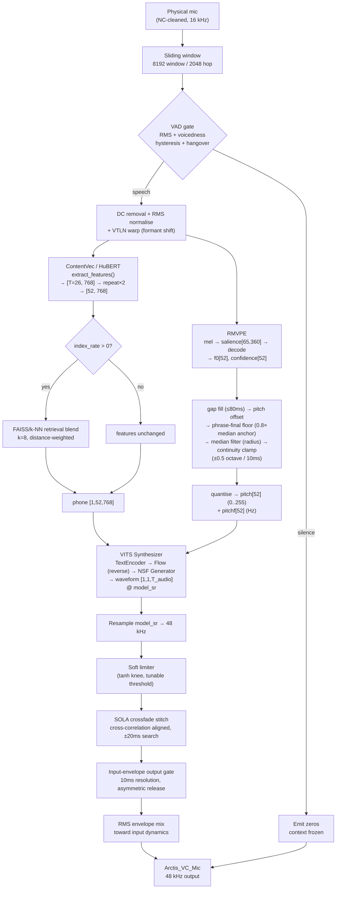
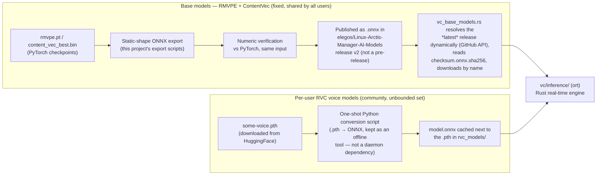

# RVC Inference Pipeline — Technical Architecture

This document covers the **AI Voice Changer (RVC)** inference pipeline specifically — the neural voice-conversion chain, its signal flow, model architecture, and ONNX conversion strategy. For the feature as a whole (LADSPA mode, model management, calibration, D-Bus interface, migration status), see [`voice-changing-feature.md`](voice-changing-feature.md). This document is the technical reference for **[E10-S6a]** in [`v3-backlog.md`](v3-backlog.md).

> [!IMPORTANT]
> **Status**: the Python reference pipeline (`src/linux_arctis_manager/voice_changer/rvc/`) is complete and is what every diagram and shape below describes. The Rust port has completed and verified the hardest open question — ONNX export of all three models, on real user model files, with negligible numerical drift — but the real-time Rust engine (`ort` sessions + ported DSP + streaming glue) is not yet built. See [Verification results](#verification-results) and [Rust component architecture (target)](#rust-component-architecture-target).

---

## Why this is a separate document

The Python reference (`pipeline.py`, ~1200 lines) is not "three model calls glued together" — it is a heavily ear-tuned real-time DSP system built *around* three neural networks. Every constant in it (VAD thresholds, SOLA search range, F0 continuity clamp, envelope release time, …) carries a comment explaining a specific audible artifact it fixes, discovered by listening. Porting it is a large enough, technically distinct enough effort — and carries enough risk of silent quality regression if done carelessly — to warrant its own architectural reference, separate from the feature-level overview.

---

## End-to-end signal flow



Every box after `NORM` runs **once per hop** (128 ms of new audio), but each inference sees a 512 ms *window* — the hop's 128 ms plus 384 ms of real previous audio as context, plus one look-ahead hop (two at cold start) as real future context. This is what eliminates chunk-boundary artefacts; see [Windowing](#windowing--timing).

---

## Windowing & timing

```mermaid
gantt
    dateFormat X
    axisFormat %L ms
    section Window N-1
    context (384ms)      :done, c1, 0, 384
    hop (128ms)           :active, h1, 384, 512
    section Window N (current)
    context = prev hop's tail (384ms) :done, c2, 128, 512
    new hop (128ms)                    :active, h2, 512, 640
    look-ahead (128ms, real future audio) :crit, la2, 640, 768
```



- **`_WINDOW_FRAMES` = 8192** samples (512 ms @ 16 kHz) — the full inference window.
- **`_HOP_FRAMES` = 2048** samples (128 ms) — new audio consumed per inference; also the SOLA/envelope quantum.
- **`_CONTEXT_FRAMES` = 6144** samples (384 ms) — real previous audio, not zero-padding, carried in `_context_buf`.
- **Look-ahead**: 1 hop (128 ms) in steady state, 2 hops (256 ms) at cold start (right after silence) — real future audio as right context, not a reflect-pad, because HuBERT is trained with full bidirectional context.
- These are compile-time constants in this application (not user-configurable), which is what makes **static-shape ONNX export** viable — see below.

---

## Model architecture

| Model | Purpose | Input | Output | Deterministic? |
|---|---|---|---|---|
| ContentVec (torchaudio `Wav2Vec2Model`, remapped fairseq weights) | Linguistic/phonetic features | wav `[1, 8512]` @ 16 kHz (8192 + 320 pad) | last transformer layer `[1, 26, 768]`, repeated ×2 → `[52, 768]` | Yes |
| RMVPE (`_E2E`: DeepUnet + BiGRU → 360-bin salience) | Pitch (F0) estimation | mel `[1, 128, 65]` (from 10240-sample `audio_padded` = window + hop) | salience `[1, 65, 360]` → decoded to `f0[65]`, `confidence[65]` | Yes |
| Synthesizer (`SynthesizerTrnMs768NSFsid`, VITS-style: TextEncoder + normalizing-flow + NSF-HiFiGAN generator) | Voice conversion / waveform synthesis | `phone[1,52,768]`, `pitch[1,52]` (coarse, 0-255), `pitchf[1,52]` (Hz), `sid[1]` | waveform `[1,1,T_audio]` @ model's native sr (`T_audio = 52 × upsample_total`, e.g. 20800 for a 40 kHz model) | **No** — two internal `torch.randn`/`torch.rand` draws (VITS prior-noise reparameterisation, NSF sine-phase + excitation noise) |

RMVPE's mel-spectrogram front end (`torch.stft` + a fixed 128×513 HTK mel filterbank matrix) is **not** part of the ONNX graph — see [ONNX conversion](#onnx-conversion-pipeline).

---

## ONNX conversion pipeline



**Base models** (RMVPE, ContentVec) are identical for every user — converted **once**, verified, and published pre-converted in the same GitHub release repo the daemon already downloads `rmvpe.pt`/`content_vec_best.bin` from today (`elegos/Linux-Arctis-Manager-AI-Models`, release `v2`). This removes any ONNX conversion step from the daemon's runtime entirely for these two.

`vc_base_models.rs` doesn't hardcode that release's tag, URL, or checksums — it resolves the repo's **latest** release dynamically via the GitHub API, reads `checksum.onnx.sha256` from that release's assets, and looks up `rmvpe.onnx`/`content_vec_best.onnx` by name against it. The release itself is the single source of truth: publishing a new one (e.g. re-exporting for a newer ONNX opset) is all a future update needs, no daemon rebuild. The legacy Python daemon is unaffected either way — it stays pinned to the `v1` tag with checksums hardcoded in its own source, and never requests anything from a release newer than that.

**Per-user voice models** are community-trained `.pth` files from HuggingFace — there is no fixed catalogue to pre-convert, so conversion happens locally, once, the first time a model is used (mirroring how OpenVINO model conversion already worked in the Python reference's design). This is the **one Python piece that stays** (see [`voice-changing-feature.md`](voice-changing-feature.md#the-one-python-piece-that-stays-pth--onnx-conversion)) — an offline tool invoked per-model, not a daemon runtime dependency.

### Static shapes, not dynamic axes — for the synthesizer only

> [!NOTE]
> Correction from [E10-S6a]'s engine-loading work: inspecting the real published `rmvpe.onnx`/`content_vec_best.onnx` (via `onnx.load(..., load_external_data=False)`, no torch needed) shows both actually use **dynamic** axes (`mel[1,128,'frames']`, `wav[1,'samples']`) — the static-shape workaround below was only ever needed for the synthesizer's `LayerNorm`, not these two. `vc/inference/engine.rs`'s `RmvpeSession`/`ContentVecSession` take the frame/sample count as a runtime parameter accordingly (RMVPE also right-pads the frame axis to a multiple of 32 per mel-channel, matching `rmvpe.py::RMVPE.infer`'s own padding for the DeepUnet's 5 stride-2 encoder layers).

The synthesizer's windowing constants are fixed by this application, not user-configurable, so *that* model is exported with **static input/output shapes** matching real usage exactly (`phone[1,52,768]`, …) rather than ONNX `dynamic_axes`. This sidesteps a real export failure found while prototyping: `synth_modules.py`'s `LayerNorm.forward` computes `F.layer_norm(x, x.shape[-1:], …)`, and when *any* dimension of the traced graph is marked dynamic, PyTorch's legacy TorchScript exporter treats `x.shape[-1]` as a non-constant traced value and rejects it (`SymbolicValueError: ... because it is not constant`). With a fully static graph, `x.shape[-1]` traces to a plain Python int and the export succeeds cleanly.

### The synthesizer's internal randomness

`SynthesizerTrnMs768NSFsid.infer()` is not a pure function — it draws two random tensors internally:

```python
z_p = m_p + torch.randn_like(m_p) * torch.exp(logs_p) * 0.33   # VITS prior reparameterisation
# ...inside GeneratorNSF -> SourceModuleHnNSF:
rand_phase = torch.rand(...)                                    # NSF sine excitation phase
noise = self.noise_std * torch.randn_like(sine)                 # NSF excitation noise
```

This means two calls with identical input produce audibly-similar but not identical output (by design — this is how VITS gets natural micro-variation). For ONNX export this matters twice over: `torch.randn_like`/`torch.rand` calls don't trace to a fixed graph the way arithmetic does, and — more importantly for verification — it makes naive "does the output match" testing meaningless, since even two PyTorch runs of the *original* code disagree with each other.

**Fix**: an export wrapper (`ExportableSynth`) reimplements `.infer()` + `GeneratorNSF.forward` + `SourceModuleHnNSF.forward` inline, calling the exact same trained submodules (`enc_p`, `flow`, `dec.conv_pre`, `dec.ups`, `dec.resblocks`, `dec.m_source.l_linear`, …) but taking `prior_noise`, `rand_phase`, `source_noise` as **explicit forward() parameters** instead of generating them internally. This has two payoffs:

1. **Provable correctness of the refactor itself**: capture the exact tensors PyTorch's own RNG drew during a real `.infer()` call (via a temporary monkeypatch of `torch.randn_like`/`torch.rand`), feed those same tensors to the wrapper, and diff the two outputs. Result: **`0.000e+00`** — bit-exact. The wrapper is not a re-derivation that might diverge; it is a proven-identical restructuring.
2. **A deterministic, testable ONNX graph**: the exported model takes noise as input, so a Rust caller (or a test) can supply a fixed seed's worth of noise and get a reproducible result — needed for any numeric regression testing against the Python reference later.

---

## Verification results

Exported and verified against the real base models on disk (`~/.config/arctis_manager/models/`) and a real downloaded voice model (`desmondsycamore.pth`, RVC v2, 40 kHz), comparing ONNX Runtime output to PyTorch output for the same input:

| Model | Max abs diff | Mean abs diff | Output range | Verdict |
|---|---|---|---|---|
| RMVPE | 1.3 × 10⁻⁷ | 2.5 × 10⁻⁸ | [0, 0.047] | Essentially exact |
| ContentVec | 1.2 × 10⁻⁵ | 2.5 × 10⁻⁶ | [-1.01, 0.86] | Essentially exact |
| Synthesizer (real user model) | 3.4 × 10⁻³ | 4.4 × 10⁻⁵ | [-0.58, 0.54] | ~0.6% relative at the peak — expected PyTorch/ONNX Runtime kernel-implementation noise for a deep generator, far below an audible threshold |

This closes the open question from earlier planning: whether the VITS-based synthesizer could be ONNX-exported without quality loss was the main unknown going into this phase. It is now a closed, verified question — not undertaken speculatively, using an approach (static shapes, externalised noise) more robust than what generic community ONNX-export tooling does, since that tooling targets variable-length offline batch conversion rather than this application's fixed real-time window.

---

## Rust component architecture (target)

```mermaid
flowchart TB
    subgraph existing["Already shipped (E10-S1..S5b)"]
        VCCFG["vc_config.rs\nLADSPA settings"]
        VCLC["vc_ladspa_chain.rs\nfilter-chain + control push"]
        VCM["vc_models.rs\nlocal model scan/delete"]
        VCHF["vc_hf_client.rs\nHF search/download"]
        VCBM["vc_base_models.rs\nRMVPE/ContentVec download"]
        VCCAL["vc_calibration.rs\nrecording + propose_variants"]
        VCRVC["vc_rvc_config.rs\nRvcParams"]
        DBUS["dbus.rs :: VcInterface"]
    end

    subgraph new["Target — [E10-S6a]"]
        direction TB
        PROV["vc/inference/providers.rs ✅\nExecution-provider selection\nCUDA / ROCm / OpenVINO / CPU"]
        ENGINE["vc/inference/engine.rs 🔶\nContentVec + RMVPE ort::Session loading\n+ inference, live-verified against real\nonnxruntime output — Synth session +\nstreaming state machine still to come"]
        DSP["vc_dsp.rs ✅\nported DSP glue: F0 post-processing,\nVTLN, SOLA, envelope gate, soft limiter,\nRMS mix — pure, unit-tested functions"]
        RETR["vc/inference/retrieval.rs ✅\nbrute-force weighted k-NN\nover the model's .index vectors\n(hand-parsed IndexIVFFlat format)"]
        MEL["vc/inference/mel.rs ✅\nnative mel-spectrogram (rustfft/realfft)\n+ computed filterbank, checked against\ntorchaudio's real source"]
    end

    VCBM -.->|downloads rmvpe.onnx / contentvec.onnx| ENGINE
    VCM -.->|resolves model.onnx next to .pth| ENGINE
    VCCAL -.->|render step, [E10-S6b]| ENGINE
    DBUS -.->|live conversion + metrics, new methods| ENGINE

    MEL --> ENGINE
    DSP --> ENGINE
    RETR --> ENGINE
    PROV --> ENGINE
```

Crate/dependency choices, validated against prior art before committing to them:

| Concern | Crate | Why |
|---|---|---|
| ONNX inference | [`ort`](https://github.com/pykeio/ort) | Already used in this daemon's design (Phase 2 decision); confirmed in production real-time-audio use elsewhere (Murmure/SilentKeys STT with NVIDIA Parakeet + Silero VAD, sbv2-api TTS) |
| Resampling (model_sr → 48 kHz) | [`rubato`](https://docs.rs/rubato) | Real-time-safe (no allocation in the hot path), replaces `torchaudio.functional.resample` |
| Mel-spectrogram STFT | [`realfft`](https://docs.rs/realfft) (built on `rustfft`) | `torch.stft` inside the ONNX graph is exporter-finicky, so the STFT + HTK mel filterbank are done natively instead (`vc/inference/mel.rs`, done) — the filterbank is *computed* from the same formulas as `torchaudio.functional.melscale_fbanks` (checked against its real source, not memory) rather than embedded as a 65k-value literal blob |
| FAISS retrieval replacement | brute-force weighted k-NN (own code) | Community `.index` files are small enough (few hundred thousand 768-dim vectors) that brute force is cheap and avoids a `libfaiss` C++ dependency — decided in [Phase 3](voice-changing-feature.md) planning. `vc/inference/retrieval.rs` (done) parses `.index`'s `IndexIVFFlat` binary format directly (reverse-engineered from `faiss`'s real source, verified byte-exact against four real downloaded models) rather than linking `libfaiss` just to read it |

A from-scratch Rust real-time RVC engine with an almost identical crate split (`vc-core`/`vc-signal`/`vc-inference`/`vc-audio`) already exists as a hobby project ([HaruSameee/Rust-VoiceConversion](https://github.com/HaruSameee/Rust-VoiceConversion)) — no license, so **not a code source**, but independent confirmation that this architecture shape is a proven, tractable way to structure the problem, not a novel risk.

---

## What is *not* yet de-risked

Exporting the models cleanly is necessary but not sufficient. The real remaining risk is the ~500 lines of hand-tuned DSP surrounding them (VAD hysteresis, SOLA alignment search, F0 continuity clamp, phrase-final floor, envelope gating — see `pipeline.py`) — every constant there was tuned by ear against real speech, not derived mathematically. The plan for that part specifically:

1. Port each DSP function as a **pure, standalone Rust function** (no model calls, no streaming state) — mirrors exactly how `vc_calibration.rs`'s downmix and `vc_ladspa_chain.rs`'s control-value math were already ported successfully.
2. For each one, compute expected outputs from the **Python reference** on fixed test vectors and assert against them in Rust `#[test]`s — the same approach already used throughout this migration, not a new technique.
3. Only after the DSP layer and the three `ort` sessions are individually verified, wire them into the real streaming loop and compare full-pipeline output against `pipeline.py` on real recordings (e.g. the calibration WAVs already on disk).
4. The user's own listening is still the final gate — numeric closeness to the Python reference is a strong proxy for "sounds the same," not a substitute for it.

---

## Related documents

- [`voice-changing-feature.md`](voice-changing-feature.md) — feature-level overview, migration phases, D-Bus interface, LADSPA mode.
- [`v3-backlog.md`](v3-backlog.md) — epic **[E10]**, story-level checklist (this document covers **[E10-S6a]**).
- [`v2-v3-gaps.md`](v2-v3-gaps.md#voice-changer-vc) — feature-by-feature V2/V3 status table.
