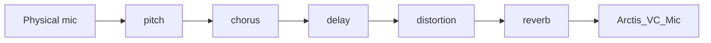
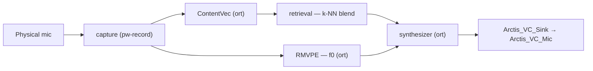

# Voice Changer

The Voice Changer replaces your microphone with a processed one
(`Arctis_VC_Mic`) that any application can select as its input. Two
independent modes are available.

- [Usage](#usage) — what it does and what each setting means.
- [Architecture](#architecture) — how it's built, for anyone extending it.

---

## Usage

### LADSPA Effects

A lightweight plugin chain — no GPU required. Enable any subset of:

| Effect | Controls |
|---|---|
| Pitch | shift amount, in semitones |
| Chorus | voices, delay, separation, detune, LFO rate, output level |
| Delay | delay time |
| Distortion | level, character (warm ↔ harsh) |
| Reverb | room size, time, damping, bandwidth, dry/early/tail levels |

Only the stages you enable run; the plugin chain rebuilds automatically when
you change which effects are on.

### AI Voice Changer (RVC)

Neural voice conversion onto a chosen community model. Needs a compatible
GPU (NVIDIA/AMD via CUDA/ROCm, Intel via OpenVINO) or falls back to CPU. The
app guides you through installing the ONNX Runtime backend it needs, with a
per-distro tutorial and a "Detect" check — nothing is installed silently.

**Models.** Search and download from HuggingFace, or point at a local
`.pth` file. A model is converted to ONNX automatically the first time it's
used (with your consent to install the one-time conversion dependencies, if
they're not already on your system) — no manual steps.

**Calibration wizard.** New models need a couple of ear-tuned parameters
before they sound right:

1. Record a short sample of your voice.
2. Listen to a few pitch variants and pick the one that fits your voice's
   register (refine and re-render as needed).
3. Same for a few dynamics/tone variants, built on top of the pitch you
   picked.

**Tuning**, per model:

| Setting | What it does |
|---|---|
| Pitch offset | Semitone shift into the target voice's register |
| Formant shift (`vtln_alpha`) | <1 shifts formants up (e.g. male→female); 1 = off |
| Envelope mix (`rms_mix_rate`) | 0 = keep your own dynamics, 1 = use the model's |
| Pitch smoothing (`filter_radius`) | Median-filters the detected pitch; 0/1 = off |
| Input drive (`target_rms`) | How hard your voice drives the model; too high saturates |
| Limiter (`limiter_thr`) | Output soft-limiter knee; 1.0 = off |
| Feature retrieval (`index_rate`) | Blends in the model's own timbre samples (`.index` file); 0 = off |

### Common to both modes

- **Enable** is a tri-state switch: off / on for this session / always on
  (starts automatically with the daemon).
- The **input device** picker is shared with the Noise Cancellation and
  sidetone-preview panels — it lists physical microphones only.
- Whichever mode wins (Voice Changer or Noise Cancellation) takes over the
  microphone; Voice Changer has priority when both are enabled.

---

## Architecture

All voice-changer logic — PipeWire graph management, settings, calibration,
model management, and inference — lives in the daemon (`lam-daemon`), like
every other feature. The GUI is a thin client: it sends settings and renders
state over D-Bus, with no privileged role over any other client.

### Module layout (`daemon/engine/src/`)

| Module | Responsibility |
|---|---|
| `vc_config.rs` | Persisted settings (`vc_config.json`): mode, per-effect LADSPA params, RVC model/tuning |
| `vc_ladspa_chain.rs` | LADSPA filter-chain graph generation, live control push |
| `vc_models.rs` | Local `.pth`/`.index` scan and delete |
| `vc_hf_client.rs` | HuggingFace search, repo listing, download |
| `vc_base_models.rs` | RMVPE/ContentVec ONNX download + checksum verification |
| `vc_export.rs` | Automatic `.pth` → ONNX conversion (invokes the one Python tool that stays, see below) |
| `vc_calibration.rs` | Calibration recording and rendering |
| `vc_rvc_config.rs` | Per-model `RvcParams` tuning |
| `vc_dsp.rs` | Deterministic DSP glue: F0 processing, VTLN, SOLA, envelope gate, soft limiter |
| `vc_retrieval.rs` (`vc/inference/retrieval.rs`) | Brute-force weighted k-NN over a model's `.index` feature vectors — replaces `libfaiss` |
| `vc/inference/engine.rs` + `pipeline.rs` | `ort` sessions (ContentVec, RMVPE, synthesizer) and the real-time sliding-window streaming loop |
| `vc/inference/providers.rs` | Execution-provider selection (CUDA/ROCm/OpenVINO/CPU) |
| `vc/inference/mel.rs` | Native mel-spectrogram front end (`rustfft`/`realfft`) for RMVPE |
| `rvc_live_chain.rs` | Wires a live microphone capture through the inference engine into `Arctis_VC_Sink` |

### The one Python piece that stays

`.pth → ONNX` conversion (`voice_changer/rvc/export_onnx.py`) is a one-shot,
offline script, not a daemon runtime dependency — the daemon invokes it
in-process (`vc_export.rs`) the first time a model needs converting. It's
the only place `torch` is required, and only as a CPU wheel.

### Signal flow

**LADSPA mode** — single `pipewire` process, live `pw-cli s <node_id> Props`
updates, no graph rebuild when only parameters change:

**RVC mode** — capture and playback are separate processes either side of
the inference engine:

### Settings persistence

`vc_config.json` under `~/.config/arctis_manager/` (same layout convention
as `nc_config.json`, `eq_settings.yaml`): mode, source device, per-effect
LADSPA params, and the RVC sub-object (model, pitch, and the tuning table
above, snapshotted per model).

### D-Bus interface

Bus name `name.giacomofurlan.ArctisManager.Next.VC`, same namespace as
`...Next.NC`/`...Next.EQ` — see [`dbus.md`](dbus.md) for the general D-Bus
conventions.

| Category | Methods |
|---|---|
| Settings | `GetVCCapabilities`, `GetVCSettings`, `SetVCSettings` |
| Local models | `GetRVCModels`, `DeleteRVCModel` |
| HuggingFace | `SearchHFModels`, `ListRepoFiles`, `DownloadHFModel`, `GetHFToken`, `SetHFToken` |
| Base models | `DownloadBaseModels` |
| ONNX Runtime setup | `GetExportDepsStatus`, `InstallExportDeps`, `DetectOnnxRuntime` |
| Calibration | `CalibrationStartRecording`, `CalibrationStopRecording`, `CalibrationGetStatus`, `CalibrationStartRender` |
| Live metrics | `GetRVCMetrics`, `SetRVCLiveParams` |

Signals: `VcChanged` (settings), `DownloadProgress`/`DownloadComplete` (HF
downloads), `BaseModelProgress`/`BaseModelComplete`, `LiveChainError`.

---

## The RVC inference pipeline

This section is the technical deep-dive on the neural voice-conversion
chain itself — model architecture, ONNX export strategy, and the real-time
DSP wrapped around it. Skip it unless you're modifying `vc/inference/` or
`vc_dsp.rs`.

### Models

| Model | Purpose | Deterministic? |
|---|---|---|
| ContentVec (`Wav2Vec2Model`, remapped fairseq weights) | Linguistic/phonetic features from raw audio | Yes |
| RMVPE (DeepUnet + BiGRU) | Pitch (F0) estimation | Yes |
| Synthesizer (VITS-style: TextEncoder + flow + NSF-HiFiGAN) | Voice conversion / waveform synthesis | No — draws internal noise (see below) |

RMVPE and ContentVec are exported once (base models, identical for every
user) and published pre-converted; the daemon downloads them like any other
asset. The synthesizer is exported per-model, locally, the first time it's
used.

### Why the synthesizer needs special handling

Two things make the synthesizer harder to export than the other two:

- Its `LayerNorm` traces `x.shape[-1]` as a constant only when every input
  shape is static — so unlike ContentVec/RMVPE (which use ONNX dynamic
  axes), it's exported with fixed shapes matching this app's actual
  windowing constants (512 ms window / 128 ms hop, fixed at compile time).
- `.infer()` isn't a pure function — it draws two random tensors internally
  (VITS prior-noise reparameterisation, NSF excitation noise/phase). An
  export wrapper (`ExportableSynth`) takes these as explicit inputs instead
  of generating them internally, proven bit-exact against the original by
  replaying a real call's own captured random draws through both and
  diffing the output. This also makes the exported graph reproducible,
  which a pure "does the output sound similar" check wouldn't allow.

### Verification

Exported models were numerically checked against PyTorch on real inputs,
including a real downloaded voice model:

| Model | Max abs diff | Verdict |
|---|---|---|
| RMVPE | ~1e-7 | Essentially exact |
| ContentVec | ~1e-5 | Essentially exact |
| Synthesizer | ~1e-2–1e-3 | Expected kernel-implementation noise, well below audible |

The full engine (all three models plus the DSP around them) has since been
verified end to end against real hardware and real speech, both for
calibration rendering and the live microphone chain.

### Windowing

Each hop of new audio (128 ms) is inferred with 384 ms of real previous
audio as context, plus one look-ahead hop of real future audio — not
zero-padding — since ContentVec is trained with full bidirectional context.
These sizes are fixed by the application, not user-configurable, which is
what makes static-shape ONNX export viable for the synthesizer.

### DSP around the models

The ~500 lines of hand-tuned DSP surrounding the three models (VAD
hysteresis, SOLA crossfade alignment, F0 continuity clamping, envelope
gating, …) were ported as pure, standalone functions and verified against
the pre-existing Python reference on fixed test vectors before being wired
into the real streaming loop (`vc/inference/pipeline.rs`). One deliberate
deviation: the engine always uses one look-ahead hop rather than growing to
two at cold start, since the synthesizer's static ONNX shape can't accept a
varying frame count — a small, known trade-off right after silence ends.

### Key dependencies

| Concern | Crate | Why |
|---|---|---|
| ONNX inference | [`ort`](https://github.com/pykeio/ort) | Loads `libonnxruntime.so` dynamically at runtime, no vendor SDK needed to build |
| Resampling | [`rubato`](https://docs.rs/rubato) | Real-time-safe, no allocation in the hot path |
| Mel-spectrogram | [`realfft`](https://docs.rs/realfft) | Native STFT + HTK filterbank, avoids `torch.stft`'s export quirks |
| Feature retrieval | brute-force k-NN (own code) | Small enough vector counts that this beats linking `libfaiss` |
