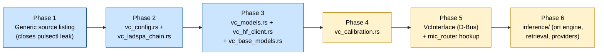
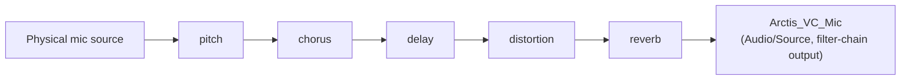
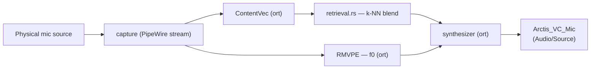

# Voice Changer Feature

## Overview

The Voice Changer adds real-time microphone processing on top of the existing audio pipeline. It exposes a virtual PipeWire/PulseAudio microphone source that any application can select as its input. Two independent modes are offered:

- **LADSPA Effects** — lightweight plugin chain (pitch shift, chorus, delay, distortion, reverb). No GPU required, minimal CPU overhead.
- **AI Voice Changer (RVC)** — neural voice conversion using community `.pth` models. Requires a compatible GPU (NVIDIA/AMD via CUDA/ROCm, or Intel GPU/NPU via OpenVINO).

> [!IMPORTANT]
> **Status**: fully implemented on the legacy Python daemon; **partially ported** to the v3 Rust engine (`daemon/engine/`) — source listing, LADSPA effect chain, and HuggingFace/model management are done; calibration and neural inference are not started. Tracked as epic **[E10]** in [`v3-backlog.md`](v3-backlog.md) (story-level status) and itemised in [`v2-v3-gaps.md`](v2-v3-gaps.md#voice-changer-vc). This document describes the **target v3 architecture**; sections describing the current Python implementation are marked as such.

The Voice Changer is one of several D-Bus clients of the daemon — the GUI is not privileged over any other client. Consequently **all voice-changer logic lives in the daemon**: PipeWire graph management, settings persistence, calibration, model management, and (target state) neural inference. Clients only send settings and render state.

---

## Migration approach

The Python implementation (`src/linux_arctis_manager/voice_changer/`) is already close to server-authoritative: its D-Bus service (`ArctisManagerDbusVCService`, 19 methods + 6 progress/completion signals) already owns settings, the LADSPA chain, calibration recording/rendering, and HuggingFace model search/download. The GUI (`gui/vc_widget.py`, `gui/vc_calibration_wizard.py`) is a thin client that polls and renders — with one exception shared with the NC and sidetone panels: it opens its own `pulsectl` connection to list microphone sources instead of asking the daemon. That gap is closed generically for all mic-consuming panels (see [E-transversal] below), not specifically for VC.

So this is **not** a "move logic out of the GUI" refactor — it is a straight **Python → Rust port** of server-side logic that is already in the right place, following the patterns `daemon/engine/src/nc_manager.rs` (PipeWire filter-chain) and `daemon/engine/src/eq/ladspa.rs` (LADSPA hosting) already established for Noise Cancellation and EQ.

---

## Target architecture

### Module layout (`daemon/engine/src/`)

Flat files (`vc_*.rs`), matching the project's existing convention for single/few-submodule features (`nc_config.rs`/`nc_manager.rs`) rather than a subdirectory — `eq/` is the exception, used there because EQ has enough submodules (preset, settings, hardware, ladspa) to warrant one. `vc/inference/` (Phase 6) is the one place a subdirectory may make sense once it exists, given it groups 2-3 files of its own.

| Module | Responsibility | Python equivalent | Mirrors | Status |
|---|---|---|---|---|
| `vc_config.rs` | Persisted LADSPA settings (`vc_config.json`), same field set as today's YAML | `voice_changer/settings.py` (LADSPA fields) | `nc_config.rs` | Done |
| `vc_ladspa_chain.rs` | LADSPA filter-chain graph generation, live control push | `voice_changer/ladspa/{effects,chain}.py` | `nc_manager.rs` | Done |
| `ladspa_util.rs` | Shared LADSPA plugin discovery (extracted from `nc_manager.rs`) | — | — | Done |
| `vc_models.rs` | Local `.pth`/`.index` scan, delete | `voice_changer/rvc/model_manager.py` | — | Done |
| `vc_hf_client.rs` | HuggingFace search/repo-listing/download over `reqwest`, `.pth` and `.zip` (`zip`/`flate2`) | `voice_changer/rvc/hf_search.py` | — | Done |
| `vc_base_models.rs` | RMVPE/ContentVec download + SHA-256 verification | `voice_changer/rvc/model_downloader.py` | — | Done |
| `vc_calibration.rs` | Guided calibration state machine, `pw-record` subprocess | `voice_changer/rvc/calibration.py` | — | Not started |
| `vc_retrieval.rs` | Weighted k-NN blend over the model's `.index` feature vectors | `pipeline.py` (`faiss.read_index`/`search`) | — | Not started |
| `vc/inference/engine.rs` | `ort` session(s): ContentVec → RMVPE (f0) → retrieval blend → synthesizer | `pipeline.py`, `rmvpe.py`, `synth_modules.py` | — | Not started |
| `vc/inference/providers.rs` | Execution-provider selection (CUDA/ROCm/OpenVINO/CPU) | `rvc/registry.py`, `rvc/pytorch_impl.py`, `rvc/openvino_impl.py` | — | Not started |

None of the completed modules are wired into a D-Bus interface yet (Phase 5, `VcInterface`) — each carries `#![allow(dead_code)]` with a comment pointing here in the meantime, and is exercised directly by its own unit tests.

> [!NOTE]
> `pytorch_impl.py` and `openvino_impl.py` collapse into a **single** Rust module. Both existing Python backends already require `.pth → ONNX` export as their real bottleneck (OpenVINO explicitly; PyTorch implicitly, since `ort` needs the same graph). `providers.rs` picks the ONNX Runtime execution provider instead of choosing between two separate backend implementations.

### The one Python piece that stays: `.pth → ONNX` conversion

Model conversion remains a **one-shot, offline Python script** (not a daemon runtime dependency), invoked when a user downloads or adds a new model — analogous to a build tool, not a service. Since the GUI itself stays Python/Qt (talking to the Rust daemon over D-Bus, same as every other v3 feature), the project already carries a Python runtime dependency; this does not add a new one. `torch`/`huggingface_hub` stay optional extras for this script only, not for the daemon.

### FAISS retrieval without libfaiss

The Python pipeline loads a `.index` file (`faiss.read_index`) exported by RVC WebUI (typically an IVF index over a few hundred thousand 256-dim vectors) and does a weighted `k=8` nearest-neighbour search per audio chunk. Rather than linking `libfaiss` (a large C++ dependency) into the daemon, `retrieval.rs` reconstructs the raw feature vectors once at model-load time and performs a **brute-force weighted k-NN** in Rust — cheap enough at this vector count and avoids depending on FAISS's on-disk index format.

### Signal flow

**LADSPA mode** (mirrors NC — single `pipewire -c <generated_conf>` process, `libpipewire-module-filter-chain`, live `pw-cli s <node_id> Props` updates, no graph rebuild when only parameters change):

Only plugins found on the system are baked into the graph; a disabled stage is neutralised via bypass controls (same approach as NC's HPF/gate/compressor), so the graph topology never needs a rebuild for on/off toggles.

**RVC mode** (target state):

### Mic priority

`daemon/engine/src/mic_router.rs` already anticipates this: *"Priority: VC output > NC output > teardown"*. Phase 5 wires `vc/ladspa_chain.rs` / `vc/inference/engine.rs`'s output source into it — no new priority logic needed.

---

## LADSPA effects reference

Unchanged from the current implementation (`voice_changer/ladspa/effects.py`); ported as-is into `vc_ladspa_chain.rs`.

| Effect | Plugin (preferred → fallback) | Controls |
|---|---|---|
| Pitch | `am_pitchshift_1433` → `pitch_scale_1193` | `pitch_shift` (factor from ±24 semitones), `buffer_size=4` |
| Chorus | `multivoice_chorus_1201` | voices, delay, separation, detune, LFO rate, output attenuation |
| Delay | `delay_1898` | delay time (max_delay = delay + 0.5 s headroom) |
| Distortion | `valve_1209` | level, character (0 = warm/even harmonics, 1 = harsh/odd) |
| Reverb | `gverb_1216` | room size, time, damping, bandwidth, dry/early/tail levels — **stereo output, must be last in chain** |

All plugins ship in `ladspa-swh-plugins` (Arch/AUR), `swh-plugins` (Debian/Ubuntu, Fedora).

---

## Settings persistence

`vc_config.json` under the daemon's settings base dir (same layout convention as `nc_config.json`, `eq_settings.json`). Field set is a direct port of `VCSettings` (`voice_changer/settings.py`): global mode/source, per-effect LADSPA params, and an `rvc` sub-object (model path, pitch offset, Hubert model choice, VTLN alpha, RMS mix rate, F0 filter radius, target RMS, limiter threshold, index rate, per-model parameter snapshots).

Local model files, calibration recordings, and downloaded base models (RMVPE/ContentVec) keep their existing filesystem locations under `~/.config/arctis_manager/` for a seamless migration — no user-facing path changes.

---

## D-Bus interface (target)

Bus name: `name.giacomofurlan.ArctisManager.Next.VC` (unchanged), same namespace as `...Next.NC` / `...Next.EQ`. Method names are kept close to the current Python service to minimise the diff in `gui/dbus_wrapper.py` and `gui/vc_widget.py` when the GUI cuts over in Phase 5.

| Category | Methods |
|---|---|
| Capabilities & settings | `GetVCCapabilities`, `GetVCSettings`, `SetVCSettings` |
| RVC runtime | `GetRVCModels`, `GetRVCMetrics`, `SetRVCLiveParams` |
| Calibration | `CalibrationStartRecording`, `CalibrationStopRecording`, `CalibrationStartRender`, `CalibrationGetStatus` |
| Model management | `DeleteRVCModel`, `DownloadBaseModels`, `SearchHFModels`, `ListRepoFiles`, `DownloadHFModel`, `GetHFToken`, `SetHFToken` |
| GPU / deps | `DetectGPU` |

Signals: `VCChanged` (settings), plus progress/completion pairs for installs/downloads (`InstallProgress`/`InstallComplete`, `DownloadProgress`/`DownloadComplete`, `BaseModelProgress`/`BaseModelComplete`) — same pattern as `EQChanged`/`NCChanged`.

---

## Related documents

- [`v3-backlog.md`](v3-backlog.md) — epic **[E10]**, story-level checklist for this migration.
- [`v2-v3-gaps.md`](v2-v3-gaps.md#voice-changer-vc) — feature-by-feature V2/V3 status table.
- [`dbus.md`](dbus.md) — general D-Bus interface conventions shared across daemon services.
